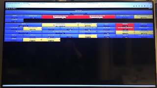

# Rethinking Test Automation - From Radiators to Telemetry

*Published 2019-11-09, updated 2019-11-12*  
*Source: <https://visible-quality.blogspot.com/2019/11/rethinking-test-automation-from.html>*

---

**Introducing Product Telemetry**  
  
A week after we started our "No Product Owner" experiment a few years back, the developers now each playing their bit in product owner decided they were no longer comfortable making product decisions on hunches. In now common no hassle way, they made a few pull requests to change how things were, and our product started sending telemetry data on its use.  
  
As so often is, things in the background were a little more complex. There was another product doing the pioneer work on what kind of events to send and sending events, so we could ride on their lessons learned and to a large extent, implementation. The thing I have learned to appreciate most in hindsight is the pioneer work they did on creating us an approach to care for *privacy* and *consent* as key design principles. I've come to appreciate it only through other players asking us on how we do it.  
  
The data-driven ways took hold of us, and transformed the ways we built some of the features. It showed us that what our support folks know and what our real customers know can be very far apart, and we as a devops team could change the customer reality without support in the middle.  
  
The concept of **Telemetry**was a central one. It is a feature of the product that enables us to extend other features so that they send us event information about their use.  
  
At first product telemetry was telling us about positive events. Someone wanted to use our new feature, yay! From the positive, we could also deduct the negative: we created this awesome feature and this week only a handful of people used it, what are we not getting here?  We learned that based on those events, we did not need to ask all questions beforehand, but we could go back exploring the data to learn patterns that confirmed or rejected our ideas.  
  
We soon came to conclusions that events about error scenarios would also tell us a lot, and experimented with building abilities to fix things so that the users wouldn't have to do the work of complaining.  
  
This was all new to us and as such cool, but it is not like we invented this. We just did what the giants did before us, adapting it to ensure it fits to the ideas of how we are working with our customers.  
  
**We Could Do This in CI!**  
  
As telemetry was a product feature, we tested it as a feature, but did not at first realize that it could have other dimensions. It took us a while to realize that if we collected the same product telemetry from our CI (testing) environment than we did in production, it would not tell us about our customers but it would tell us about our testing.  
  
As we did that, we learned things about the way we test (with automation in particular) that the scale of things creates fascinating coverage patterns. There were events that would never be triggered. There was a profile of events that was very different to that of production. A whole new layer of coverage discussions was available.  
  
This was different use of the same feature we had in the product in test than in production.  
  
**The Test Automation Frustration**  
  
To test the product we are creating, we have loads of unit tests to do a lot of heavy lifting on giving feedback on mistakes we may make when changing things. As useful as unit tests are, we still need the other kinds of testing, and we bundle this all together in a system we lovingly call TA. As you may imagine, TA is shorthand for Test Automation, but the way I hear it, I rarely hear the long word at work but TA is all around.  
  
"We need to change TA for this."  
"We need to add this to TA."  
"TA is not blue. Let's look at it."  
  
TA for us is a fairly complex system, and I'm not trying to explain it all today. Just to give some keywords of it: Python3, Nosetest, DVMPS/KVM, Jenkins, and Radiators.  
  
Radiator is something you can expect to see in every team room. The ones we're using were built by some consultants back in the days when this whole thing was new, and I have only recently seen modernized versions someone else built in some of the teams. It's a visual into all of the TA jobs we have and a core part of TA as such.  
  

  
The Radiator builds a core principle on how we would want to do things. We would want it to be blue. As you see from the image of its state yesterday as I was leaving office, it isn't.  
  
When a box in that view is not blue, you know a Jenkins job is failing. You can click on the job, and check the results. Effectively you read a log telling you what failed.  
  
A lot of times what failed is that some part the TA relies on in its infrastructure was overloaded. "Please work on the infrastructure, or try again later."  
  
A lot of times what failed is that while we test our functionalities, they rely on others. They may be unavailable or broken. Effectively we do acceptance testing of other folks changes in the system context.  
  
Some people love this. I love it with huge reservations, meaning I complain about it. A lot. It frustrates me.  
  
It turns me into either someone who ignores a red, or risking overlapping work. It requires a secretary that communicates for it. It begs people to ignore it unless reminded. It casts a wide net with poor granularity. It creates silent maintenance work where someone is continuously turning it back blue, that hides the problems and does not enable us to fix the system that creates the pain.  
  
I admire the few people we have that  open a box and routinely figure out what the problem was. I just wish it already said the problem.  
  
And as I get to complaining about the few people, I get to complain about the logs. They are not visitor friendly. I don't even want to get started on how hard it is for people to tell me what tests we have for X (I ask to share my pain) or for me to read that code (which I do). And logs reflect the code.  
  
**From Radiator to Telemetry**  
  
A month ago, I was facilitating a session to figure out how to improve what we have now in TA. My list of gripes is long, but I do recognize that what we do is great, lovely, wonderful and all that. It just can be better.  
  
The TA we have:  
  

- spawns 14 000 windows virtual machines a day (older number, I am in process of checking a newer one)
- serves three teams, where my team is just one
- tests 550 unique tests for my team for number of windows flavors on pull request
- tests all the 15 products we are delivering from my team
- runs 100 000 - 150 000 tests a day for my team
- finds crashes and automatically analyzes them
- finds regression bugs in important flows
- enables us to not die out of boredom repeating same tests over and over again
- allows us to add new OS support and new products very efficiently

The meeting concluded it was time for us to introduce telemetry to TA - and some of the numbers above on the unique tests and number of runs daily are our first results of that telemetry in action.

Just as with the product, we changed the TA product to include a feature that allows us to send event telemetry.

We see things like passes and fails now in the context of the large numbers, instead of the latest results within a box on the radiator.

We see things in multiple radiator boxes combined together into the reason we before needed to verify from the logs.

We see what tests take long. We see what tests pass and what fail.

And we have only gotten started.

The historic date of the feature going live was this week Thursday. I'm immensely proud of my colleague Tatu Aalto for driving through code changes to make it possible, and the tweets where he is correcting me on my optimism warning he had a few bugs he already fixed. I'm delighted that my colleague Oleg Fedorov got us to see a solution through seeing things. And I can't wait to see what we make out of it.
