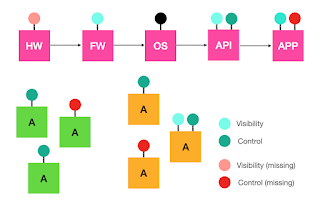

# Orchestrating System Test Automation for Visual Thinkers

*Published 2020-11-24*  
*Source: <https://visible-quality.blogspot.com/2020/11/orchestrating-system-test-automation.html>*

---

Working on a sizable system, feature after feature I found us struggling with timeliness of completing testing. Each feature kickoff, testerkind showed up to listen, and start learning. While development was ongoing, more learning through exploring took place. And in the end, after feature was completed, tests were documented in test automation, and just in case time taken for some more final exploring.

It seemed like a solid recipe, but what I aspired for is finding a way where testing could walk more in sync with the development. The learning time was either half-attention, or elsewhere occupied, and it resembled a mini-waterfall for each feature.

I formulated an experiment, with the intent of learning if being active with test automation implementation from the start would enable us to finish together. And so far, it is looking much better than  before.

The way I approached test automation implementation was something I had not done before. It felt like a thing to try, to move focus from testerkind listening and learning to actively contributing and designing. In preparation for the feature kickoff, I draw an image of points of control and visibility, tailored to the specific feature.

As I don't want to go revealing any specific of what we build, I drew a general purpose illustration of the idea. Each box on the main line were touch points where development for the feature would happen (pinks). Each box on the side was a touch point already existing in the system, found by analyzing the system for what was relevant combination for this feature (greens and oranges). I used two colors to categorize existing system touchpoint on closeness to the things we were developing (greens) and necessity for end to end perspective (oranges). Finally, for each touch point, I identified the type of handles: visibility and control, existing or missing.

To make the abstract a little more specific, let me give you a few safe examples from my years in testing:

- ssh to a command line in a remote computer is a touch point of both control and visibility
- reading a file in filesystem is a touchpoint of visibility
- reading a system log is a touch point of visibility
- calling a REST API and verifying responses is a touch point of both visibility and control
- clicking a button on the UI and entering values is a touch point of control

Same things can be both control and visibility. Making these choices is how I think about design for testability. And I prefer thinking it visually.

Having agreed the touch points, we could do test automation a touch point at a time. Our understanding of what touch points that were not about to change we could already work on, and what touch points were depending on the changes. We could talk about how order of development enabled testing. And most importantly, we could talk about which touch points I identified did not make sense for the system scale, because we could address risks on unit and component tests.

The current popular thinking in the testing community is to paraphrase testability into something wider than visibility and control. This little exercise reminded me that I can drive a better collaboration test automation first, without losing any of exploratory testing aspects - quite contrary. This seemed to turn the "exploring to learn randomly while waiting" into a little more purposeful activity, where learning was still taking place.

In a few weeks, I will know if the original aspiration of starting together actively to finish together will see a positive indication all the way to the end. But it looks good enough to justify sharing what I tried.
