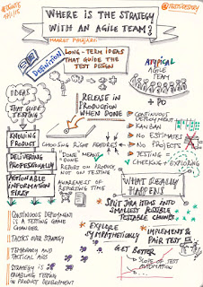
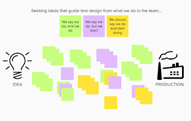

# In Search of a Test Automation Strategy

*Published 2021-02-12*  
*Source: <https://visible-quality.blogspot.com/2021/02/in-search-of-test-automation-strategy.html>*

---

The world of software as I know it has changed for me. I no longer join projects in preparation of a testing phase that happens in the end, but I am around from when I'm around until I am no longer around, building testing that survives when I am gone.

Back in the day of testing phase at the end of a project, test strategy used to be the ideas you prepared in order to work through the challenging phase. It gave the tests you would do a framing, guiding design. It usually ended up being written down in a test plan under a heading of approach, and it was one of the most difficult things to write in a way that was specific to what went down in that particular project.

With agile, iterations and testing turning continuous, figuring out test strategy did not get easier. But the ideas guiding test design turned into something that was around for longer, and in use longer. I talked about what ideas stuck with me at DEWT5 in 2015, and same ideas guide my testing to this day.

Since then, I'm working even more on the strategy we share and visualizing it to nudge it forward. Seeing the strategy in action in a new team can be dug out of the team, asking the team to visualize their testing activities.   

The strategy I set does not matter, if it does not turn to action with the team. We now move versatile groups of people across different roles and interests.

This week gave me a chance to revisit my ways on a theme of test automation strategy. I have never written one. I have read many, and I would not write any of those. But it stopped me to think of the ideas that guide my test automation design right now. These are the ideas that I brainstormed:

- Start with the end in mind

- Release time with minimal eyes on system. Rely on TA (test automation) on the release decision.
- TA keeps track of what we know so that it remains known when we change things

- Incremental, incomplete, learning

- Work towards flow of TA value - small streams become a significant pool over time. Moving for better continuously matter, not starting well or perfect.
- Something imperfect but executable is better than great ideas and aspirations. Refactor to reveal patterns.

- Timing

- Feedback nightly, feedback on each change.
- Maintain ability to run TA on every version supported for customers

- Early agreement

- Design automation visibility and control interfaces at epic kickoffs

- Scope

- For each epic (feature), add the positive case to TA. Target one. More is allowed but don't overstretch.
- Unit and software integration tests cover cruft of functionality. TA is for system level scenarios including hardware (as it is embedded for us).
- Not only regression TA, also data, environments, reliability, security and performance in automation.
- Acceptance tests for interfacing teams monitor expected dependencies.
- Save the data. Build on the data. But first learn to run it.

- People

- Invest in skilled TA developers through learning and collaboration

- Require developers to maintain automation for breaking changes
- To facilitate GUI selectors, GUI devs create first test with keywords
- Allow for a "domain testing expert" who only contributes in pull request reviews on TA

- Practices

- Suites and tags give two dimensions to select tests, use tags for readiness
- Seek to identify reusable data sets and oracles
- Reuse of keywords supported through reviews and refactoring time

I guess this is as close to a test automation strategy I'm about to get.
