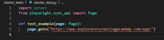
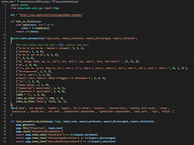

# Removing Robot Framework From My World

*Published 2021-11-26*  
*Source: <https://visible-quality.blogspot.com/2021/11/removing-robot-framework-from-my-world.html>*

---

Making progress in removing Robot Framework from my world. Why, you might ask, especially when so many managers in Finland have been taught to expect it. If you do something where you frequently need help of a community to learn it further, why would you choose something where information search isn't giving you a large community?

I put a complete newbie through a month of Robot Framework and a month of pytest. Pytest won, hands down. My key takeaways:

1. Information search is completely different experience: both quantity and \*tone\* in responses the communities provide is different and developer-first communities do better in leveling materials for fast-tracking newbies
2. Debugging tests in IDE, you'll need it and save tons of time avoiding abstractions that take some of that power away from you. Running a single test from a suite - pure bliss in a suite that takes an hour to run
3. One less layer, one less source of problems. Tools have bugs. You can always let the bugs hit others and carefully select the time when you allow for new, but foot on brake is energy away from where it should be. And when it is not bugs, you are waiting (or contributing) to the translation layer to get the new cool stuff from the underlying library into your use.
4. Learn more. Robot Framework has become a synonym for bad programming combined with bad testing. In recruiting, it is more likely to mean "not good" than the other way around. Sadly, but this is the trend. Making easy things easier is great, but making hard things harder gets people to stop at easy over important. Look at the behaviors people have with tools, there is a difference that matters

In an hour of contemporary exploratory testing, we can go from this:

to this - with people who have never written a line of code, with power of ensemble programming.   

Next up, recognize the ten bugs these tests document as "works as implemented".
