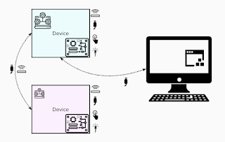

# Robot Framework and the Myth of Embedded Devices

*Published 2021-12-23*  
*Source: <https://visible-quality.blogspot.com/2021/12/robot-framework-and-myth-of-embedded.html>*

---

Coming in to projects, I find myself shaping my work and perspectives to **balance**. Back in the days of being a test manager, working with project managers, I noticed that working with an optimist made me a pessimist; working with a pessimist made me an optimist. Extreme views on one end lead to opposing extreme views on my end.

Robot Framework is like this for me. I respect the fact that I have been dropped into a puddle of Robot Framework love, both in terms of where I work and in terms of being in Finland, and I just don't buy into the love.

Instead, I look at what goes on. Like noticing a Robot Framework Test Automation Expert, who due to technology choices ends up having to live in a team where that wasn't a tool of choice for *the team* becomes unable to contribute, period.  Like noticing the difference in speed of problem to solution in test system space comparing someone specializing in Robot Framework and someone who can also equally fluently use pytest. Like noticing how moving away from Robot Framework increases whole team testing using test automation.

Or like most recently, noticing how a colleague asks for an example on "how to run modbus-protocol device with python and playwright", showing a common example of not thinking what pieces Robot Framework consists of and recognizing that the lovely modbus/nimbus-R library we use at work is a piece of python code we ourselves created for the purposes of running modbus-protocol device with python.

Surely short questions and answers will always be inaccurate and lead to conclusions on understanding, so I decided to take a longer text form - even if to create more confusion.

The key thing here is understanding architectures just enough to know what we connect with. On the rest of it, the chosen framework may help us create clarity of structure we can enable future of our organizations with.

While on hobbies side I do a lot of my examples on either web UI (choosing an appropriate driver for it) or REST APIs (choosing an appropriate driver for it), work wise I have had a mix of web in cloud, web from device, embedded devices, windows UIs, and Windows/Linux Servers just in the last few years. Somehow people think embedded is so different, but it really isn't. It's all hard, it's a little different kinds of hard.

Let's talk about this a bit on the level of architecture and what it might mean for test automation.

Imagine you have two teams, each building an embedded device.

The first one (pink) has a very light set of operating system services, including the idea that instead of thinking of something as advanced as a file system, you have a set of registries you store values in. These devices tend to be highly specialized for their purpose, but purpose from one device like this to another that is seemingly similar can be all different. There's some way of connecting with the device, in form of a cord you can plug in, or some form of wireless messaging. There might be a button somewhere, and there might be nice blinking lights. Be it wired or wireless, there's one or more communication protocols to read and/or write data. If you're in the team testing the pink device, the likelihood is you won't be running your tests inside that device but controlling inputs and observing outputs on one of the connections.

The second one (blue) has embedded linux on it, and even if it is an embedded device, it's not the kind of embedded device you read in the age-old books. It's a full-fledged computer, and with linux, everything is a file! The options of what structures you end up implementing are endless - and uncertain. Again you can connect, wired and/or wireless, most likely with a different set of protocols.  You have a button to press, and some lights to see blink in colors. But most of all, you can drop code in this, general purpose test code, and make it do things inside, and collect results when done. That is, should you want to.

To automate, you control whatever your control points are.

- Power: you turn on/off power supply the device relies on (requires hardware interface for remote control)
- Communication: you send/receive stuff in batches or continuously to run the device on any of the protocols and interfaces you have.
- Visual: you "see" lights with light-sensitive test devices or read filesystem for logically turning the lights on/off.

No matter what your test automation tool is, this is an exercise of recognizing interfaces and having libraries available to making accessing those interfaces possible.

Robot Framework nor pytest will run on the pink device. It runs on the controller PC connected to it.

Both could run on the blue device, neither one needs to, unless your test design for a specific feature demands it for proper testing.

Both run on the PC connected to the device(s) available interfaces. Both are capable of orchestrating multiple interfaces.

Instead of asking why I am so vehemently against Robot Framework, try asking why you are so vehemently for it? Did you really compare what the same people can get to in maintaining a test framework where they can name every driver rather than thinking it "comes with Robot Framework" which is, just like pytest, an extendable ecosystem. The first has a "vibrant community" but so does the latter.

You already see the first (because it is the local market leader), why are you so against seeing the latter that you think attacking me for saying I see problems with the first is warranted?
