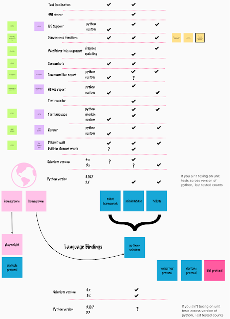

# Test Automation with Python, an Ecosystem Perspective

*Published 2022-10-17*  
*Source: <https://visible-quality.blogspot.com/2022/10/test-automation-with-python-ecosystem.html>*

---

Earlier this year, we taught 'Python for Testing' internally at our company. We framed it as four half-day sessions, ensemble testing on everyone's computers to move along on the same exercise keeping everyone along for the ride. We started with installing and configuring vscode and git, python and pytest, and worked our way through tests that look for patterns on logs, to tests on REST apis, to tests on MQTT protocol, to tests on webUI. Each new type of test would be just importing libraries, and we could have continued the list for a very long time.

Incrementally, very deliberately growing the use of libraries works great when working with new language and new people. We imported pytest for decorating with fixtures and parametrised tests. We imported assertpy for soft assertions. We imported approval tests for push-results-to-file type of comparisons. We imported pytest-allure for prettier reports. We imported requests for REST API calls. We imported paho-mqtt for dealing with mqtt-messages. And finally, we imported selenium to drive webUIs.

On side of selenium, we built the very same tests importing playwright to driver webUIs, to have concrete conversations on the fact that while there are differences on the exact lines of code you need to write, we can do very much the same things. The only reason we ended up with this is the ten years of one of our pair of teachers on selenium, and the two years from another one of our pair of teachers on playwright.  We taught on selenium.

You could say, we built our own framework. That is, we introduced the necessary fixtures, agreed on file structures and naming, selected runners and reports - all for the purpose of what we needed to level up our participants. And they learned many things, even the ones with years of experience in the python and testing space.

**Libraries and Frameworks**

Library is something you call. Framework is something that sits on top, like a toolset you build within.

Selenium library on python is for automating the browsers. Like the project web page says, what you do with that power is entirely up to you.

If you need other selections made on the side of choosing to drive webUIs with selenium (or playwright for that matter), you make those choices. It would be quite safe bet to say that the most popular python framework for selenium is proprietary - each making their own choices.

But what if you don't want to be making that many choices? You seem to have three general purpose selenium-included test frameworks to consider:

- Robot Framework with 7.2k stars on github
- Helium with 3.1k stars on GitHub (and less active maintainer on new requests)
- SeleniumBase with 2.9k stars on GitHub

Making sense of what these include is a whole another story. Robot Framework centers around its own language you can extend with python. Helium and SeleniumBase collect together python ecosystem tools, and use conventions to streamline the getting started perspective. All three are a dependency that set the frame for your other dependencies. If the framework does not include (yet) support for Selenium 4.5, then you won't be using Selenium 4.5.

Many testers who use frameworks may not be aware what exactly they are using. Especially with Robot Framework. Also, Robot Framework is actively driving people from selenium library to RF into a newer browser library to RF, which includes playwright.

I made a small comparison of framework features, comparing generally available choices to choices we have ended up with in our proprietary frameworks.

Frameworks give you features you'd have to build yourself, and centralise and share maintenance of those features and dependencies. They also bind you to those choices. For new people they offer early productivity, sometimes at the expense of later understanding.

The later understanding, particularly with Robot Framework being popular in Finland may not be visible, and in some circles, has become a common way of recognising people stuck in an automation box we want to get out of.
