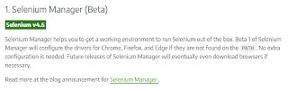

# The Browser Automation Newbie Experience

*Published 2023-02-17*  
*Source: <https://visible-quality.blogspot.com/2023/02/the-browser-automation-newbie-experience.html>*

---

Last week I called for Selenium newbies to learn to set up and run tests on their own computer, and create material I could edit a video out of. I have no idea if I ever manage to get to editing the video, but having now had a few sessions, writing about it seemed like a good use of an evening.

There are two essentially different things I mean by a newbie experience:

1. Newbies to it all - testing, programming, browser automation. I love teaching this group and observing how quickly people learn in context of doing.
2. Newbies to browser automation library. I love teaching this group too. Usually more about testing (and finding bugs with automation), and observing what comes in the way of taking a new tool into use.

I teach both groups in either pair or ensemble setting. In pairs, it's about \*their\* computer we pair on. In ensemble, it about one person's computer in the group we pair on.

The very first test experience is slightly different on the two and comprises three parts:

1. From empty project to tools installed
2. From tools installed to first test
3. Assessing the testing this enables

I have expressed a lot of love for Playwright (to the extent of calling myself a playwright girl) and with actions of using it in projects at work. But I have also expressed a lot of love for Selenium (to the extent that I volunteer for the Selenium Project Leadership Committee) and with encouraging using it in projects at work. I'm a firm believer that \*our\* world is better without competition and war, rather admiration and understanding and sustainability.

So with this said, let's compare Playwright and Selenium \*Python\* on each of these three.

### From Empty Project To Tools Installed - Experience Over Time

Starting with listing dependencies in requirements.txt, I get the two projects set up side by side.

| Playwright | Selenium |
| --- | --- |
| pytest  playwright  pytest-playwright | pytest  selenium |

I run pip install -r requirements.txt and ... I have some more to do for playwright: running playwright install from command line, and watching it download superset browsers and node dependencies.

If everything goes well, this is it. At time of updating the dependencies, I will repeat the same steps, and I find the playwright error message telling me to update in plain English quite helpful.

If we tend to lock our dependencies, need of update actions are on our control. On many of the projects, I find failing forward to the very latest to be a good option, and I take the unusual surprise of update over the pain of not having updated almost any day.

### From Tools Installed to First Test

At this point, we have done the visible tool installation and we only see if everything is fine if we use them tools and write a test. Today we're sampling the same basic test on [todo mvc app, the js vanilla flavour](https://todomvc.com/examples/vanillajs/).

We have the **Playwright-python** code

With test run on chromium, headed:

== 1 passed in 2.71s ==

And we have the **Selenium-python** code

With test run on chrome Version 110.0.5481.100 (Official Build) (arm64)

== 1 passed in 6.48s ==

What I probably should stress in explaining this is that while 3 seconds is less than 7 seconds, more relevant for overall time is the design we go to from here on what we test while on the same browser instance. Also, I have run tests for both libraries on my machine earlier today which is kind of relevant for the time consideration.

That is, with Playwright we installed the superset browsers with the command line. With Selenium, we did not because we are using the real browsers and the browser versions on the computer we run the tests on. For that to work some of you may know that it requires a browser-specific driver. The most recent Selenium versions have built-in SeleniumDriver that is - if all things are as intended - is invisible.

I must mention that this is not what I got from reading Selenium documentation, and since I am sure this vanishes soon as in gets fixed, I am documenting my experience with a screenshot.

I know it says "No extra configuration needed" but since I had -- outside path - an older ChromeDriver, I ended up with an error message that made no sense with the info I had and reading the blog post, downloaded a command line tool I could not figure out how I would use. Coming to this with Playwright, I was keen to expected command line tool instead of automated built-in dependency maintenance feature and the blog post just built on the assumption.

### Assessing the Testing This Enables

All too often we look at the lines of code, the commands to run, and the minutiae of maintaining the tool, but at least on this level, it's not like the difference is that huge. With python, both libraries on my scenarios rely on existence of pytest and much of the asserting stuff can be done the same. Playwright has been recently (ehh, over few years, time flies I have no clue anymore) been introducing more convenience methods for web style expects like expect(locator()).to\_have\_text() and web style locators like get\_by\_placeholder(), yet these feel like syntactic sugar to me. And sugar feels good but sometimes causes trouble for some people in the long run. Happy to admit I have both been one of those people, and observed those people. Growing in tech understanding isn't easier for newbie programmers when they get comfortable with avoiding layered learning for that tech understanding.

If it's not time or lines, what it it then?

People who have used Selenium are proficient with Selenium syntax and struggle with the domain vocabulary change. I am currently struggling the other way around with syntax, and with Selenium the ample sample sets of old versions of APIs that even GitHub copilot seems to suggest wrong syntax from isn't helping me. Longer history means many versions of learning what the API should look like showing in the samples.

That too is time and learning, and a temporary struggle. So not that either.

The real consideration can be summed with \***Selenium automates real browsers**\*. The things your customers use your software on. Selenium runs on the webdriver protocol that is a standard the browser vendors use to allow programmatic control. There's other ways of controlling browsers too, but using remote debugging protocols (like CFP for Chromium) isn't running the full real browser. Packaging superset browsers isn't working with the real versions the users are using.

Does that matter? I have been thinking that for most of my use cases, not. Cross-browser testing the layers that sit on top of frontend framework or on top of a platform (like salesforce, odoo or Wordpress), there is only so much I want to test the framework or the platform. For projects creating those frameworks and platforms, please run on real browsers or I will have to as you are risking bugs my customers will suffer from.

And this, my friend, this is where experience over time matters.

We need multiple browser vendors so that one of them does not use vendor lock in to do something evil(tm). We need the choice of priorities different browser vendors make as our reason to choose one or another. We need to do something now and change our mind when the world changes. We want our options open.

Monoculture is bad for social media (twitter) with change. Monoculture is bad for browsers with change. And monoculture is bad for browser automation. Monoculture is bad for financing open source communities. We need variety.

It's browser automation, not test automation. We can do so much more than test with this stuff. And if it wasn't obvious from what I said earlier in this post, I think 18-year old selenium has many many good years ahead of it.

Finally, the tool matters less than what you do with it. Do good testing. With all of these tools, we can do much better on the resultful testing.
