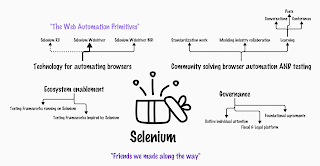

# Selenium is the friends we made along the way!

*Published 2024-10-28*  
*Source: <https://visible-quality.blogspot.com/2024/10/selenium-is-friends-we-made-along-way.html>*

---

Today, October 28th, is a relevant day. While it is [National Chocolate Day](https://www.nationaldaycalendar.com/national-day/national-chocolate-day-october-28) for our American colleagues, it is also the official date when we commemorate Selenium.

October 28th 2024 Selenium turned 20 years, and we celebrated the momentous occasion in an event lead by Pallavi Sharma, available on the [Selenium Project's YouTube channel](https://www.youtube.com/live/TO-ZCl2LZ50). On stage you could see Diego Molina and Puja Jagani from Selenium Project Technical Leadership Committee, and in the conversation bit in the end a balance of generations of leaders in the project: Jason Huggins, Simon Stewart, David Burns, Alex Rodionov, and myself. There was some generations of information wealth also in the YouTube chat and it was great seeing people connect for the occasion.

All of this made me reflect again on the marketing / communication confusion that is Selenium. What is Selenium, really? With at least three major milestones over 20 years in the technical architecture to solve a challenge of \*automating browsers\*, we keep having conversations along these lines:

- We should really talk about webdriver, because that is the current implementation and whatever we are doing with webdriver bidi, we will try to maintain the public facing APIs and do changes a layer down in the stack
- People still can't separate rc, grid and webdriver! And webdriver and selenium manager!
- Should I automate with selenium ruby or use Watir? Selenium python or SeleniumBase?
- Is it selenium if it uses the protocol and relies on browser implementing the protocol but not the components Selenium project makes available?

Today, the conversation reframed **what is selenium**. Selenium is **the friends we made along the way**. It is an organization and collective / community coming together to work on browser automation in a way where ownership is decentralized with carefully laid out governance.

  

When Selenium is the friends we made along the way and the organizational frame for making friends while solving a problem worth solving in an open source frame, it makes even less sense to compare it as if it was a tool.

In the box of Selenium for its birthday, we can find:

- Generations of technologies that are Selenium. Selenium RC. Selenium WebDriver. Selenium WebDriver BiDi. Selenium Manager. Selenium Grid.
- Community solving browser automation AND testing. Individually (because browser automation is not only for testing; testing in browsers is not only with Selenium) and combined. Solving includes projects to drive positive change with standardizing browser automation, showing exemplary cross-industry collaboration and openness. and having the entire community cross-pollinate ideas sharing them in conversations, posts and conferences.
- Ecosystem enablement. Things are powered by Selenium. Open source and commercial. And not only powered, but inspired. While the comparisons of Selenium vs. others seem to miss the mark on comparing apples and apple trees, Selenium powers a lot of the conversations.
- Governance, the structures that allow a project to outlive its creators and maintainers. Agreements that remain and keep it open, and agreements that help the project build forward in the fiscal and legal necessities that legal entities have.

With two years on the project, my contributions are on everything but the technology. And there's plenty of work on all fronts for us to do, so whatever your angle is, you are welcome to join us. Perhaps in a year, we can tell a more recent story of how someone got through a job interview with this community's help than the one we reminisced today from 10 years ago. I would want to see 10 of these stories a year.

Happy birthday Selenium. You are international community of brilliant people, the friends we made on the way. And our way forward continues, with more friends to make.
