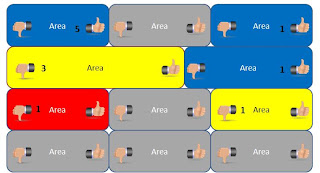
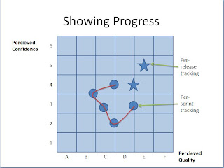

# Manual Testing Radiator

*Published 2011-11-30*  
*Source: <https://visible-quality.blogspot.com/2011/11/manual-testing-radiator.html>*

---

Two days ago Finnish Association for Software Testing - that I just happen to be the chairman for - had an Exploratory Testing Dinner. The idea is to eat and talk testing, with some volunteering to talk on a topic, and then let others join in.  
  
One of the three talks this time was by Petri Kuikka from F-Secure. He's my testing idol, someone I respect and admire, having worked with him for a few years at F-Secure. He shared a story on a manual testing radiator, that I just need to share with others even before they manage to put the system open source as they've planned.  
  
In the years I worked at F-Secure, I brought in borrowed idea of a testing dashboard, adapted from James Bach's materials. I introduced the idea of area architecture based reporting on two dimensions, Quality and Coverage. We used traffic lights for the first, and numbers 0-3 for the latter. In some projects, I used a third entity, best-before commitment, which basically was an arrow showing if we'd need to say I'll change my mind about quality due to changes by tomorrow / a little longer / relatively stable. To collect the values, I used to collect people into rooms for thumbs up / down voting, making the other's opinions visible and just learning to report feelings based data in a consistent way. I learned that power of a crowd outweights any metrics-based reporting in delivering the message.  
  
The problem that I never tackled but Petri and other current F-Secure employees have tackled, is keeping this style of reporting up to date, when you have continuous integration, with changes introduced from many teams, for areas separate and common.  
  
For the continuous integration build system, they have a status radiator for automated tests coming directly from the tool of their choice. If a build fails, the visual radiator shows which part is failing, and when all is well (as per test automation being able to notice), the whole picture of parts remains blue.  
  
The manual testing radiator does the same, but with a facebook-like thumb-voting icons. If a tester clicks thumbs up, that's counted as a positive vote. Positive votes remain valid only for a limited timeframe, as with continuous changes, if you did not test an area for a while, it's likely that you really know little of the area anymore. When several people vote thumbs up, the counts are summed and showed. Similarly, there's possibility to cast to kinds of negative votes. With the thumbs down icon, the tester gets to choose if the status is yellow ("talk before proceeding, concerns, bug report ID") or red ("significant problem, here's the bug report ID") . If a negative vote, even one, is cast, the positive votes counting goes back to zero. All the votes are saved in a database, this is just the visible part of it in the radiator.   
  

Another type of a radiator they use is showing progress on statuses on regular intervals. Like in battleship game, they mark down where they feel they are with product releases and end-of-sprint versions. This is to show that not tested does not mean not working, but it means we really don't  know. With scrum and automation, the amount of exploratory testing is still significant and guided by time considerations.   

  
Petri was talking about having the automated and manual testing radiators, on visible locations at office, side by side. I would imagine that causes positive buzz towards the results that exploratory testing can deliver, that are hard for the automation - assuming that there's stuff that exploration finds on areas that automation claims that is working fine.
