# Blog while testing, an experiment of a way to test

*Published 2015-06-26, updated 2016-08-02 · Labels: Exploratory Testing*  
*Source: <https://visible-quality.blogspot.com/2015/06/blog-while-testing-experiment-of-way-to.html>*

---

For a while, I've been struggling. There's a new feature I should test and even before I start, I feel bored. It's relevant but somewhat small (calendar months in development though). It's not obviously easy, but the moves that I would need to take feel too similar to what I always do. And whenever bored, I need to do something differently. So I experiment with blogging while testing.  
  
In the product I'm testing, there's an area we refer to as luminaire schedule. Simply stated, it is a view into luminaire's (lamps in layman terms) and their attributes, organized into different buildings. An inventory of to-be-physical devices and information on them. The area has been around a while. The new feature I'm just now getting started with is about sharing same luminaires for different buildings. Because design-wise, some buildings will just end up being identical and doing identical lists as copy paste will make it hard for the later maintenance.  
  
Just as I write this, I realize that the purpose the feature serves for its end users is maintenance of the information. They could easily copy-paste once, but change of mind in during design (they learn too) needs to happen with this feature. But during existence of the building, the luminaires may go their own directions, like someone changing a living room lamp in one building to a different one, but letting neighbors do their own choices of what and when. So the ability to turn it on and off for different design-construction phases will be relevant for the designer. I add these things on my mindmap and start thinking about reading the specification about this, deciding to leave it for later. I want to first think and explain what the feature is.   

[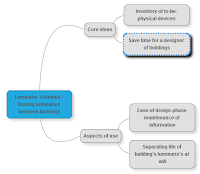](https://blogger.googleusercontent.com/img/b/R29vZ2xl/AVvXsEh2YTlewTmduUCGL0H3bv1hh2suoal3xvldrNWsGzEbkgCUmBRjomEFinatViOZgoI7G5InhKmeAy3SEV35nxzMvtuux1ZM5zGT64PaZkn_ONXUi3zwrGW8EPuxprE_rYOgl2aDrZK0t5I/s1600/2015-06-26+11_49_22-Luminaire+Schedule+_+Sharing+luminaires+between+buildings.png)

As my mindmap skeleton is set up, I move to take a screenshot of how the feature appears, just to explain it for this blog. Instead of the screenshot I intended to take, I take another one that I pass to my developers - environment is broken. And I take another screenshot of the same with less info, for the purposes of blogging.  

[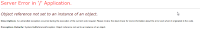](https://blogger.googleusercontent.com/img/b/R29vZ2xl/AVvXsEhnk05FMqX4g5TRCEQESTBCigJpPm3DJM60flAdyLi8CPAzPiqi9wf2_5jFRbuvV_C0dT02S9D4FWC4bLpkChqod7PZczT4Vlxs4Rr_5BzKj4DO0LHgySYwxiBuYS3UrdN-0D17ufN7uZY/s1600/2015-06-26+11_53_18-Object+reference+not+set+to+an+instance+of+an+object..png)

Seems everyone is out for lunch, and I think this is my cue to decide between two things I could do now. I could go to lunch and hope to continue after. Or I could think more about the feature without actually using it. I dislike the latter option, mostly because I have a strong preference to building my ideas of features while using it, and I almost always postpone reading about the feature to time I have already used it without instructions.  
  
Writing about it makes me realize there's a pattern I could just as well break for today. I go dig out the specification, and realize it is one page of text amongst 31 pages of description of other stuff related to this area. This makes me realize I'm highly likely to find a lot of problems about how this feature goes together with the other ones. And I make a note to myself about the idea that I will also need to go through the 30 pages for ideas of connections, but that I will leave for later.  
  
The spec has one picture of a new dialog this feature needs, and a bit of explanation. For purposes of blogging, I finally take a picture of how the user interface is. Simple: I just choose which buildings use same data. And there's no exceptions, it's all or none in the linking. But I see a new concept: first feature to connect to other properties and their buildings. That should be interesting source of inconsistencies as it breaks our current assumptions of how things get grouped.   

[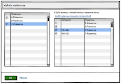](https://blogger.googleusercontent.com/img/b/R29vZ2xl/AVvXsEjOU0sWM4teVU1CotSneI8QWIDrJVfXLOhAlutdrNutY1coicDet5XXGKmq_cmU0MQbubEc4LZoWY0EiQD4C4MYv9l5AciuVy0KEf0SmqRFaVI_Oe_rWyl4PdULrBv9p3JD3sJfe5fxQe0/s1600/2015-06-26+12_02_32-Ohjelmistokuvaus+-+Ohjelmistokuvaus+Valaisinluettelo.docx+%2528vain+luku%2529+-+Microsof.png)

My train of thought with the spec gets interrupted, as it turns out I have found (with some other tests) a way of breaking our data so that login fails. I make a note of that on my to-do, need to isolate what I did in the last two days that caused that. I have a pretty good idea, but don't want to run for it right now. My notes allow me to do that also next week, I want to finish this today. So I start from a clean data, visiting our SQL database with a query to set up things as I want them.  
  
With the database set, I revisit my mindmap, updating my current ideas there.  
  

[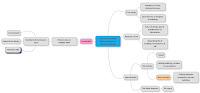](https://blogger.googleusercontent.com/img/b/R29vZ2xl/AVvXsEi5lus8y5GN8rjyYioMz4yuNAqfYWZxYYOjNrfeCAAYReUTmsoatv42yQepNxMpKX2dFaMNvFrbNZBRifXCLW-UDDqbdnEGa7gpNSkWwqf0WiStz9XqyfghgOM1u3C7f9pf4i8pUzMEDAo/s1600/2015-06-26+12_21_45-Luminaire+Schedule+_+Sharing+luminaires+between+buildings.png)

I get interrupted with a face-to-face question of what I'm doing. I explain I'm experimenting a with a new way of testing I call "Blog while Testing". As usual, I get a "Why?". I explain I feel bored and and as the asker is a developer, I get a usual answer of perhaps I should automate, if I do the same things. I explain that the "same things" are same activities on high level, where I feel alone, while the contents of the testing are very much different from all other features. I give him the example of what I just learned about linking properties, and that with automation-focused approach, I would not have anything ready for that particular perspective. He accepts my notion of automation not being the solution here, and I thank him for voicing out the idea so that we could clarify it.  
  
By this time, I realize that writing things slows me down but I feel more engaged and want to run through the experiment. But I need to break for lunch. Regardless of my intention to get up and go, I come back to make notes of the bug I need to isolate, as the theory of what it is based on what I have done is building in my head. I still update my mindmap.  

[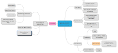](https://blogger.googleusercontent.com/img/b/R29vZ2xl/AVvXsEjX4ysOuvJDBvyNcwYfybO3clwvquONNGI6UB11m4X_nauNUcSvIff6GCiFQAGdgWE_rmqs371a-HKV06cmYxZR898qGrGJnfJe-9NXVK73WoegiPW7kP4BJBwT7puSUccMQ3VTXEWoVg4/s1600/2015-06-26+12_38_38-Luminaire+Schedule+_+Sharing+luminaires+between+buildings.png)

As I'm ready to continue, I remember more clearly than usual that I decided to look at the spec first. It doesn't give me much. There's a current and target state description. I learn that the dialog changes to a bit more complicated one. Looking at the new dialog, I'm immediately convinced that with ability to mix properties, I can get this messed up bad. I resist the urge to go try out that theory. I just make a note: "what if I link third to a pair". As usual, writing it down helps me keep myself focused where I was going for.  
  
I added some ideas about claims the spec has into my mindmap, and then tried logging in again. Turns out it still fails with fresh data. I would want to try again with restarted browser but since I don't want to close this browser right now as it has other windows, I mark down different browsers and switch the application to Chrome. I guess this is as good a reason as any other for switching browsers, I will anyway move between CG, FF, and IE10/11 before I'm done. I also add a bit about data (what data luminaire consists of), as the spec mentions data being copied.  

[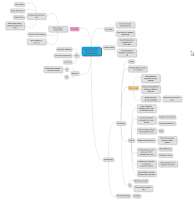](https://blogger.googleusercontent.com/img/b/R29vZ2xl/AVvXsEg77Ca_ngxIcM2Ew7joJNe5TTfUJi2lbrWBwqfLVg8idD0HApwxcIJqLVjZ95kRnAlbn__m3GL7QOabha1qIWKVwy9Qa5pWbHEhF3cZb1Gjswti8N4Uo7qniSKooin-S7R23cDf9rTkAaQ/s1600/2015-06-26+15_31_30-Luminaire+Schedule+_+Sharing+luminaires+between+buildings.png)

I know from past testing experiences with the product that there's clearly three different types of pieces.  And while I write this, I further split one of the types into more subtypes. I know I could get this stuff reading other specifications, but having worked with the product, a lot of the relevant stuff is already available to recall, if anything just triggers my memory. I remember a few types and feel uncertain if I forgot something, so I make a note to go check that later. I also remember there's a nicely hidden feature of three intertwined attributes that needs special attention.   

[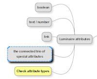](https://blogger.googleusercontent.com/img/b/R29vZ2xl/AVvXsEh_LwrOGmlNKbRq91m0wmUHtxWDVCR_3nZXHxU9MJaG-QeZXSrYrqeRe0VExxT-qGWdbQWUzikM4Z__waBkq5qnWnDLFsdW09qawwBHiqNFh4GcXcdN6J8T2VeNQ9OA-CyTy0y9bRI57m4/s1600/2015-06-26+15_35_55-Luminaire+Schedule+_+Sharing+luminaires+between+buildings.png)

  
I've looked at spec for just this feature, and my need of getting on the application again is getting urgent. I feel a little hindsight on my choice of first working on the spec, it's getting late and with the decision of first not using the application after there was the claim that it is now ok, I might have missed availability of developers. This might soon block my testing for real.  
  
I log in with fresh data and fresh browser and no problems yet. Time to find that new dialog. I have the starting data, with two buildings and no luminaires. On shallow UI level, I seem to be able to select one and link to the other. So far so good. I decide to start simple, the case where the designer links the buildings within same property without yet having any luminaires. I color my note saying this is where I am now just to remind me of what I was planning to do, and add a couple of other options I could start from. The nagging feeling is telling me that there's more than just these three, but I can worry about those later. I need to see if this works at all, now.  

[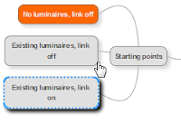](https://blogger.googleusercontent.com/img/b/R29vZ2xl/AVvXsEgpULD0s9qB1nVb9tQeMLGLtnaTOYpmi8wmDIgf46QuG3f-ovsrniGOSWlhyphenhyphenl8FO01Wesiv9gh21i02WqawsXFAvoYfS-3Zgu1mCFgBcsHB1FkJWX0bZQDpfCRXYPioA1PXlbOsrSfjWfc/s1600/2015-06-26+15_47_30-Luminaire+Schedule+_+Sharing+luminaires+between+buildings.png)

Linking, could have worked as in no error messages. But what happens now that I add a new luminaire, it was supposed to be same for both buildings. How does that show in the application? I realize I don't know, but I'm about to find out. I'm just about to do this, and thinking of taking a screenshot, I realize the UI speaks Finnish. It doesn't have to, so I'll just change it. And add languages to my mindmap of things to cover. I open the dialog again, to notice it's partially Finnish. I decide to log that in Jira. I write a title stating the problem "Unlocalized text in the new building selection dialog" and a quick note of description "check the picture". The screenshot I took I edited as I was taking it to mark the places I'm making a note on.  
  
As I was about to take another screenshot for this blog post, I realized there's Finnish text that is from the fact that the data I use is Finnish. I consider starting a new property with different data, but the blogging cannot distract me that much. And with that thought, I realize there must be a problem when we mix properties and links between two properties that are started with different language data - and nothing to block that. I add the ideas to my list of things that could go wrong with the new kind of concept. I also realize it's hanging on top as I process my ideas, and I compare instinctively anything to it to find out new ideas.  
  
I take the pictures. Here's what the dialog looks like - similar enough to my spec. I can't resist clicking on the link I decided to leave for later, just to see what opens there. And with 30 second wait, I first look at the frame of it and finally see also the data.  
  

[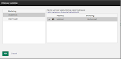](https://blogger.googleusercontent.com/img/b/R29vZ2xl/AVvXsEio0UAi9Avsd5UqIhPq6Cqe9HDgctMgxyZ1RjHJOH4JCkOmclVX2N_xV2sWWIigoXMGoJ-k-4VKP2x7HKLGrFuWywpmej4fpZzD0ou_b83aIGMQm1ehJ0XCRjJlzbypd2XL5_R83J95E2U/s1600/2015-06-26+16_02_45-H66666.P000+%25C2%25A0_%25C2%25A0+Granlund+Designer%25C2%25AE.png)

[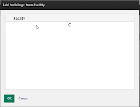](https://blogger.googleusercontent.com/img/b/R29vZ2xl/AVvXsEgZVuWPK9TfOmmm7EKvNuF4EZaPWBDkYArsOXLh1r9GiISzkUvyh1ZJkAi1ReOUADGDRC6Gh_qz3XxBY5GuLIPrpgZYASUzQ3ZTm6YAJzT5aLVCNdFoiDnTrab_GLVupEWD6PUqJiyHGhc/s1600/2015-06-26+16_03_10-H66666.P000+%25C2%25A0_%25C2%25A0+Granlund+Designer%25C2%25AE.png)

  
The second dialog and the wait for it at time when I'm on my shortest patience leads me to log another issue requesting a new feature: this needs to have paging. We can't load all buildings at once. And I need to be able to search the list. Why? Because these features reflect principles we have elsewhere in the application.   
  
I decide to spend time logging those requests now, as two separate things. But I end up writing them both on the same issue. And I decide that while I'm not going to work on this session that much longer today, I will want to see if even the basic thing works as the spec claims.  
  
I add my first luminaire. Position 1, just one text attribute with content being the name of the attribute and I click ok. I notice I'm expecting a visible error message any moment, as I feel almost surprised when there is none. But I realize I still don't know if this worked. So I have this for a building. What is there for the other building? Changing buildings I find out - nothing. Hmm, I could expect this, seems plausible. But now what if I add with the same position? I add same position but another attribute, same principle on naming my data. And this seems to work too. I'm puzzled. I go check if the buildings were linked - they were. So something is off.   
  
I change to the other building to realize the data there is as I just changed the second building to be. So my expectation could be off. I was expecting a popup of some sort that would warn me. I go back to read what exactly did the spec say. This is not correct. But how it is not correct isn't obvious.  
  
The spec states that when adding a new luminaire, you go fetch the other building's same position information. No fetching I could see as user, but it was fetched in the sense that the other got overwritten. The spec states that when updating the luminaire - which is sort of what I could be doing here except I don't see anything on the visible list that I'm updating, it's "hidden" - the update goes with the latest owner. But buildings are not really owners in our terminology. I make a note talk to team about how the owner concept has been used in implementing this, or check the code. But later.  
  
I decide the problem as I would state is is the fact that there's a hidden list of luminaire's which confuses the user. I decide that based on all the things I know on how we do things. It would make sense rather to show the luminaire's that exist through linking, as opposed to get the information as I'm adding a position number in the add dialog. If that would be the place for the functionality, it would be dependent on what information the user first enters on the dialog - complicated. But bringing the luminaire's visible isn't complicated. I ponder a moment between "unfinished work" and "program improvement". We do both anyway, the latter just have lower priority. I decide this is more of an unfinished work type of thing, as we see things.  
  
With this problem, I realize there might be more of a problem when I have created luminaires on two buildings and never edited them on other and I unclick the linking. Or if I have changed them in the other, will the buildings end up having the right luminaires at that point? I make a note of that. And I take another picture of my mindmap.  

[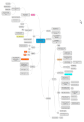](https://blogger.googleusercontent.com/img/b/R29vZ2xl/AVvXsEgF_E16pXEgHUx66nAMgmnI4o9B0mq4lliRQ-_EtJD89OaE56deFFRkhgqCOfasvS9ogqv5zZuWs38Iy1afRsmI6kQa4mj0vBPITKNsJ6ABXhYexkUO4eJ9lOQwQXWBoXyAht9qTh8b-Cw/s1600/2015-06-26+16_49_48-Luminaire+Schedule+_+Sharing+luminaires+between+buildings.png)

  
I've been painfully aware how long this post has been getting, so I decide to wrap it up. A little reflection is still in order.  
  
**How did this work for me?**  
  
My highlights of this testing are:  

- Being blocked from use of the application directed me to specification
- I felt awful spending much time on spec (low info, low value) as opposed to spending time on the application and felt sorry for people who have to write test cases before they test.
- I was aware of doing things in a different order and making more active choices on that
- Automation would have had little to do with the boredom of repeating this activity again
- I should have had so many of these discussions earlier before implementing the feature, it comes back whenever we have an excuse not to do that. But it's never too late.

Blogging while testing makes me more analytical than I really am. I explain things I normally wouldn't explain, and I'm not convinced that all of my explanations of what and how I think are actually true. Humans have the tendency of coming up with a rationalization even if there wasn't one.  
  
It clearly changed how I felt about getting on this feature. I had more fun. I know I'm not \_really\_ more connected by writing about this, but I feel I am. I feel just a little less alone. I'm guessing, as I have no comparison data. But I'm guessing that with
how little motivation I had for this feature when I was getting started
and how much more I have right now, I tested better today this way. Even though writing slowed me down and was away from time I could have used on testing. For
now. While this experiment is new and fun. It stopped me from procrastinating to
twitter, and kept me on the thing I was supposed to work on. I can
imagine a lot of other techniques that could give me that. Change suits me. It makes me energetic.  
  
There were many realizations about how things link. The session was focused on identifying what is there and I just scratched the surface on actually testing it. The writing of what I think about slows me down, as expected. But I did not expect that slowing down seemed to stop me in ways that enabled coming up with ideas I usually come up in different settings, with more effort and focus on them. Slow leaves room for thinking. Writing formalizes the way I think.  
  
I love the fact about my work that I can do this. I can share. That adds to my motivation in general.   
  
It would be great to compare notes with other testers on how they think with similar testing problems. Real products. Anyone up for that?
