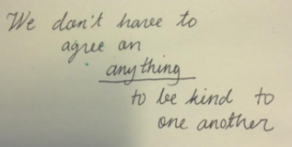

# Away from Fear:  Kindness-driven dialogue-oriented testing community

*Published 2015-08-09, updated 2017-07-22*  
*Source: <https://visible-quality.blogspot.com/2015/08/away-from-fear-kindness-driven-dialogue.html>*

---

I don't want to be afraid. And even more, I don't want people around me being afraid. Fear is all too common in the world of testing I live in. Fear of dismissal. Fear of bullying. Fear of being put to one's place. Fear of not being right with limited experiences.  
  
I've stayed off some agile stages with the fear of being put to my place about my views on automation.  I've built specific styles of presenting experiences to feel safe with the context-driven testing thought leaders. But the fear goes outside stages. It's fed on social media.  
  
Let me give you a specific example. Last week, I saw this tweet.  
> Take Your Career to New Heights with ISTQB Certification - <http://t.co/Fk30a6lnCH>
>
> — SoftwareTestingClub (@testingclub) [August 6, 2015](https://twitter.com/testingclub/status/629300757846593536)

It's clearly an ad. Ad amongst all the other tool adds I have a tendency of dismissing. I dismissed this one too. Until a reply got into my tweet stream. I started looking at it more. I saw comments like "Hacked?" and "You must be kidding, right?". I continued looking into [STC discussion forums and found more](http://www.softwaretestingclub.com/forum/topics/istqb-ads) examples unkind approaches.  
  
It's amazing how many people start a conversation with me as I identify as a context-driven tester by apologising that they have an ISTQB certificate because they have been trained to believe they don't "belong" if they admit to having it. Liking it is even worse. I too format my two ISTQB certificates as "I have them but find them useless". I would perhaps offer my views on its usefulness, but it hardly defines the person I'm talking with.  
  
To feel you belong in context-driven testing community, there's more no-no's than ISTQB. There's test cases. There's vocabulary that calls automated tests checks. These are strong beliefs, that I too hold, but that I wouldn't want to get in the way of collaboration and communication.  
  
Context-driven testing with its rules of what is appropriate is a cause of fear. I've started to observe this fear in myself. It manifests in me second-guessing things I said without a proper reference (everything could have a reference, there's hardly anything original in this world). It makes me overreact to facial expressions of certain experts during my talks when they are in the audience. I'm afraid, clearly.  
  
I see the same fear in others as almost compulsive-obsessive mentioning of the key names like a mantra, so that their talks are really about other people and their own great messages get diluted.  
  
Recently, I've heard the same fear cited as a reason for stopping great people from getting up on that stage in the first place. This one makes me particularly sad.  
  

#### Kindness is the key

On a day I was particularly frustrated with agilists telling me that my tester job should not exist anymore, I posted my new guideline on twitter.  

  
We don't have to agree. But we have to take the other as a person that deserves to be treated kindly, regardless of our differences of opinion. Telling me personally I should go away from software isn't kind. The discussion could be about unlabeling what I do and finding out if there's still value with a specific mix of things I contribute.  
  

#### Dialogue culture

Context-driven testing builds on the notion of "debate" and scientific principles. Without kindness, debates turn into argument and not actual dialogue. Peter Senge in his book 5th Discipline distinguishes between dialogue and discussion. The first aims at mutual learning. The latter is about finding the best viewpoint in a group and enforcing that on all participants. Dialogue requires suspending own views in search of the truth, and listening deeply to each other.  
  
Let me give you an example of what makes our debates discussions and arguments. People I respect come out of those discussions with a message that they "don't belong to the context-driven community", and are blocked from participating in discussion forums identified as context-driven. There's an impression that people recite in conferences that context-driven testing is an elitist circle that controls opinions of it's members and is quick to kick you out, should you disagree. The context-driven school has become a label of bad behaviour some of us need to avoid.  
  
I've been reading a book ['Argument Culture' by Deborah Tannen](http://faculty.georgetown.edu/tannend/book_argument_culture.html). The key takeaway for me from it is that I do not want to be in war against the people who have opposing views. I want to have a constructive dialogue. We can agree to disagree, and still treat one another with kindness. We should encourage people having differences of opinion, instead of telling which opinions are not good enough. Argument has an implied meaning of one being right and the other
being wrong, and only a mild undercurrent of changing one's mind if the
opponent comes up with good enough arguments.  
  
People shouldn't have to keep their experiences to themselves for the fear of having a disagreement. We should be kinder in our disagreements and treat people with respect.  
  
I'm still a context-driven tester. I look at the practicalities of where I am, and adopt my testing to it. Saying ISTQB has been good in some contexts I've been in does not make me any less of context-driven. I've chosen that label, it has not been assigned to me. So, the CDT leaders cannot take it away from me. Right now I'm thinking that label has more bad than good, but I will let that thought build up some more before deciding on taking action.  
  
I belong to the kindness-driven dialogue-oriented testing community. If that is different from context-driven, let it be.
