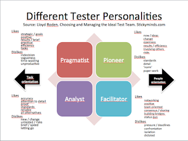

# Let me be myself - all testers are not the same

*Published 2015-09-22, updated 2016-08-02 · Labels: Exploratory Testing*  
*Source: <https://visible-quality.blogspot.com/2015/09/let-me-be-myself-all-testers-are-not.html>*

---

This year, I noticed that on one of the conferences was offering a workshop on Myers-Briggs type indicator for finding out about your natural style / personality, and how that might affect your style of testing. As much as I dislike the idea of thinking as a manager that the type really would tell you what one of the people you coordinate would do, I really like the idea of trying to understand oneself. In your journey to self-understanding, tools like this may be helpful, while they don't give you ready answers.  
  
I was typed as "ENFP". Through those letters, I learned that I have typical patterns of what I lean towards, and I found understanding my stress reactions typical for the type particularly useful over the years in learning to work better with others. I also learned that a "typical tester" would be just opposite, and have tried to keep that in mind when assuming testers should be like me - they typically are not. I also later learned that in strong voices of exploratory testing, there's others who are typed same as me.  
  
My first thought on noticing the session at the conference was that this is again the same old stuff. But right after that came the realization a friend of mine gave me, that is turning into a bit of a mantra now.  
> The software industry doubles every five years. It means that half of us have less than five years of experience.

What's same old and obvious to me, might be something we've stopped talking all in all in the field amongst those who have been around a little longer.  
  
Myers-Briggs is kind of complicated, and I recall reading five books on the topic on my journey back then. I've used a simplification of similar ideas by Lloyd Roden that groups testers into four categories. As I went googling for [the reference](http://conference.eurostarsoftwaretesting.com/wp-content/uploads/t15cover.pdf), I came to realize this is from 1999 and as valid today as it ever was.  
  
Lloyd looks at the then popular writings about personality types, and finds four tester profiles he names Pragmatist, Analyst, Facilitator and Pioneer. Within these, I'm a pioneer.  I went to dig out the summary slides I've done when reading the article while being a researcher.  
  

  
I recognize myself from what the Pioneer is said to like/dislike, as well as can identify with the list of things a pioneer is good at:  
  

- Be good at exploratory testing / bug-hunting / error guessing
- Be good at challenging and improving things to make things more efficient and effective
- Enjoy GUI-type of testing / lateral testing
- Have good ideas
- Be good at brainstorming ideas on what to test
- Share ideas about different ways to approach testing
- Identify and take necessary risks when required
- Have creative ideas on how to test to find more bugs

With growth mindset, this does not define what I can do, but it could show what my natural tendency to gravitate towards is. And a working theory of mine is that people who want all testers to be automators most likely are not "like me" in personality and background. If that would be true, with automation emphasis we're redefining certain personality types of out of our recruitment patterns. I can just hope my working theory is incorrect. And if I ever have the time and energy, actually go and research my working theory.

I named the blog post after a song that played in my head this morning with yet another batch of people encouraging me into automation: [Let me be myself](http://www.metrolyrics.com/let-me-be-myself-lyrics-3-doors-down.html). I want to let others be themselves too. There's no one tester. There's a lot of great, diverse people with personalities and interests that compliment the others. With software running the world, we can't leave people out from the revolution, we need to learn to be more inclusive and stop trying to find the one perfect profile that should not exist for the bigger picture.
