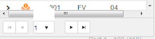

# A bug that taught that we're implementing too much

*Published 2015-10-28, updated 2016-08-02*  
*Source: <https://visible-quality.blogspot.com/2015/10/a-bug-that-taught-that-were.html>*

---

There's a bug we've been analyzing that is emphasizing things in a relevant way.  
  
At first sight, it appears to be just a resizing / layout issue. An extra white box that emerges when you resize your window.  
  

At first, we let time fly by with the high-level discussion between two developers on what could cause it. One, responsible for styles appeared convinced it would require functional changes to fix it. The second, responsible for technologies appeared convinced it would require style sheet changes. With the unclarity on needed skills, it wasn't going forward while the second person did not have time to jump in.  
  
Finally the two paired up and started investigating. I felt very proud looking at them triangulating the cause by removing factors and simplifying the problem to understand it better. No rushed "let's try this" or "maybe this would fix it", but building an understanding before jumping into conclusions more. We had already our share of conclusions aired while not investigating deeper and speculation isn't the right thing here. They removed all self-built styles from the component we're using, and the problem disappeared. So we now we know the second developer was right.   
  
The main insight, however, is the discussion our team ended up with next. We realized there was hundreds of lines of style code (in Less) that made very small changes to the (relatively nice) styles the commercial component ships with. And our aspiration to tweak all the details of the layout was causing us to use, repeatedly, a significant amount of time testing, debugging and fixing problems. What if we would redesign our approach to styles from maintainability viewpoint, how would that change things? What if we actively would have less of implementation, since many of the tweaks in styles are not driven by the end-user value but the possibilities of all the things we could do.  
  
From a small fix, we're going into a shared work of **creating less software to maintain**. I find this way of thinking insightful to enough to note down and share. We're a small team, we can't afford to not react on maintenance burden.  But it has been a long route of added collaboration and shared ownership to get to a point where these discussions and lessons naturally emerge, and are taken forward.  
  
Is this testing? I might think so. It's all of my business to bring forth the cost of testing complicated structures to get them simplified.
