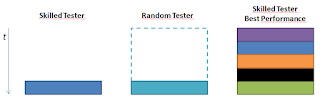

# Testing isn't testing: A story of Skilled vs. Random Tester

*Published 2016-02-25, updated 2016-08-02 · Labels: Exploratory Testing*  
*Source: <https://visible-quality.blogspot.com/2016/02/testing-isnt-testing-story-of-skilled.html>*

---

You know, testing isn't testing. Sounds weird, right? So let me try to explain a discussion I seem to be having over and over again.  
  
There's two people, and both of them could do testing on the exact same thing. Let's say one of them is a skilled tester - which is someone who is really paying attention to how you learn using a software product as external imagination - and the other is a random tester. The random tester might be good, but she is not the same as skilled tester, not unless focus is on learning to test great.  
  
The random tester often is a developer, doing her end-of-development testing to the best of her abilities. And those abilities might be great, and the overall result well worth being called good enough.  
  
When we then compare the "final testing" of a skilled tester and random tester, there seems to be this mysterious magical idea of skilled tester just being dropped in and doing their best performance. But, since the skilled tester learns in layers, the first time testing at the end of development isn't going to be the best performance. There's layer after layer to get deeper, and each layer provides useful results - just not the same.   
  

  
Some managers still let skilled testers be around a little in the end, and confuse a good performance with the best performance. And many testers still confuse the Skilled Tester's good performance to the Random Tester's Best Performance, in particular when there's always an aspect of testing and learning even when you decide to all it "programming".  
  
If you're serious about good quality, you'll want to enable the Skilled Tester's Best Performance. The Skilled Tester's good performance happens somewhere along the line, but the final show with the final results is the best you can get from her. The best performance happens at the end, after rounds of learning and practice.  
  
So testing isn't testing. Performance and output from such a performance varies greatly. Random testers do a great job, and some of them are very close to skilled testers. It's a question of motivation and focus.   
  
And if you wondered why this? I just had yet another encounter with someone who thinks they get to buy my best performance without practice. Because skilled must mean packaged, like a machine.
