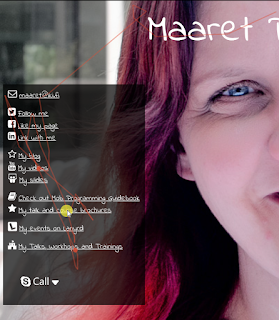

# Spying on users - a new form of usability testing

*Published 2016-04-26, updated 2016-08-02*  
*Source: <https://visible-quality.blogspot.com/2016/04/spying-on-users-new-form-of-usability.html>*

---

There's all sorts of production monitoring tools we've been using, but I recently run into something different I've been looking into tonight. The tool is called [Hotjar](https://www.hotjar.com/) and a friend introduced it to me as a tool for usability testing. With the tool, you can see for each user in video format their mouse movements and clicks, and can build more fine-grained ways of analyzing when your users lose engagement on your pages.  

How much of a spying tool this is became clear to me today as I went and checked for the first time the recorded uses of my personal landing page.  

The red line traces the mouse movements. The red dots indicate clicks. I see what devices and browsers my visitors have used, and how long they've stayed.  
  
Following what my users saw I can test different screen sizes and devices with eyes of my users, without setting the environments up myself. Doing this early on (and fixing), I could prune out problems through testing in production, annoying a limited number of users but coping with my limited ability to cover different combinations.  
  
For now, I'm just blown away with this. And needed to share. I reserve my right to change my mind as always, but for now, I'm just excited.

(function(h,o,t,j,a,r){
h.hj=h.hj||function(){(h.hj.q=h.hj.q||[]).push(arguments)};
h.\_hjSettings={hjid:183445,hjsv:5};
a=o.getElementsByTagName('head')[0];
r=o.createElement('script');r.async=1;
r.src=t+h.\_hjSettings.hjid+j+h.\_hjSettings.hjsv;
a.appendChild(r);
})(window,document,'//static.hotjar.com/c/hotjar-','.js?sv=');
