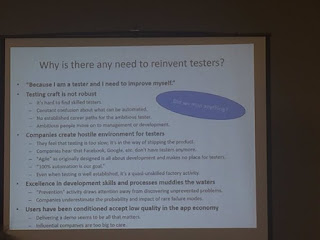

# Need to reinvent testers?

*Published 2016-05-17*  
*Source: <https://visible-quality.blogspot.com/2016/05/need-to-reinvent-testers.html>*

---

James and Jon Bach are delivering their course on Reinventing Testers as of now, and as I'm not there, I can only rely on the glimpses twitter has to offer with #MakeTestingGreatAgain.   
  
One of the first things that caught my eye is a slide on Why is there any need to reinvent testers?  
  

  
**Point 1: "Because I am a tester and I need to improve myself"**  
  
Ok, so I am a tester. I'm not a tester just by role, I'm a tester by profession. I'm a tester by identity. I've been a tester for 20 years and it's (professionally) all I know how to be. I feel uncomfortable when I was last Friday referred to by a customer representative as being "the programmers".  
  
There's two ways for me to work on this.  
  
**Option 1**. I can decide that what I am is what I am and that is not going to change. I can (and have) apply job crafting to reinvent tester to be whatever I want and am able to do. So far I've crafted my job as a tester enough to have other testers (and in particular researchers of testing) tell me that I'm not a tester.   
  
**Option 2**. I can work on changing my identity. I've already been working on confronting my love of the tester identity by representing myself as something else. I've joined hackathons representing as a programmer. I've deliberately joined discussions with groups that don't know me representing a business person (easy to fool people because as a tester, that is a core to what makes me so good), a UX specialist (not that hard either, I've always cared about design and it's an area of testing feedback), a programmer (needs interest in technologies and some knowledge, but surprisingly many programmers know very little as well) and a project manager (like a business person, but simpler as the world of opportunities is narrower). No matter what I represent, I'm still me. And all this experimenting has given me new found respect for what I am and that it is useful. I don't have to be a tester to be a tester.  
  
I believe that a deliberate focus on things we label "testing" is what made me the tester I am. Earlier in my career, I could have ended up developing different traits than what I find useful as a tester. I could have chose not to stare at the screen while testing, listening to my inner voices telling me what I observe and deduct. I could have been tempted to take the easy route and just manage testing when I chose to dig in deeper in doing it. I could have fallen in love with code and let it take me as it has taken my colleagues. I saw people like me model after other people than I chose to model, and end up not so great at testing. It takes deliberate practice. And hours are limited, until you look at the hours on a long enough timeframe.  
  
I've started to see that with Option 1, I'm like a fireman at the time when sprinkler systems changed the world. I'm ready to become an arsonist or encourage people to being arsonists just so that I would be needed.  
  
Testing is important skill, but it's a skill that no longer belongs to just testers. We have found ways of making the need and pacing of testing very different (agile & the business environment change). I find it necessary to challenge the status quo now, but rewriting things back to the "good old days" isn't my choice as of now.   
  
I agree, I need to improve myself. But what the improvement means lies my disagreement.  
  
**Point 2: Problems: Craft, Companies, Programming, Expectance of low quality**  
  
All these problems are problems in the industry, with a large enough sample. Within the sample, there are examples of places where these are and have been addressed. Could it be that the ones within the realms of agile actually have found ways of doing things better and actually reinvented testers in a way that the masses are just not ready to accept.  
  
I wish I would have been blogging longer, and I could show you in detail how my perspectives have changed. I've lived through things in my own project at work. I haven't just analyzed it from afar, but taken change of it as my personal responsibility - with my team and my organization.  
  
In a way, I don't care about the industry. I've seen that within the industry, there are companies that do it better. How about opening up the channels to *truly listen* to those who work with this, and stop telling them that their experiences must be incorrect because of someone else's experiences.  
  
It was supposed to be *context-driven* testing, what happened to context when defining and discussing this stuff? We lose context, and muddle the waters by combining the worst of the industry as a motivation on how we, as the profession of tester need to improve.  
  
No thanks.  
  
(Note: I'm not open for a debate on this. Debate, as it happens in the testing world is a form of bullying and I claim my right to not engage in needing to defend myself. Instead, I'm open to a dialog. If you really care about *why* I feel the way I do and what are my experiences that make me feel the way I do, I'd love to work on those. Or if you want to explore on *why* you feel differently and how your experiences differ from mine. I want both of us to respect our varying experiences that define what we see and emphasize.)
