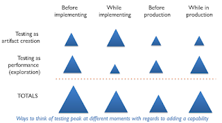

# Programmers make great testers

*Published 2016-06-03*  
*Source: <https://visible-quality.blogspot.com/2016/06/programmers-make-great-testers.html>*

---

Patrick Prill published a throughful, and heartfelt blogpost on [Reinventing Testers and Testing Prepare for the Future](https://testpappy.wordpress.com/2016/06/01/reinventing-testers-and-testing-to-prepare-for-the-future/). Read what he said, there's so much good in that.  
  
There's a piece I want to write on more on in that blog post:  
> As a tester in the role as tester, used in the right situations, I can
> provide value to the project only I as tester can provide. And I don’t
> want to give up my role as a tester. I want to continue asking
> questions, experimenting with the system, analyzing strange problems, I
> don’t want that to go away.

These words could almost be mine. On some days, they are exactly like words I use. But when I use them, I recognize that for me, those phrases are grounded in fear. And justifiably, I'm afraid of not getting to do the job I love. I'm afraid I wouldn't at some point find work in which the management understands the immense value I provide because they'd worry about developers giving up on their quality-responsibility for just mere existence of someone like me.   
  
However, I see programmers asking questions - better questions even - than me, and it fills me with delight. I see programmers experimenting with the system and showing genuine curiosity. I see programmers analyzing strange problems, using debugging tools to deeply understand what is going on. I see programmers doing brilliant testing, changing perspectives, realizing new stuff. And I don't feel fear of losing my work, but I feel pride in enabling other people to get to enjoy the stuff I've enjoyed so much. And I feel delighted when they identify tedious points of doing this and add automation to help out with that.   
  
I'm proud to be a tester. But I'm more proud that my programmers are testers too.   
  
I recently met with a tester, who was waiting or coming up with other simple tasks while she couldn't test. The discussion reminded me on the fact that even with my programmers testing very close to my skills, there's so much work on feedback that there's always stuff I could propose to contribute on. (Actually, just contribute. Ask for forgiveness, not permission).  
  
Now that we release daily, there is no more testing phase, but the whole life is a testing phase and for all of us. There's always the view of testing as artifact creation (giving us spec, feedback, regression and granularity) and the view of testing as performance/exploration (giving us guidance, understanding, models and serendipity). The views and deep skills to those views peek at different times with regards to adding a capability for the software. We test continuously.   
  

  
As a tester, I've spent a lot more of my time with things some people like to call "shift left". But since this is all a cycle, there's no more right or left, really. While in the past as a tester, my main contributions were on tasks with focus on exploring before production (letting the software speak to me) and contributing before implementing, now my focus is more on exploring while in production, with help of metrics and insights supported by patterns of real use. I get to do more while implementing when we mob too, and absolutely love the half-sentence picks that save us hours and days without programmer ego in play.  
  
  
I believe we need new ways of explaining what is the "testing" we speak of. Because it is more of testing as performance. The performance feeds the artifact creation. The artifact creations constrains the performance - often unnecessarily.  
  
Learning in layers - testing as performance - takes time. The time taken is what makes some programmers bad at testing as we know it. Time comes from outside as well as from within.  
  
I will do whatever I can to make sure we enable the programmers that see big picture and work wonders. Enforcing a tester role, and founding it in arguments of fear has not helped me. Enforcing understanding of testing has. When I speak of my fear, I get helpful responses. When I set up defenses and claim I'm not afraid, I feel attacked.
