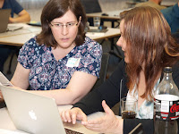

# When two testers meet

*Published 2016-06-21, updated 2018-12-26 · Labels: Pairing*  
*Source: <https://visible-quality.blogspot.com/2016/06/when-two-testers-meet.html>*

---

Last Saturday, I participated a Code retreat in Vienna, Austria. I wanted to share my favorite moment of the day: meeting another tester.  
  
In a code retreat, we practice programming implementing Conway's Game of Life in pairs with Test-Driven Development and various types of constraints (like data structures, frequency of checking in required, style of pairing). A day fits typically 5 sessions and thus 5 pairs.  
  
I had just finished my first session of the day and a morning break was called, when one of the three women amongst the 25 participants approached me. She had learned that we were both testers, and we set up to pair together on the problem in the next session.  
  
I had great time programming with her. It was one of these experiences some folks tend to refer to as "Reese's pairing" where both parties have ingredients that make the result great but neither has the complete set of things.  

*\*\* In case you don't know, Reese's are peanut butter + chocolate, an american candy that was advertised as a lucky accident of bringing two great ingredients together to make something even  better. I wouldn't know as I'm neither American or able to each anything with chocolate.*  
  
There were pieces I could bring into the puzzle from past code retreat experiences. With her, I pushed for trying out ApprovalTests and I really liked the way our domain model ended up in the classes. I learned a lot I could use in the later sessions of the day too.  
  
Later in the afternoon, we were sitting with a small group. We got back to the discussion about both of us being testers. My pair was a tester specializing in Java test automation. I was a tester specializing in exploratory testing. What we do for our work has little in common, yet we're both testers to others.  We also work in very different contexts as per ratio of testers to developers and resulting assumption of who would contribute what in the development work.   
  
When two testers meet, it's good to remember that we're not all the same. And instead of us arguing on the essence of which one of us is a true tester, we can just add labels to explain our difference.
