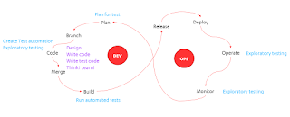

# Testing in the DevOpsian World

*Published 2016-10-20, updated 2018-12-26 · Labels: Agile*  
*Source: <https://visible-quality.blogspot.com/2016/10/testing-in-devopsian-world.html>*

---

There is an [absolutely wonderful blog post](https://danashby.co.uk/2016/10/19/continuous-testing-in-devops/) that describes Dan Ashby's reaction to being in non-testing conferences that seem to make testing vanish. The way Dan brings testing back is almost magical: testing is everywhere!  
  
At first, I was inclined to agree. But then I decided to look at the DevOps model with more empathy for the DevOpsers and less for the Tester profession, I no longer did.  
  
The cycle, as I've experienced it with the DevOpsers, is used to explain continuous flow of new features through learning about how the system works in production. It's not about setting up branching systems or strategies. It's not about questioning the mechanisms we use to deploy multiple times a day - just the delivery of value to the application.  
  
I drew my version of the testing enhanced model:  

In this model, testing isn't everywhere. But it is in places where DevOpsers can't really see it. Like the fact that code is much more than writing code, code is just end result of what ever manual work we choose to put on the value item delivery. All the manual work is done in a branch, isolating the changes from whatever else is going on, and it includes what ever testing is necessary. With a DevOpsian mindset, we'd probably seek even exploratory testing at this point to be driving the automation creation. But we wouldn't mind finding some things of oops where we just adjust our understanding and deliver something that works better, and while some portion of this turns into automation, it's exactly same as with other code: not all things thought around it are in the artifact, and that is ok, even expected.  
  
But as we move forward in the value delivery cycle, we expect the systems to help us with quick moving to production are automated. And even if there is testing there, there's no thinking going on in running the automated tests, the build scripts, deployment scripts and whatever is related to getting the thing into production. Thinking comes in if the systems alert on a problem, and instead of moving forward in the pipeline, we go back to code. Because eventually, code is what needs to change to get through the pipeline, whether it's test code or production code.   
  
On a higher level, we'd naturally pay attention to how well our systems work. We'd care about how long it takes to get a tested build out, and if that ever fails. We would probably test those systems separately as we're building them and extending them. But all of that thinking isn't part of this cycle - it's the cycle of infrastructure creation, that is invisible in this image. Just as the cycle of learning about how we work together as a team is invisible in this image.  
  
However, in the scope of value delivery, exploratory testing is a critical mindset for those operating and monitoring the production. We want to see problems our users are not even telling us on, how could we do it? What would be relevant metrics or trends that could hint that something is wrong? Any aspects that could improve the overall quality of our application/system need to be identified and pushed back into the circle of implementing changes.  
  
I find that by saying testing is everywhere, we bundle testing to be the perspectives tester thinks testing is. A lot of activities testers would consider testing are design and proper thinking around implementation for non-testers.   
  
By bringing in testing everywhere, we're simultaneously saying the model of value delivery is extended with elements of   

- Infrastructure creation
- Team working practice improvement

And it's natural we'd say that as testers. Because, those all are perspectives we consider part of what a tester facilitates. But are they testing of the application and does testing need to go everywhere on a model that isn't about all things development? I would disagree.   
  
My feeling is that the tester community does a disservice to itself saying testing is everywhere. It's like saying only things we label testing make it good. Like things programmers label programming or code wouldn't have same potential.  
  
To stay in the same table discussing and clarifying what truly happens in DevOpsian world, we need to consider speaking in the same scope. Well, I find that useful, at least.
