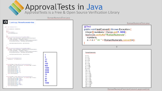

# From appreciation of shallow testing towards depth

*Published 2017-03-24, updated 2021-12-13 · Labels: Exploratory Testing*  
*Source: <https://visible-quality.blogspot.com/2017/03/from-appreciation-of-shallow-testing.html>*

---

At 46 minutes into [Cucumber Podcast on Approval Testing](https://itunes.apple.com/fi/podcast/cucumber-podcast-rss/id1078896635?mt=2&i=1000380435340), this happens.

*So, Maaret Pyhäjärvi is an extraordinary exploratory tester. ... She took ApprovalTests as a test target. She's like "I want to exploratory test your ApprovalTests" and I'm like "Yeah, go for it", cause it's all written test first and its code I'm very proud of. And **she destroyed it in like an hour and a half.** She destroyed in in things I can't unit test. One of the things she pointed out right away was "Your documentation is horrible. You're using images that you can't even copy and paste the examples from". And I'm, like, "yeah, that's true". And then she's like "Look at the way you write this API, it's not discoverable". And that's a hard thing for me to deal with because for me, I know exactly where the API is. One of the things I constantly struggle with is beginner mindset. And it's so easy to lose that and then never appreciate it in  the beginning. You're like "no, idiot, your supposed to do it this way". So **this idea that my names are not discoverable is not something I could unit test** but she was able to point out right away. And after pointing it out, and **sort of arguing a little bit**, she did this thing where she... She did in a session. I attended the session, but everybody is doing a mob exploratory testing an **now I'm watching like 10 people not being able to find a reporter**. It's nothing like watching people use your product and not be able to talk to make you **appreciate you've done it wrong**. I was like "oh, this is so painful, I never want to see that again".*   
 *What I found is that it **used to be the case that we would write code and it was horrible**. It was buggy and just so full of problems. And there was so many bugs where what we intended to occur wasn't what was happening, so that **all that testing was was checking that what the programmer intended what the code did**. This is all we had time for. As we started doing unit testing and automated testing, and test first, those problems started to go away. So now what the code does is what we intend it to do. And then it turns out **there is this entire another world of is what you intended what you want**. And it turns out, that's still a remarkably complex world. So you don't want to spend your time fighting with what I intended is not what the code does, so you need the unit test for that. But we also need this much bigger world of is what I intended what I actually want. What are the unforeseen consequences of these rules. That starts moving to **exploratory testing and monitoring**. Which is effectively exploratory testing via your users. "*

The story above a great story about how one programmer learned there was more to testers contributions that he could have seen. It's great hearing this developer pass hints in a meetup to other programmers such as yesterday: "Your testers know of more bugs than what they tell you. Even though it feels they tell you a lot, they still know more. Ask them, don't just wait them to tell you."

Some of the emphasis in the above text are for adding more to the story.

**1,5 Hours is Shallow Testing and Excludes Earlier Learning**

While a tester can in "just hour and a half" get you to rewrite half of your API, there's more depth to that testing than just the work immediately visible. Surely, when I started testing ApprovalTests, I already knew what that was supposed to be for and the hours in the background getting familiarized count in what I could do. I had ideas on what a multi-language API in IDEs should be like, and out of my 1,5 hours, I still used half an hour on two research activities: I googled what a great API is like and I asked user perspective questions from the developer to find out what he thinks ApprovalTests Approvals and Reporters do - collecting claims.

With the claims in particular and consistency across languages taking into account language idiosyncrasies, I could do so much more with deep exploratory testing he has not yet seen. That's what I do for my developers at work.

**Things You Can and Can't Unit Test For**

While discoverability of an API in an IDE does not strike as an idea to unit test for, after you have that insight, it is something you can change your unit tests to include. Your unit tests wouldn't notice if the API turns again hard to but it would give you the updated control over what you now intended it to be.

The reason I write of this is that I find that a lot of times when I find something through exploration, I have a tendency of telling myself that this insight couldn't be a unit tests because I found it in the system context. After an insight exists, we could do a lot more on turning those insights into smaller scale and avoid some of the pain at least I am experiencing through system level test automation. We need to understand better (through talking about it) what is the smallest possible scope to find particular problems.

**When Making a Point, Try Again**

The story above hints on arguments over the API, that were much less of arguments than discussions on what is practical. Changing half of your API after you have thousands of users isn't exactly a picnic in the park and as a tester, I totally get that many organizations don't really care about that feedback on discoverability when it is timed wrong - get your testers involved before your users fix your world.

I would believe I got my message through with this programmer already telling my experience. But surely, I do have a tendency of advocating for the bugs I care for, and getting an experience with your real users trying to use your software is a powerful advocation tool.

As an exploratory tester, I could write a chapter about ways I've tried advocating for things that my devs don't react on, just to be sure we understand what we don't fix. Perhaps that's what I do next for my [exploratory testing book on leanpub](http://leanpub.com/exploratorytesting).

**Where Most of the Software World Is**

Getting to work with developers who do test-driven development and test with the commitment this programmer shows is rare. When in the second part of the exerpt he talks about the testing for what programmer intended for, I can't help but realize that out of the hundreds of developers I've had the pleasure working with, I can count the ones who do TDD with one hands fingers.

Let's face it. The better of us unit test at all. And even that is not a majority still. And generally, most of us still suck at unit testing. Or even if not personally, we know a friend who does.

When I explore, it is a rare treat to have something where the software does \*even\* what the programmer intended to. So I start often with understanding that intent through exploring the happy, expected paths. I first have empathy of what the world could be if the programmer was right in what he knew today while implementing this.

But even the TDD-ers, I approach with scepticism.  The meetup talk yesterday introduced Asserts vs. Approvals and he had this slide comparing someone's Assert-TDD end result to his Approvals-TDD end result.

The developer pointed out that the tests on the left (Asserts-TDD) missed a bug in the code for value 4 being represented as IIII, whereas the test on the right (Approvals-TDD) found that missed bug run against the other's code.

As a tester, I would have been likely to check how the developer tested this. My life would have been a lot simpler reading the Approvals-file with formatting and scenarios collected. But even if I did not read the code, I would be likely to have gone to sample values that I find likely to break.

What you usually get in TDD is your best insight. And our shared insight, together, tends to be stronger than yours alone. I tend to generate different insight when my head is not buried in the code.
