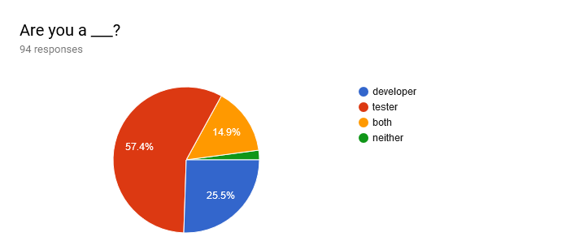
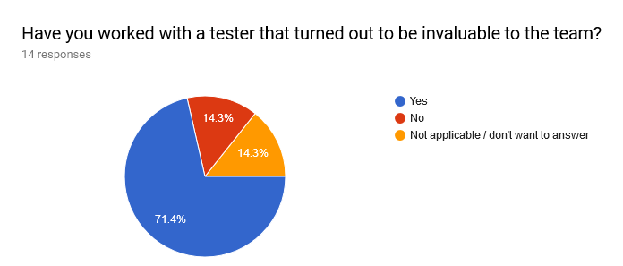
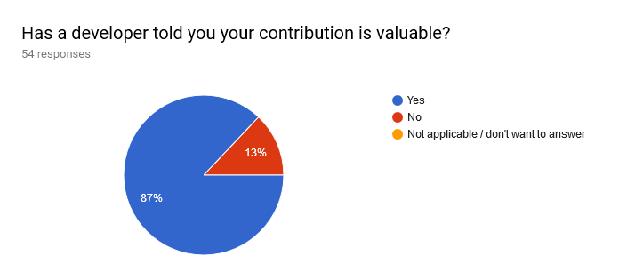
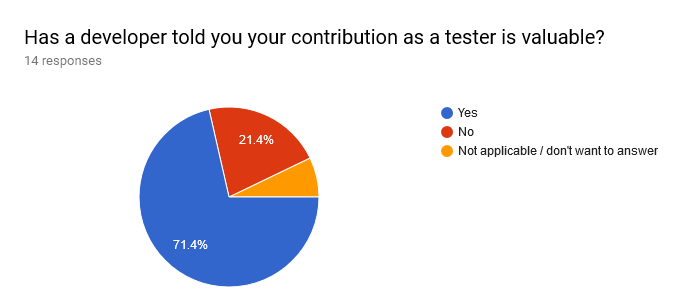

# What did 100 people say about their Tester - Developer Collaboration?

*Published 2018-06-18, updated 2018-12-26 · Labels: Agile*  
*Source: <https://visible-quality.blogspot.com/2018/06/what-did-100-people-say-about-their.html>*

---

What did 100 people say about their Tester - Developer Collaboration?

By Maaret Pyhäjärvi &Franziska Sauerwein

  

In search of inspiration for a shared talk on Tips to improve collaboration between testers and developers, a tester-developer duo decided to ask around on what good experiences people have to share. The experiences shared provided fuel for collecting tips from their own experiences. The results from the questionnaire were interesting and insightful, and this article sums them up.

  

We received 94 written, anonymous responses. In addition, we talked to a few colleagues to get to a nice round number. We got people from software testing and software crafter communities and ended up slightly skewed towards people identifying as testers.

First things first

  

The very first observation from the survey results was the asymmetry of tester - developer relationships. There were many developers who had never had a chance of working with a tester, while there were no testers who wouldn’t have worked with a developer. Similar asymmetry was visible in the results: it was a lot harder for developers to say positive things about their tester colleagues when asked, also in cases where they had tester colleagues.

  

In the graphs below, we show the division of responses separately for the “I identify as a developer” and “I identify as both developer and tester” groups.

 ****  

Similarly, in the graphs below, we show the division of responses separately for “I identify as a tester” and “I identify as both developer and tester” groups.

 ****  

Around 70 % of developers could identify a tester that has turned out to be invaluable. Around 80 % of testers remembered a developer telling them their contribution was valuable. We found it mildly interesting that within our group, the ones who identified as both tester and developer seemed to have heard of the value of their contributions slightly less.

  

What we really asked and what did people say?

  

We asked developers:

- Tell us about a memorable moment of working together with a tester
- What did a tester do to be invaluable?
- What frustrates you when working with testers?
- What do you enjoy when working with testers?

  

And we asked testers:

- Tell us about a memorable moment of working together with a developer
- What did you do to be told your contribution was valuable?
- What frustrates you when working with developers?
- What do you enjoy when working with developers?

  

Tell us about a memorable moment of working together with a tester

  

- Teaching tech tricks

- Learning how to structure my CSS to make it easier to test changes using automated tests
- They showed me that they use computer vision to identify and click UI elements.

- Learning about testing

- The first time I did pair testing (I had only done pair programming). It is eye-opening to watch others see the application with different eyes (yes, that was long ago).

- Having a good big picture on feedback they provide

- I first realised the testers were doing more than just trying to break my code when working as a freelancer. The customer's tester gave invaluable input and communicated his testing strategy early in the project - very different from the way I was used to working with testers in a waterfall setting.
- Super smart tester thinking of all the ways a product would be (ab)used, rather than just checking if it meets specs.

- Being fast learner

- A new tester that had known nothing about VCSs got himself quickly familiar with Git and started asking good questions that made developers rethink their work

- Getting to teach testers something

- Getting them to run their first ever automated test locally
- It is actually the first time I work with my current junior peer - the enthusiastic way they are eager to learn

- Clarifying specifications

- Working on BDD test scenarios
- Discovering hidden business rules nobody explained to us.
- I haven't worked in a team with testers for many years. My memory of working with them was that the design phase was definitely the most valuable and helpful to me as a developer fresh out of university. Taking an adversarial view on a feature is not something I'm good at even now, and it was incredibly useful to have someone specialising in that before writing a single line of code.

- Finding problems

- There are a few. All involve the tester finding issues with my "perfect" code.
- I have a presentation made only with code (no slides, just Java) I have given to in total to around 600-ish people over 25-ish different times, it has an (on purpose) error on the code, the error does not make my tests fail, I never talk about the error: only 3 people have reported it: all testers, no dev has ever seen the error, I find this amazing
- Bug reports that deserve the name of a genius tester. Including business information if required.
- We make it, they break it
- With a mobile app, they found a fundamental issue just prior to launch

- Being nice to work with

- Hard to pinpoint one particular moment, but really enjoyed the collaborative atmosphere between testers and dev at a previous job: exchanging with testers on user stories beforehand, and very constructive and positive reviews after implementation

- Doing things together

- When we paired with one person on keyboard/mouse on mind mapping. We created a really clear picture of our what, why, and how for the day.

- Being helpful

- I was new to the team, and the tester immediately volunteered to help me on Day One because they were not confident about their code-writing skills, but they knew enough to walk me through the user journey :-)

- Bringing in new feature ideas and following through together

- When testing we found a new feature could be useful and we developed it together :)

- Optimizing automated test suites

- Instructing how 3kloc Test suite can be optimized into 400loc and by doing so also improve on random failures. Essentially just showing good code design patterns also improve test code.

- Fast feedback, in scope of my change

- For me, the bests moments are when tester come on my computer and the tester check quickly the function. Because I understand simply my mistakes or I bring the small finishing. It's more effective when we did a quickly pair-testing to review the feat.
- When our QA person tested something I had done within 10 minutes after I had pushed the code

- Doing good work

- We worked together on a massive set of test data which I then used to do the regression tests on a completely rewritten part of our system and they used it to write the automated UI tests for that part.
- There isn't one specific moment that stands out, just a number of projects where working with the testers has been invaluable to the success of the project.
- The great deal of work put into analysing Test runs day by day

- Running through a tough test

- Working overnight babysitting a 12 hour semi-automated simulated real-world scenario for a system longevity test, being so happy that the systems were still near the end responsive, but being crushed by defeat as workstations started to lock up with half an hour left. Much good data was generated from that.

- General goodness

- Hard to nail down just one. It's routinely useful.

- No experience

- Never worked with a tester :'(
- I haven't worked together closely with a tester as a developer myself. There seem to be too few of them always.

- Negative memorable moments

- The tester had no clue, I know more about tests, e.g. equivalence classes, automation, etc.
- Non-existent
- I helped testing and automating tests that the tester defined on a project where I wasn't part of development. I experienced the rudeness some devs develop when interacting with testers. "this error can never occur, we don't need to cover that! you're not here to put more work on my table!"

  

What did a tester do to be invaluable?

  

- Testing edge cases

- Spotted problems in edge cases way beyond the official test. A great lateral thinker

- Clarifying the specification

- Contribute to clarifying the acceptance criteria, and finding edge and error cases nobody else was thinking of.

- Asking questions

- Ask the right questions early on (what if ..., how are we going to test...) and be a champion for the user
- Asked questions, questioned acceptance criteria for stories, helped triage issues

- Working on feature spanned wider than the devs

- They did start the work even before a dev started. Supported us from requirement engineering to production. Provided fast and clear feedback.
- EVERYTHING and yet nothing. They knew where everything was, could tell the folklores, could point people in the right directions, but never owned quality as a gatekeeper. Always collaborating.

- Knowing business requirements thoroughly

- Broke (our illusions of) our code. Usually by knowing the business better than any of the developers and most of the business folk
- Found issues with the user flow
- Their domain knowledge and knowledge of the other systems we were interacting with was way ahead of the rest of the team. They were the go to person for any questions about how things should work and chief explainer of all the things.
- Manual tester with lots of business knowledge
- Great testing I’ve experienced was done by product mgr not dedicated tester
- Had immense expertise in the domain we were working in. A true subject matter expert and ridiculously observant of everything going on in the system.
- They put themselves in the real world and thought and used like a real user

- Being always available

- They were part of the team and worked with developers at all times.

- Bringing in new perspectives

- Challenged the monocultural assumptions of the team
- Think outside the box

- Filtering test results that need developer reaction

- Sifting through massive amounts of test results each day and picking out the true positives. Giving us developers feedback on what is automatically testable and what is not.

- Automating testing

- Automate each and every kind of test.
- They went the extra mile to create the first proper automation testing framework I've seen including with a vagrant based setup of our infrastructure in order to create a fully controllable test suite

- Learning new things about agile testing

- They were keen to learn new ideas about testing. They were not dead-set on the idea of the tester as a gatekeeper for the developers. They were interested in trying out new processes and new patterns (like Three Amigos). They also were forthcoming about giving feedback to the team, and they wanted to be involved in all the things the team did.
- Refused to do click through the test script for the umpteenth time (that's when we started to automate)

- Taking wider process responsibility

- Leading the whole release process.

- Nothing positive to mention

- Manual testing with not much care
- Development requires a combination of mindsets and skills. All collaboration between specialists is valuable to the team, especially when it leads to broadening of everyone's skills and mutual understanding/empathy. The two roles mentioned in this survey should not be separate roles, and never should have been.
- Didn't offer their feedback, just showed up and played games all day
- Not yet. Unfortunately I've worked with lots of average testers who just did verification against spec, not thinking about how the software was actually used.

  

What frustrates you when working with testers?

  

- Their skills

- Seem to be even more unskilled/junior than the usual developer. maybe because testing is considered cheaper work (by some people, not by me).
- Lack of coding skills.
- Nothing frustrating about working with someone with genuine testing skills. It's frustrating to work with people labeled "tester" who lack testing skills, however.
- Non-Technical Testers

- Their confidence

- Lack of confidence that their voice is being heard
- When they lack confidence in their own skills and ability to look to learn new things.

- My skills

- That my coding is so bad and my own testing so limited.

- Having no testers

- The lack of them. (not their fault)

- Delayed feedback

- Late feedback. I want to pair with testers to get feedback as quickly as possible, but it's usually boring for the tester to spend minutes or hours dealing with boilerplate. (Correct solution: remove boilerplate.)
- Too much manual testing. Not enough interaction before writing code.

- Script-oriented testing

- I get frustrated only if they are bad ones that just want to follow the script
- Here in France the biggest issue is that the market has spent years turning the job of a tester in a mechanical "I execute scripts written in word by hand" so many good testers left the field, so my biggest frustration is finding testers that are not reduced to that in their mindset and really want to see the test beyond the test document
- Monkey tests
- Lack of focus on problems noticed besides predefined assertions
- when they just want to follow a script instead of using their brains

- Insufficient bug reports

- When they are describing an error only with a screenshot of the exception message box - but that doesn't happen very often these days.
- I had indirect experiences a long time ago where testing was done but a separate company, and consisted just in useless and very repetitive bug reports
- Most understand testing in a way to tell there is a bug. But they forget to provide relevant information.
- Creating a bug with a finding on such a high level that I can't even start investigating without lots of effort, e.g. in localized UI terms when it's about the Backend. Especially when refusing to descent through the stack in further discussion with me.

- Overly negative communication style

- When testers view themselves as having a role that is "in opposition" to the developers. I've worked with testers who said "This code is shit, it does not work" -- not a great way to build an empathetic working environment!
- It depends on the tester himself: their personality, their collaboration and their competence. We must not generalize…
- They can be very, very negative. Nothing is ever good enough, yet they don't try to improve anything. (Not all testers, just many I've encountered).
- Unclear test goals, insufficient information on bug/error reports, blame-focused feedback.

- Stretching features and feedback too far in name of testing

- I'm frustrated when the tester applies weird step of test. The test ask feat's comprehension. The test isn't always good.

- Focusing on details I don’t find relevant

- When it becomes a point scoring exercise in how many stupid bugs they can find, e.g. the wrong colour green or a pixel too far to the right.
- Not being involved in the project, not knowing about the value given vs a minor bug, for example
- All or nothing mentalities. Whether it be code quality or bug priorities, I get frustrated when testers fight against pragmatism rather than creatively and collaboratively looking for a way to succeed.

- Class-hierarchy

- They are usually treated as second-category citizen.

- Their attitudes

- Sometimes unwillingness to trust/learn ways to automate tests’
- When they still act as gatekeepers in an agile world

  

What do you enjoy when working with testers?

  

- Finding and understanding bugs

- Tracking down weird bugs
- Found a bug. Screen was showing wrong data
- Found a corner case they hadn't thought of
- Thought about the desired outcome of a proposed change from multiple sides, helped catch errors before code was written. Also caught difficult to observe issues and determined easy ways to reproduce them.
- Found a bug, verified it, contacted them about it. Then continued to work with them until it was resolved, and verified that it was really fixed.

- Making reproducing bugs easy

- If they give good descriptions of the steps to reproduce an error. If they are forcing me to produce testable systems.

- Doing specifications and automation collaboratively

- Collaborative approach, BDD/ATDD, finding good ways for test automation together.

- Seeing things from another view

- A different perspective
- I get a deep satisfaction from shipping close to bug free systems. Testers help me do just that. And they always broaden my perspective when thinking about what the system should and should not do.
- I like to have people pushing through the limits of the specifications, trying to find the failure of the system: trying to destroy my illusions
- When tester is asking questions I did not think about
- When I learn more comprehension of business. Or when the tester give me an other point of view.
- When they are able to question you or make you think and help clarify how things should be and have you considered everything.
- Testers call our attention to error scenarios that we don't necessarily think about as developers.
- The different perspective, the learnings

- Sharing responsibility

- That I can put something out there, have it scrutinized and hopefully approved by another person so we share the responsibility
- Feeling safe to have more eyes on what my code does
- There is a person looking at my work, knowing the business and ensuring I had not misunderstood or completely missed something. One step to better quality.

- Pairing

- Pairing! I love pairing with people who have a different skillset to me.

- Being thorough

- Finding all possible user flows
- Benefiting from a thorough view of all consequences of a proposed implementation
- Tested against not tracked use cases
- Manual and exploratory testing

- Being team players

- When they're nice people who are interested in learning, and they view the whole team as being responsible for software quality, not just themselves.
- Their knowledge and willingness to help.
- Work \_with\_ people. Talk through my thinking. Come into conversations with trust that people are doing the best they can.

- Automating tests

- When they can automate stuff
- Automate regression tests & build end to end testing fw
- I introduced contract tests to our micro service architecture.

- Improving process

- not only spoke about the tests I challenged the process and the developers and PMs loved the new way how we did things

- Nothing / unclear

- A developer is both a programmer and a tester, and more. Therefore, the question does not make sense to me. I have been told by fellow developers that the ability to switch perspectives between coding and testing has been useful.
- My job as I saw it, to them it was great work testing their work
- Nothing

  

Tell us about a memorable moment of working together with a developer

  

- Pairing

- Pair testing an important feature with developer - lots of useful insight that was very helpful, we've discovered many issues, which I probably wouldn't find testing by myself
- On my last project, I was able to pair several times with developers as they wrote the software. It was great for finding defects earlier in the process.
- Paired testing! The dev said they never would have thought to look where I asked about.
- When doing paired testing and developing. They would change code on one screen. Then I would look at it on the other, give feedback and they'd change it again.
- It was good to refactor my automation code in a pair session to make it easier to understand and more portable.
- Making up with my developer after arguing for months by pairing on writing tests
- Not a developer, but this one time when I paired up to learn from a network security engineer and that still etched in my memory. In India (the only place that I have worked), developers treat testers as second class citizens. And testers mostly avoid working with the dev due to this reason. And working with them is a pain, because recently my team of 4 testers faced bad behavior from a dev. And the verdict came out that one of the tester be removed from the team! It is weird bad time to be a dev or tester, unless you are a rebel and brave. Also the culture and region factor plays a big role, the dev is comfortable to learn and teach someone from their own region or who speaks their language. There are over 20 languages in India and the work force having a mixed employees kills the joy of working if you don't speak their language.
- Pair programming an interface
- Pairing on dev/testing
- Paired up with a dev. We ran super fast iterations where we could discuss my findings, make adjustments and build a new version within minutes.
- Sitting together recently testing in production while the application was going live. We were hoping for a successful release and it happened
- Debugging an iOS app with no iOS/Swift experience
- Mob programming. Never solved a tricky bug faster.

- Being asked for help in testing

- They asked for ideas to test locally! (this was a first, as they usually didn't test anything before checking in)
- Being called to look at it on dev's PC. Then listening to dev's demo on what and why. Afterwards suggesting things to try to see if it works the way we'd expect

- Being able to tell how to do things

- Telling a developer how to fix the current issue, how a developer should code (ways to handle his code, functionally) when they got stuck very badly.

- Finding bugs without testing through getting them thinking

- Asking a question about some code that led the developer to realise a potential error.
- I love when I just sit next to the developer and he is talking to me about what he wrote. He gets then fixated with talking about the points where he might done something wrong and finding those places finally deciding he needs to fix then. Without me saying a single word during all this time ;)
- Sitting down with a new developer to discuss the requirements and high level design for a feature. They’d describe the operation of the feature, and I'd say "OK - so I'm going to do this  to test it". It became clear that they'd interpreted the requirements narrowly to make the problem easier - when I pointed this out, they realised they'd have to re-work the entire design. Once delivered, the feature was awesome and made our Ops team's lives better :) And the developer really appreciated not having written something completely useless and the subsequent piecemeal patching that would have been required to meet deadlines…
- Not long ago, I detected a strange behavior in our product and wondered what caused it. It seems I expressed my astonishment loudly. A developer overheard it and instantly came over to see the strange behavior himself. Another developer joined in as well, we debugged the problem together and identified the root cause way quicker than I would have done it on my own. (I really like those situations of spontaneous collaboration and joining in myself in case I overhear a developer struggling. Another perspective often helps, no matter our "roles".)
- Working through a building complex state diagram together, where the dev was explaining the system design to me, and together we found gaps/ambiguities/areas for change - the working together helped build our mutual trust.
- I have many memorable moments and would find it difficult to single out one. Most of my memorable moments are when I'm working closely and early on in the development of an area of functionality or working together to resolve something.
- whiteboarding a mobile app concept and getting back something so much better

- Being paid attention to

- The best developer in our department taking the time to read about an idea I came across for testing and actually thinking about it and discussing with me how we might apply it to our applications. <3 span="">

- Getting positive feedback

- I was showing them a defect, and working my way through all our tools, and they were impressed that, as a non-coder, I was so adept at using our tools for troubleshooting and discovery.
- As a developer said "I want to understand your great stuff."

- Feeling useful

- Different point of views
- Starting a project we all worked on design aspects equally contributing
- Good one: fixing a bug together bad one: ignoring a reported bug
- It can be great to see them realise that you are helping, not hindering them
- ammm this is a corner case, i'm pretty sure no user will test it like this :P
- The first time I didn't feel like a second class citizen and the developer saw the value I've brought the team
- Mind the edge(-cases)
- I found a severe bug by chance only short before shipping. It was obvious to me, but the developer reasoned that it was impossible to occur. I had to prove him with an integration test in his own code that the bug was real. He eventually built in my solution, and was very grateful I had found it in the first place. Shipping was delayed by a few days.

- Teaching them something

- Showed that with right tools&code doing functional testing can be a breeze.

- Testing something meaningful

- Testing email firing on a time schedule. It took weeks (on and off) to test but every time it was a pleasant experience.

- Timely fixing

- Fixing bugs as I found them rather than having to log them.

- Timely testing

- The first time I properly communicated our requirements for writing automated checks at the same time as they were writing the API code. For the first time, our tests were ready to run as they pushed their changes to the test environment.

- Having a shared project on test automation

- As a team, deciding and improving a stagnant automation framework.
- A developer and I build a test double of a 3rd party application together to increase automation coverage.
- Conference talk on a visual regression testing tool developed together.
- When I started working at new company and started with test automation. I had my first code reviews, which were very valuable, not judging, a lot of advice with good practices. It was very useful, I was learning very much in short time, I've received great feedback
- When we created a tool to reduce risk in production code by moving test hooks to the test suite.
- Working together on some tooling to make developing tests using the test automation framework I inherited / started improving easier. The Dev had a tool he'd written to make it easier to simulate conditions necessary for testing the module that he was working on, and we figured out some ways to use it to generate data that drove tests for our framework.
- Trying to get coverage report for E2E tests. I learned a lot from a dev and he was excited about the project because no one had ever tried to build a coverage report for E2E tests, only unit tests.

- Negative memorable moments

- When a Scrum master told me not to disturb dev
- Sending bugs that aren't reproducible as we are working in a very agile environment!
- A developer has all development skills. Perhaps you mean "programmer?" A person with only one skillset trends not to generate many memorable moments.
- The quick reaction with no discussion about validity of test

- No memorable moments

- I don’t really have a moment that stands out with a developer. One of my favorite moments comes from my product owner, who took the time to call out and acknowledge the quality of work that I’d done for a project, during the final client demo and presentation. It meant quite a lot that he publicly recognized my contribution.

  

What did you do, as tester, to be told your contribution was valuable?

  

- Said something nice to them about them

- Thanked them
- Said thank you.
- Thank them
- Said Thanks
- Appreciation was quite honest so it was acknowledged wholeheartedly

- Paired

- Pair, and protect the project from making mistakes.
- Paired with them with resolving an issue. Debugging, Code review & testing

- Made myself available

- Always offered to pair up, ask what about..., ask them for help in testing, taught them how I think...

- Found good bugs

- Found some hard to detect, reproduce, but easy to fix defects.
- I found a an issue with the system that they hadn’t thought of.
- Either found the cause of an issue or found bugs that would have a big impact if left undetected
- Point out a bug including reasonable points of origin and possible solutions.
- With just a basic set of e2e tests I uncovered a critical bug at the heart of the database design. Something that was missed by the internal team tests.
- Found a corner case they hadn't thought of
- Found a bug. Screen was showing wrong data.
- Found a bug, verified it, contacted him about it. Then continued to work with him until it was resolved, and verified that it was really fixed.

- Testing, differently

- Tested against not tracked use cases

- Reproducing difficult customer issues

- Found steps to customer problems to clarify so we could fix issues.

- Giving fast feedback

- I was the first tester the developer had worked with. He really appreciated my insights and quick turn around time on getting defects after development.
- Gave feedback on the work he had done
- Thought about the desired outcome of a proposed change from multiple sides, helped catch errors before code was written. Also caught difficult to observe issues and determined easy ways to reproduce them.

- Keeping them safe

- I've been a tester - saw the bigger picture, understood problem, got their back.

- Doing my job

- Not directly, but the build manager has. I just did my job :)
- Nothing it’s the normal thing

- Testing, well

- Exploratory testing
- Explored a system that testers had only manually tested before. The developer said the system had never been tested so well.
- Going through test ideas together early and asking questions to clarify behavior/risks which had not been addressed yet - Testing an early increment together - Going through test findings with the developer and instantly fix them together - Finding issues in places the developer did not expect at all - Constantly trying to improve the product/team/myself
- Testing of applications
- "Hey, be part of the Champions League - extend your testing also!"
- My normal job of acceptance testing, catching bugs and regressions prior to deploys; helping the team stay on process; upholding standards of quality for the work we deliver.
- Manual and exploratory testing
- My job as I saw it, to them it was great work testing their work

- Completing a more significant test area

- Planned, executed, analysed and published performance test results (API)
- Run a large suite of automated E2E tests covering features of a legacy application
- We've went together through plan of migrating data. Also I was told about my valuable contribution several times during normal work - testing current tasks.

- Speaking up against “authorities”

- Once I was unable to attend grooming and afterwards one dev came up to me to say that he thinks we might have underestimated a task. I was missed with an assumption that I would have challenged the feature better
- Asked questions, not just of the developer but also of the product owner, and of the business stakeholder in a meeting where the developer's estimate was being questioned, i.e. stood up for the developer/asked for him to be listened to/respected.

- Giving feedback also on processes

- I not only spoke about the tests I challenged the process and the developers and PMs loved the new way how we did things

- Teaching them

- Taught them about the product as a whole, and ux.
- He send me a video message on my last day, because he was not in the office: He learned to differentiate between automatable and not automatable testing, implemented a very fast testing approach, with a high coverage.

- Talkinging level of code

- They didn't like testers so they would never tell us what he changed. So we would always have to test "everything" again rather than focus on the change and the impact of the change. One day when testing I asked them to print me the code they changed (as he couldn't tell me what he changed again). So I read pages and pages of horribly written code. Followed variables name Var1, Var2, etc. Thru pages and pages to see what was happening. At one point I found Var31 being used but never ever initialized. I pointed this out, along with a few other bugs. They looked mortified, but kept their cool. I later had them come by my desk (which they never did). He told me they fixed the Var31, gave me a new print out (much smaller than the last since it was only the changes), thanked me for pointing out the Var31, and asked if I could test the next changes they was putting in. After years of people trying to get their cooperation I was the first.

- Asked good questions

- They commented that they were impressed that I was so good at asking questions that revealed overlooked assumptions/unexpected behavior.
- Very recently I helped (was not part of that project) test an app being built and asked lot of questions while I was testing. At the end of the time boxed session, the developer said that 'I never knew a tester could think like this'. Think from user perspective. Introduce different risk types to the programmer. Come up with scenarios in which the code is not able to cope with. Record the session and share the bug report at the end of the session. All I did in that session was demonstrate the other voiceless testers to collaborate with the dev as much as possible. Win for testers is when the dev + tester works together.
- Ask questions. That made them think
- I ask a lot of questions which get group thinking about edge cases/the bigger picture (how our changes in this area affect the whole product).
- I tested the interface and asked questions
- Ask question. Usually it was a good question how the code will behave in some special rare case which saved his time writing a wrong code.
- Work \_with\_ people. Talk through my thinking. Come into conversations with trust that people are doing the best they can.

- Synchronizing expectations

- Gave them a high level list of planned tests to make sure we both expected the app to work the same way.

- Saving them time

- Saved them from weeks of useless work

- Giving them snacks

- Brought ice-cream/food

- Automated tests for them

- Automate regression tests & build end to end testing fw

- Brought in new ideas

- I introduced contract tests to our micro service architecture.
- A developer is both a programmer and a tester, and more. Therefore, the question does not make sense to me. I have been told by fellow developers that the ability to switch perspectives between coding and testing has been useful.

- Negatives

- Not appreciated, In my company it's a real environment. Developer thinks they are the king. And our TL (testing TL is his friend) so ultimately they also don’t appreciate me (rather us) I can write about this a whole story.
- Nothing

  

What frustrates you when working with developers?

  

- Missing information

- Lack of providing information
- Bad communication
- Developers not sharing information with ease (which they will easily have access to) frustrates me. They must realize that testers too need access to the information that they have.
- "You don't need to know this"
- Not being talked to, not being valued as testing is not valued. If it becomes a them - me thing.
- Not telling me about changes that were made "by the way" - developers many times don't think those are important, but sometimes they bring regression. Also I don't like when developers don't check their work and wait for me to do it - sometimes I can see they haven't even run the code.

- Feeling like an outsider

- When I don't feel like part of the team.

- Not being open to new insights

- They often have a certain mindset and sometimes don't want to acknowledge different ones
- Refusing to accept a found bug as true, or at least possible.
- Slow to admit a mistake or acknowledge a defect
- They're pretty sure they understand statistics better than I do. I'm pretty sure they don't, but I'm more willing to acknowledge the limits of my understanding, and they interpret that as a lack of understanding.
- When they say "It works for me" and think that means I have to prove to them that it’s a real problem.
- Absolute confidence that their design is correct or the best
- Some developers still stick to acceptance criteria too rigidly - ‘this isn’t an issue because it wasn’t covered in the acceptance criteria’ - is something I still hear.
- Formality and no interest to think (about different aspects)
- Sometimes the blinkered and isolationist approach
- The assumption that it was great when they handed it over to you and therefore any defects you find are somehow your own problems
- When they don't understand the problem and says it is a default behavior
- "It's impossible" syndrome for the same reason as all or nothing mentalities in testers is frustrating. To me it is a way to dissolve all responsibility towards solving the problem in a sustainable, pragmatic way, and (many times) creative way.
- Overconfidence in their coding abilities. Refusal to see testing feedback as a learning opportunity. Unwillingness to question the why of a feature.

- Mistreating testers

- They thinks they are the soul of the product. No one appreciates. Not allowing QA to participate. Work done by me shown as done by MY TL. They never allow me to reach my manager to ask questions. They never want me to grow. They never shows my work , my queries to manager, (CTO)
- Asshole mentality, that they are better than testers. Or do not need to include testers on meeting that may or may not be helpful in their eyes.
- They think testers are time wasters. This should change, and the change starts with 'you' each and everyone involved. Knowing that 'early bird gets the bug' works well.
- They don't see our value sometimes. when they send bugs back that aren't 100% fixed
- - "Them vs. us" mindset and behavior; "those evil testers"; testers seen as inferior monkeys clicking around and doing monkey stuff -> fortunately all those points are not the case in my current team - Communication via ticket comments instead of direct face-to-face communication - When the developer hands over a build but did not basically test it themselves yet; e.g. when an issue is identified on first interaction with the product
- The unspoken hierarchy & restrictive ideas about limits of testing. Developers who refuse to talk directly to me about a bug. Passive aggressive behavior.

- Assuming we’re stupid

- They always assume they’re smarter
- Being treated like a dumbass, it takes a lot of patience
- Attitude that Testers are lower or stupider.
- If they don't think we understand how software (should) work(s)...

- Taking feedback personally

- I think sometimes developers take the raising of issues personally.

- Overreliance on my testing

- Depending heavily on manual regression testing
- When they throw code over the wall
- Some really do think testing is only for testers…
- "Isn't this what testers are for"
- Doing a bugfix and not even checking in any way that the bug is resolved (or no new bug was uncovered that could be found with the same test).
- The rolism I am facing
- Missing priority for broken builds

- My development skills

- I have a hard time following the coding - our code base is complicated
- My lack of knowledge of some technical solutions.

- Their development skills

- Developers who want the world and don’t see the full picture while they are developing a simple thing
- Nothing frustrating about working with genuine, multi-skilled developers. It's frustrating to work with people labeled "developer" who lack development skills, however.
- When they write the program first and the tests (maybe) later
- Not (very) interested in improving quality, learning about new testing tools and approaches.

- Not making a real attempt for a finalized product

- "That's impossible to get looking like the designs" And recurring mistakes.
- Dismissing bugs in favor of new features
- Mindset of chaos
- Appreciation for Results.
- Sometimes lack of overall thinking
- Not documenting anything, because "the code is the documentation".

- Having to give late feedback

- When I am getting involved too late

- Belittling testing they don’t understand

- Them saying testing is trivial
- Think that they can do our job easily
- Only code-centric point of view
- "No user would ever do that".
- Developers that don't understand testing and look down on testers as though they are not 'technical' or that I would not understand something.
- When they treat us like we are second class or don't know the value we can provide.

- Rejecting issues if understanding takes any effort

- Sometimes they pretend to be busy even if they are not. Sometimes rejecting the issue without going through full description.

- Making fun of testers

- Jokes about Throwing tickets over to test.

- Not appreciating our contributions

- When they don’t trust my feedback. When they force me to get other devs to “vouch” for my work before they’ll take action on it. When they take QA personally, and see it as a blocker to “real work.” When teams of developers are praised for their work on a project, but QA never gets mentioned. When a ticket failing QA breaks a sprint, blame is put on QA engineer for breaking the sprint. Being the only QA Engineer on my team, with nobody to speak up for my point of view.
- Overruling team-decisions [testing] questions.

- Nothing

- Nothing especially
- Very little: once I can show them I can help rather than hinder we usually get on well
- Nothing

  

What do you enjoy when working with developers?

  

- Building something together, teamwork

- Sharing ideas and helping one another
- Making good software better
- Learning from them and teaching them about testing and what we do. Then finally reaching the point where they see my role as part of the team, making their contribution better. Rather than as the naysayer running them down.
- I enjoy being part of a team, and working together to find issues early and address them quickly.
- Seeing the designs/creativity unfold for a solution
- Learning and profiting from each other
- Collaborating to create a better project
- I enjoy when we're both clearly working together to create a better product. I enjoy when they help me understand something and it allows me to ask a better question.
- Building relationships and trust
- When we're all working together as a team to deliver a better product. Trust and collaboration.
- Seeing that we both learned and grew and started to do things slightly better due to the knowledge/perspective gained. If we happen to work together, the trust grows
- Everything.
- Complementing each other regarding skills and perspectives to build a great product together
- Shared vision to deliver a quality product which helps our users
- Feeding off their knowledge, their enthusiasm to create
- Working together to solve complex problems resulting in better products

- Open, respectful communication

- Open discussion
- Respectful cooperation with lots of fun.
- Two way communication and knowing that learning is bi-directional helps me. And eventually I will enjoy working with those that I learn and having an open mind. Who they are doesn't matter as long as they are professional.
- Collaboration
- Collaboration, solving problems and learning.
- Collaboration.
- When they think that testers are not against them but working as team for a successful product.
- In previous workplaces I worked in a separate QA team, without constant contact with developers. It was way harder. Now when I work with developers, sitting next to them - I enjoy it very much. Work is way easier, communication is much better. I learn very very much from developers. I like different views on hard issues, talking everything through, planning.
- When they explain why a bug happened so I can test around the fix better. When they show me a new tool or discuss a feature they are excited about. Most interactions are good for me!
- When they say “thank you” for ensuring the quality of work - seeing it as a collaboration, and see me as a teammate, not the enemy.
- If they are willing to accept mistakes they made, and own their bugs.

- Being useful, providing ideas and feedback

- Giving insight into the solution they envision
- Positive feedback typically means I've found the right level of diplomacy/phrasing, which I consider a more of a testing victory than just finding issues. That said, as diplomatic as you can be, ego seems to be another obstacle..and one which I can't really do much about. So..enjoy? Being able to have a laugh with them in the face of issues I'm firing back their way (I work alongside my Dev team).
- Puzzling them with a report, that they admit being valid, but somehow not captured in the initial implementation
- Criticizing their ideas
- Bouncing ideas off of each other, when findings during a session get fixed during the session, when we review each other's results and build on top of each other
- The discussions, the feeling of helping to get the job completed well

- Planning and designing features

- I enjoy feature planning. Standing at a whiteboard and mapping out the interactions of our different components. It allows me to get a technical understanding and better informs my testing.

- Learning tech

- Learning about the application and the tools used to build it
- Learning new ways of testing
- They will explain the technical parts
- Learning a lot of coding, teaching a lot of shift-thinking
- Experience, knowledge, deep understanding of systems, willingness to learn and share
- Getting ideas of how to write better code for automation.
- If they enhance my test approach or they learn something for their work.

- Being right

- Finding issues with an experienced developer and proving that you are right. Also participating in a debate to prove I'm right. (Sometimes I may be wrong too, but learn new things). In this conversation the word “why” comes very often and answers the question sometimes.
- I enjoy reopening their issues ;)

- Tight feedback loop

- Working one on one and the dynamics of fixing and test and fix when it come to front end tweaks

- Pairing

- Pairing. My favorite way to test.
- Pairing on work.
- Pairing and mobbing (mob programming and testing)

- Developers showing interest in test automation

- When they explain and are interested in automation - when the team is combined rather than defined roles of tester and developer
