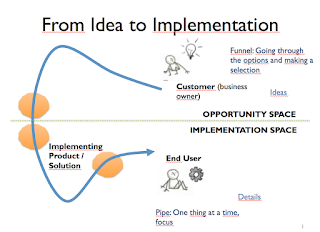

# Folks tell me testing happens after implementation

*Published 2018-07-31, updated 2018-12-26 · Labels: Agile*  
*Source: <https://visible-quality.blogspot.com/2018/07/folks-tell-me-testing-happens-after.html>*

---

As I'm slowly orienting myself to the shared battles across more and more roles, throughout the organization as I return to office from a long and relaxing vacation, I'm thinking about something I was heavily drawing on whiteboards all around the building before I left.

The image is an adaptation based on my memory of something I know I've learned with Ari Tanninen, and don't probably do justice to the original illustration. But the version I have drawn multiple times helps discuss an idea that is very clear to me and seems hard for others. In the beginning of the cycle, testing feeds development and in the end of the cycle, development feeds testing.

  
There's basically two very different spaces in the way from idea to delivery. There's the space that folks like myself, testers, occupy together with business people - the opportunity space. There's numerous things I've participated in saying goodbye to with testing them. And it's awesome, because in the opportunity space ideas are cheap. You can play with many. It's a funnel to choose to one to invest some on, and not all ideas get through.  
  
When we've chosen an idea, that's when the world most development teams look into starts - refining the idea, collecting requirements, minimizing it to something that we can deliver a good first version of. Requirements are not a start of things, but more like a handoff between the opportunity space and the implementation space.  
  
Implementation space is where we turn that idea into an application, a feature, a product. Ways to deal with things there are more like a pipeline - with something in it, nothing else gets through. We need to focus, collaborate, pay attention. And we don't want to block the pipeline for long, because when it is focused on delivering something, the other great ideas we might be coming up with won't fit it.  
  
A lot of time we find seeds of conflict in not understanding the difference of cheap ideas we can toy with in the opportunity space and the selected ideas turning expensive as they enter the implementation space. Understanding both exist, and play with very different rules seems to mediate some of that conflict.  
  
As a lead tester (with a lead developer by my side), we are invited to spend as much of our efforts in the opportunity space as we deem useful. It's all one big collaboration.  
  
Looking forward to the agreed "Let's start our next feature with a marketing text writing, together". Dynamics and orders of things are meant to be played with, for fun and profit.
