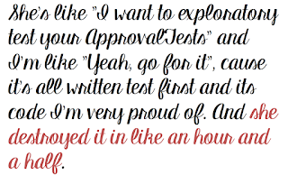

# Stop thinking like a tester

*Published 2018-07-31, updated 2018-12-26 · Labels: Exploratory Testing*  
*Source: <https://visible-quality.blogspot.com/2018/07/stop-thinking-like-tester.html>*

---

I'm very much an advocate for exploratory testing, and yet I find myself seeking kind of what Marlena Compton seems to be doing in space of Extreme Programming and Pairing - seeking the practicality, inclusion and the voices that keep shouted down by the One Truth.  
  
Whenever I find people doing good testing (including automation), I find exploratory testing plays a part. The projects lacking exploratory testing are ones that [I can break in two hours](http://visible-quality.blogspot.fi/2017/03/from-appreciation-of-shallow-testing.html).  
  

  
So clearly the focus and techniques I bring into a project, as I apply them are something special.  
  
In this particular project, some of the observations I shared lead to immediate fixes and easing things for whoever came after me. Some of the fixes (documentation) were done in mid-term timeframe, and looking at the documentation now, I don't want to test it, I want to write it better. And some of the fixes remained promise ware (making the API discoverable, which it isn't and the message was well delivered by making a group of people with relevant skills fail miserably with its use).  
  
So sometimes I've found myself saying that I think like a tester. I do this stuff that testers do. It's not manual, so it must be the way I think, as a tester.  
  
I've seen same / similar curiosity and relentless will to believe that things can be different in other roles too. My favorite group of like minded peers is programming architects, and I get endless joy in those conversations where I feel like I'm with my people.  
  
So I came to a conclusion. Saying that we teach how to think like a tester is like brute forcing your thinking patterns on others. Are you sure the way the people think wouldn't actually improve the way you're building things, if you carefully made sure everyone in the teams is celebrated for their way of thinking.  
  
I sum this up as this.  
> I can't teach you how to think like a tester because my thinking is a mix of being a manager, tester and developer. I don't think learning to think my way is a thing. Being your whole true self, growing is a thing.
>
> — Maaret Pyhäjärvi (@maaretp) [July 31, 2018](https://twitter.com/maaretp/status/1024218878266814465?ref_src=twsrc%5Etfw)

Be your own, true, unique self and help others do that too. Growing is a thing, but while growing, be careful to not force the good those people already have in the hiding.  
  
It took me so much time to realize what things I do because they are expected of me and my kind, and what I do because I believe it is the right thing for me to do. Appreciating differences should be a thing.  Think your way.
