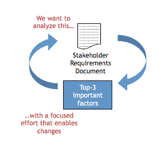

# Test-Driven Documentation

*Published 2018-08-04, updated 2018-12-26 · Labels: Agile*  
*Source: <https://visible-quality.blogspot.com/2018/08/test-driven-documentation.html>*

---

I remember a day at work from over a decade ago. I was working with many lovely colleagues at F-Secure (where I returned two years ago after being away for ten years). The place was full of such excitement over all kinds of ideas, and not only leaving things on idea level but trying things out.

The person I remember is Marko Komssi, a bit of a researcher type. We were both figuring out stuff back then in Quality Engineering roles, and he was super excited and sharing about a piece he had looked into long before I joined. He had come to realize that in time before agile, if you created rules to support your document review process, top 3 rules found find a significant majority of the issues.

Excitement of ideas was catchy, and I applied this in many of my projects. I created tailored rules for requirements documents in different projects based on deeper understanding of quality criteria on that particular project, and the rule creation alone helped us understand what would be important. I created tailored rules for test plan documents, and they were helpful in writing project specific plans instead of filling in templates.

Over time, it evolved into a concept of Test-Driven Documentation. I would always start writing of a relevant document from creating rules I could check it against.

The reason I started writing about this today is that I realized it has, in a decade, become an integral part of how I write documentation at work: rules first. I stop to think about what would show me that I succeeded with what I intended, and instead of writing long lists of rules, I find the top-3.

Many of the different versions I've written are somewhere on my messy hard drive, and I need to find them to share them.

Meanwhile, you could just try it for your own documentation needs. What are 3 main rules you review a user story with? If you find your rules to be:

- Grammar: Is the language without typos?
- Format: Does it tell all the As  I want  so that ?
- Completeness: Does it say everything that you are aware that is in and out?

You might want to reconsider what rules make sense using. Those were a quick documentation of discussion starters I find wasteful in day to day work.

Tests first, documentation then. Clarify your intent.
