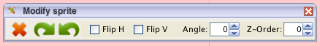

# Testing a Modify Sprite Toolbar

*Published 2018-12-04, updated 2018-12-26 · Labels: Exploratory Testing*  
*Source: <https://visible-quality.blogspot.com/2018/12/testing-modify-sprite-toolbar.html>*

---

I've been teaching hands-on exploratory testing on a course I called "Exploratory Testing Work Course" for quite many years. At first, I taught my courses based on slides. I would tell stories, stuff I've experienced in projects, things I consider testing folklore. A lot of how we learn testing is folklore.

The folklore we tell can be split to the **core of testing** - how we really approach a particular testing problem - and the **things around testing** - conditions making testing possible, easy or difficult as none of it exists in a vacuum. I find agile testing still talks mostly about things around testing, and the things around testing, like the fact that *testing is too important to be left only for testers* and that testing is a whole team responsibility, those are some great things to share and learn on.

All too often we diminish the core of testing into test automation. Today, I want to try out describing one small piece in the core of testing from my current favorite application under test while teaching, Dark Function Editor.

Dark Function Editor is an open source tool for editing spritesheets (collections of images) and creating animations out of those spritesheets. Over time of using it as my test target, I've come to think of it as serving two main purposes:

- Create animated gifs
- Create spritesheets with computer readable data defining how images are shown in a game

To test the whole application,  you can easily spend a work week or few. The courses I run are 1-2 days, and we make choices of what and how we test to illustrate lessons I have in mind.

- Testing sympathetically to understand the main use cases
- Intentional testing
- Tools for documenting & test data generation
- Labeling and naming
- Isolating bugs and testing to understand issues deeper
- Making notes vs. reporting bugs

  

Today, I had 1.5 hours at Aalto University course to do some testing with students. We tested sympathetically to understand the main use cases, and then went into an exercise of labeling and naming for better discussion of coverage. Let's look at what we tested.

Within Dark Function Editor, there is a big (pink) canvas that can hold one or more sprites (images) for each individual frame in an animation. To edit image on that canvas, the program offers a Modify Sprite Toolbar.

  

How would you test this?

We approached the testing with Labeling and naming. I guided the students into creating a mindmap that would describe what they see and test.

They named each functionality that can be seen on the toolbar: Delete, Rotate x2, Flip x2, Angle and Z-Order. To name the functionalities, they looked at the tooltips of some of these, in particular the green arrows. And they made notes of the first bug.

- The green arrows look like undo / redo, knowing how other application use similar imagery.

They did not label and name *tooltips* nor the actual *undo/redo* that they found from a separate menu, vaguely realizing it was a functionality that belonged in this group yet was elsewhere in the application. Missing label and name, it became a thing they would have needed to intentionally rediscover later. They also missed label and name of the little x-mark in the corner that would close the toolbar, and thus would need to discover the toggle for Modify sprite -toolbar later, given they had the discipline.

The fields where you can write drew their attention the most. They started playing with the Z-order, giving it different values for two images - someone in the group knew without googling that this would have impact on which of the images were on top. They quickly run into the usual confusion. The bigger number would mean that the image is in the background, and they noted their second bug:

- The chosen convention of Z-order is opposite to what we're used to seeing in other applications

I guided the group to label and name every idea they tried on the field. They labeled numbers, positive and negative. As they typed in the number, they pressed enter. They missed label and name for the *enter*, and if they had, they would have realized that in addition to enter, they had the *arrow keys* and moving *cursor out of focus* to test. They added decimals under positive numbers, and a third category of input values of text.

They repeated the same exercise on Angle. They quickly went for symmetry with Z-order, and remembered from earlier sympathetic testing they had seen positive value 9 in the angle work already. They were quick to call the category of positive covered, so we talked about what we had actually tested on it.

We had changed two images at once to 9 degree angle.

We had not looked at 9 degrees in relation to any other angle, if it would appear to match our expectations.

We had not looked at numbers of positive angles where it would be easy to see correctness.

We had not looked at positive angles with images that would make it easy to see correctness.

We had jumped to assuming that one positive number would represent all positive numbers, and yet we had not looked at the end result with a critical eye.

We talked about how the label and name could help us think critically around what we wanted to call tested, and how specific we want to be on what ideas we've covered.

As we worked through the symmetry, the group tried a decimal number. Decimal numbers were flat out rejected for the Z-order, which is what we expected here too. But instead, we found that when changing angle from value 1 to value 5.6, the angle ended up as 5 as we press enter. Changing value 4 to 4.3 showed 4.3 still after pressing enter, and would go to 4 only with moving focus away from the toolbar. We noted another bug:

- Input validation for decimal numbers would work differently when within same vs. other digits.

As we were isolating this bug, part of the reason why it was so evident was that the computer we were testing with was connected to a projector that would amplify sounds. The error buzz sound was very easy to spot, and someone in the group realized there was asymmetry of those sounds on the angle field and the Z-order field. We investigated further and realized that the two fields, appearing very similar and side by side would deal with wrong inputs in an inconsistent manner. This bug we did not only note, but spent a significant time writing a proper report on, only to realize how hard it was.

- Input validation was inconsistent between two similar looking fields.

I guided the group to review the tooltips they did not label and name, and as they noticed one of the tooltips was incorrect they added the label in model, and noted a bug.

- Tooltip for Angle was same as for Z-order description.

In an hour, we barely scratched the surface of this area of functionality. We concluded with discussion of what matters and who decides. If no one mentions any of the problems, most likely people will imagine there are none. Thinking back to a [developer giving a statement about me exploring their application in Cucumber podcast](https://itunes.apple.com/fi/podcast/cucumber-podcast-rss/id1078896635?mt=2&i=1000380435340):

> She's like "I want to exploratory test your ApprovalTests" and I'm like "Yeah, go for it", cause it's all written test first and its code I'm very proud of. And she destroyed it in like an hour and a half.

You can think your code is great and your application works perfectly, unless someone teaches you otherwise.  
  
I should know, I do this for a living. And I just learned the things I tested works 50% in production. But that, my friends, is a story for another time.
