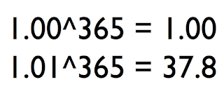

# Never Stop Learning

*Published 2019-11-02*  
*Source: <https://visible-quality.blogspot.com/2019/11/never-stop-learning.html>*

---

I have a full time work that I enjoy, and I very carefully review my own satisfaction to the impacts going on at work. I require myself a balance of being *productive* and *generative*. Not one to the other, but a balance of these two.  
  
I'm being productive when I:  
  

- strategize testing and communicate strategies so that we are better aware of problems I will be looking for
- test (possibly documenting as test automation) to add to coverage of what might work but particularly identify things that did not
- have the gazillion discussions leading to over time to a process improvement or someone else's raise
- when I fix problems, be in it the program or in the way people interact

I'm being generative when I:

- teach others how they do better testing when I am not around to do it
- lead people into insights that make then do things in a way that is more productive
- bring in ideas that inspire me and through me, us overall

The way I control my work weeks is that I try to be mindful doing things that are directly for my employer the 40 hours a week, and then have 'hobbies' that resemble work but are fully my choice, my control - even though these activities benefit my employer too.

Realistically, I cannot split work and fun. Work is fun. So I manage my own expectations of what I do, and try being mindful of the work-life balance when the lines are blurred by my own choices.

Doing stuff that resembles work and could be work 140% is a better framing. On top of that there's family, friends and stuff that does not resemble work. Writing a blog post on a Saturday resembles work.

I do this because my interest are divided. While I love the impact we are building for at work that I have defines as my purpose (while there, for now), I also love making a dent in the world outside helping new speakers get started, building my own talks, writing articles beyond what can fit in my work day frame.

In theory, I could be giving more for the purpose at work. The 100% time I give them could arguably be more awake, more focused if I wasn't doing all the other things. But thinking this way would be shortsighted because the 40% time gives me learnings that change who I am and what I can do, both in providing motivation and actual skills.

Having discussed this with a colleague with similar yet different profile, I'm taking a learning from it:

It's not the hours and their efficiency today, it's the continuous growth on our ability to deliver.

It's the math of never stopping learning.
