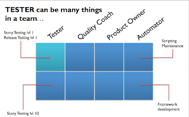
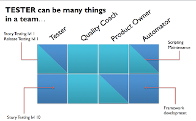
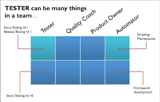
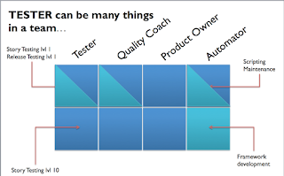
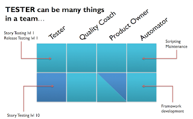

# One Eight Fraction of a Tester

*Published 2020-03-25*  
*Source: <https://visible-quality.blogspot.com/2020/03/one-eight-fraction-of-tester.html>*

---

As I was browsing through LinkedIn, I spotted a post with an important message. With appropriate emphasis, the post delivered its intended point: TEST AUTOMATION IS A FULL TIME JOB. I agree.

The post, however, brought me in touch with a modeling problem I was working through, for work. How would I explain that the four testers we had, were all valuable yet so very different? The difference was not in their seniority - all four are seniors, with years and years of experience. But it is in where we focus. Because, TEST AUTOMATION IS A FULL TIME JOB. But also, because OTHER TESTING IS A FULL TIME JOB.

As part of me pondering this all, I posted on Twitter:

> I'm reconsidering my position around need of testers in teams, and as a tester, I am not doing this lightly. I am starting to believe that with agile (and learning cycles), developers get smart enough not to need manual testers around.
>
> — Maaret Pyhäjärvi (@maaretp) [March 23, 2020](https://twitter.com/maaretp/status/1242115245402882050?ref_src=twsrc%5Etfw)

  

The post started a lively discussion on where (manual) testers are moving, naming the two directions: **quality coaches** *teaching others to build and test quality* and **product owners** *confirming features they commenced.*

**The Model of One Eight Fraction of a Tester**

Taking the concepts I was using to clarify my thinking about different testers, a discussion with [Tatu Aalto](https://twitter.com/AaltoTatu) over a lovely refreshing beverage enjoyed remotely together drew the mental image of a model I could use to explain what we have. With two dimensions of 4x2 boxes, I'm naming the model "One Eight Fraction of a Tester".

*1st Data Point*

In our team, we have six developers and only one full-time manual tester. I use the word manual very intentionally, to emphasize that they don't read or write code. They are too busy with other work! The other work comes from the 6 super-fast developers (who also test their own things, and do it well!) and 50+ other developers working in the same product ecosystem. Just listing what goes on as changes on a daily basis is a lot of work, let alone seeing those changes in action. Even when you leave all regression testing for automation.

The *concern*  here is that story and release testing both in our context could be intertwined with creating test automation. For level 1 testing to see features with human eyes, that could also happen while creating automation.

Yet as the context goes, it is really easy to find oneself in the wheel, chipping away level 1 story testing "I saw it work, maybe even a few times", story after story, and then repeating pieces of it with releases.

*2nd Data Point*

A full time exploratory tester in the team, taking a long hard look at where their time goes, is now confessing that the amount of *testing* they get done is small and the testing is level 1 in nature. The coverage of stories and releases is far from the tester focusing there full time. Instead, where time goes is enabling others in building the right thing incrementally (product owner perspective) and creating space for great testing to happen (quality coach perspective). While they read code, they struggle to find time to write it, and they use code for targeted coaching rather than automating or testing.  

The *concern*  here is that no testing is getting done by themselves. Even if they *could* do deeper story testing, they never practically find the time.

As the context goes, they are in a wheel that they aren't escaping, even if they recognize they are in it.

*3rd Data Point*

A most valued professional in the team, a spine of most things testing is the test automation specialist. They find themselves recognizing tests we don't yet have and turning those ideas into code. While they've found, with support of the whole team, particularly developers, time to add to coverage not only maintain things functional, maintenance of tests and coordinating that is a significant chunk of their work. While they automate, they will test the same thing manually. While they run the automation, they watch automation run to spot visual problems programmatic checks are hard to create for. That is their form of "manual testing" - watch it run and focus on things other than what the script does.

  

  
The *concern*  here is that all testing is level 1. Well, with the number of stories flying around, even with all groups groups of developers having someone like this writing executable documentation on expectations exist, they still have a lot of work as is.  
  
As context goes, they too are in a wheel of their own with their idea of priorities that make sense.  
  
*4th Data Point*  
  
Automation and Infrastructure is a significant enabler, and it does not stay around any more than any other software unless it is maintained and further developed. The test automation programmer creates and maintains a script here and there, test a thing here and there but find that creating that new functionality we all could benefit from needs someone to volunteer for it. Be it turning manually configured Jenkins to code in a repository, or our most beloved test automation telemetry to deal with the scale, there is work to be done. As frameworks are best being used by many, they make their way to sharing and enabling others too.  
  

The *concern* here is that no testing gets done with a framework alone. But it without framework, it is also slower and more difficult than it should be. There are always at least three main infrastructure contributions they could make when they can fit one into their schedule, like any developers.

They have a wheel of their own they are spinning and involving every in.

*Combining the data points*

  
In a team of 10 people, we have 10 testers, because every single developer is a tester. With the four generalizing specializing testers, we cover quite many of the Eights.   

The *concern* here is that we are not being always intentional in how we design this to work, it is more of a product of being lucky with very different people.  
  
The question remains for me: is the "Story Testing lvl 10" as necessary and needed I would like to believe it is? Is the "Story Testing lvl 1" as unnecessary to separate from automation creation as I believe it is? And how things change when one is pulled out - who will step up to fill the gaps?  
  
How do you model your team's testing?
