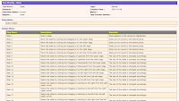
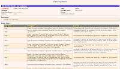
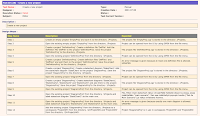

# The Difference of a Test Idea and a Test Case

*Published 2020-10-07*  
*Source: <https://visible-quality.blogspot.com/2020/10/the-difference-of-test-idea-and-test.html>*

---

Year after year, organization after organization I join in anticipation of not having to see test cases other than those that are automated, and through continuous execution guide the process in keeping themselves up to date.

Yet year after year, organization after organization I learn people still write test cases. Those things where there's a title and steps. Those that set out a flow through the application that needs to be verified, and steps you can choose to disobey because you are not a robot.

The way I look at it, ideas are cheap, and we don't care much on how well they are documented. The ideas on post-it notes I find often difficult to decipher in a month, but they are critical notes when I'm learning to structure things in a way that I can recall later. Test cases are something we may want to keep around for later, they are more than ideas. They have structure that supports executing them, even if they were checklist-like. They often include steps and an idea of an order of execution. Test cases are better considered output of testing (and automated!) than an input to testing.

The thing is, some of our worst experiences will never get published, because we can't talk about them while we are in the middle of them. Inspired by conversations today, I go back to an experience I could not talk about back when it happened, but I can today, with examples.

I was working with a product / consulting company, and the consulting side I was representing was doing quite well - so well in fact that it was hard to make space for any of our testing experts to do testing on our own product. The consulting paid so much better. The management pulled one of us consultant out to test release 1, another to test release 2 and so forth. Eventually, I was next in line.

Thinking about it 20 years later, it is hilarious to realize I already was presenting as the resident testing expert. Going in to test the product, I intended to do well - don't we all. I asked what the ones before me had done, and was pointed to a test management tool, by the proud colleagues who had made sure they documented their testing.

These are actual samples of what I received.

  

These were considered test cases. They are a lot worse than some of the better test cases I have seen over the years, but even the better ones come with the universal stigma of not being useful for good testing.

These test cases were awful. They still are awful. Time did not make them better, only worse. They were step by step instructions, with a lot of effort in faking testing by describing elaborately the same steps just so that the tester using them would know they've for example moved a box up, down, right and left. They had magic values defined that completely miss the point of why those values were selected, but I can only guess the choice of data in these reflected naming by concept, not naming for likelihood of finding problems or even pointing at ideas where problems might be.

On my round, the first thing I did was throw these away. These were done by my respected colleagues, and they did the best work they thought of with the situation they had at hand. I could only hope they reflected test cases, not the testing that was done.

I moved testing to exploratory. No more test cases. Closest we would get was expecting a checklist of features and ideas after it was all learned and structured through multiple rounds of rehearsing through actual testing.

While what I run into in organizations nowadays is generally not this bad, it isn't much better either. I've shown it again and again that dropping test cases has improved testing. The controlled experiment of four weeks where we used pre-designed cases for two finding zero problems and using freeform exploratory testing with prepared test data for other two finding all the problems there was to report from that acceptance test. The removal of 39 pages with 46 "test cases" where 3 pieces of information were something I did not know joining a new company on week 1. The others where I did not do a public presentation I can go dig out years later for numbers I was sharing.

I wish the world was ready for good testing, but it still isn't. Automating and working through ideas of better and good seem like our best hope. And I'm delighted that test automation is merely a smart way of documenting your testing.
