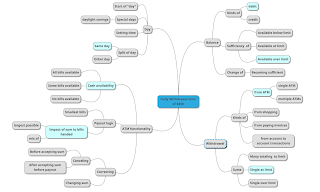

# Learning while Testing

*Published 2021-07-01*  
*Source: <https://visible-quality.blogspot.com/2021/07/learning-while-testing.html>*

---

You know how I keep emphasizing that exploratory testing is about learning? Not all testing is, but to really do a good job of exploratory testing, I would expect centering learning. Learning to optimize value of our testing. But what does that mean in practice? Jenna gives us a chance of having a conversation on that with her thought experiment:

> Testing though experiment:  
>   
> An ATM allows a daily withdraw limit of $300  
>   
> You can’t ask the stakeholder any questions about the requirement, what tests would you run to understand the requirement better and test this functionality?
>
> — Jenna Charlton she/they 🏳️‍🌈 (@SheWrestlesTest) [July 1, 2021](https://twitter.com/SheWrestlesTest/status/1410628694583001089?ref_src=twsrc%5Etfw)

When I first came about Jenna's thought experiment, I was going to pass it. I hate being on the spot with exercises where the exercise designer holds the secret to what you will trip on. But then someone I admire dared to take the challenge on in a way that did not optimize for \*speed of learning\* and this made me wonder what I would really even respond.

**It Starts with a Model**

Reading through the statement, a model starts to form in my head. I have a *balance* of some sort that limits my ability to withdraw money*,*a *withdrawal* of some sort that describes the action I'm about to perform, an *ATM functionalities* of some sort, and a *day* that frames my limitation in time.

I have no knowledge on what works and what does not, and I don't know \*why\* it would matter that there is a limit in the first place.

**The First Test**

If I first test a positive case - having more than that $300 on my balance, withdrawing $300 expecting I get the cash at hand and then any smallest sum on top of that that the functionalities of the ATM allow for, I would at least know the limit can work. But that significantly limits anything else I can learn then on the first day.

I would not have learned anything about the requirement though. Or risks, as the other side of the requirement.

But I could have learned that even the most basic case does not work. That isn't a lot of learning though.

**Seeing Options**

To know if I am learning as much as I could, it helps if I see my options. So I draw a mindmap.

Marking the choices my 1st test would be making makes it clear how I limit my learning about the requirements. Every single branch in itself is a question of whether that type of a thing exists within the requirements, and I would know little other than what was easily made available.

I could easily adjust my first test in at least giving myself a tour of the functionalities the ATM has before completing my transaction. And covering all ways I can imagine going over after that first transaction getting me to limit would lift some of the limitations I first see as limiting learning over time.

**Making choices on learning**

To learn about the requirement, I would like to test things that would teach me around the concepts of what scope the limit pertains to (one user / one account / one account type / one ATM) and what assumptions are built into the idea of having a daily limit with a secondary limit through balance.

For all we know, the way the requirement is written, it could be ATM specific withdrawal limit!

Hands on with the application, learning, would show us what frames its behavior fits in, and without time to test first things out, I would just want to walk away at this point.
