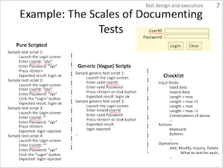

# The Most Overused Test Example - Login

*Published 2021-07-28, updated 2021-07-29*  
*Source: <https://visible-quality.blogspot.com/2021/07/the-most-overused-test-example-login.html>*

---

As I am looking for a particular slide I created to teach testing many, many years ago, I run into other ones I have used in teaching. Like the infamous, most overused test example in particular in the test automation space - the login.

As I look at my old three levels of detail example, I can't help but to laugh at myself.

  

Honestly, I have seen these all. And yet while it is only a year since I last tested a login that was rewritten, I had zero test cases I wrote down.

Instead, I had to find a number of problems with the login:

- Complementing functions. While it did log me in, it did not log me out but pretended it did.
- Performance. While it did log me in, it took its time.
- Session length. While it did log me in, the two different parts of it disagreed on how long I was supposed to be in, resulting in fascinating symptoms while being logged in long enough combined with selected use of features.
- Concurrency. While it did log me in, it also logged me in a second time. And when it did so, it got really confused on which one of me did what.
- Security controls. While I could log in, the scenarios around forgetting passwords weren't quite what I would have expected.
- Multi-user. While it logged me in, it did not log me out fully and sharing a computer for two different user names was interesting experience.
- Browser functions. While it logged me in, it did not play nicely with browser functions remembering user names and passwords and password managers.
- Environment. While it worked on test environment, it stopped working on test environment when a component got upgraded. And it did not work in production environment without ensuring it was setup (and tested) before depending on it.

I could continue the list far further than I would feel comfortable.

Notice how none of the forms of documenting testing suggest finding any of these problems.

Testing isn't about the test cases, it's about comparing to expectations. The better I understand what I expect, the better I test. And like a good tester, if I know what I expect, I tell it in advance and it still allows me to find things I did not know I expect - with software under test as my external imagination.
