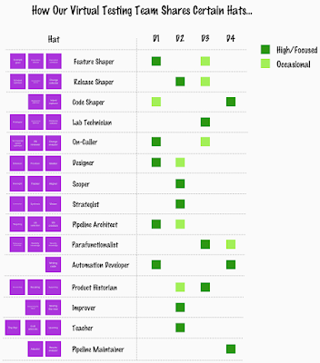

# Tester roles and services

*Published 2021-07-29*  
*Source: <https://visible-quality.blogspot.com/2021/07/tester-roles-and-services.html>*

---

An interesting image came across on my twitter timeline. It looked like my favorite product management space person had been thinking and modeling, and [created an illustration of the many hats people usually have around product creation](https://cutlefish.substack.com/p/tbm-3152-the-weeds). Looking at the picture made me wonder where is testing? Is it really that one hat for one category of hats? Is it the reverse side of every single one of these hats? Don't pictures like this make other people's specialties more invisible?

As I was talking about this with a colleague (like you do when you have something on your mind), I remembered I had created a listing of the services testing provides where I work. And reading through that list, I could create my own image of the many hats of testing,

- **Feature Shaper** focuses on hat we think of as feature testing.
- **Release Shaper** focuses on what we think of as release testing.
- **Code Shaper** focuses on what we think of as unit testing.
- **Lab Technician** builds systems that are required to test systems.
- **On-Caller** provides quick feedback on changes and features so that no one has to carry major responsibilities alone.
- **Designer** figures out how we know what we don't know about the products.
- **Scoper** ensures there's less promiseware and more empirical evidence.
- **Strategist** sets us on a journey to the future we want for this project, team and organization.
- **Pipeline Architect** helps people with their chosen tools and drives the tooling forward.
- **Parafunctionalist** does testing on the top skills areas extending functional: security, reliability, performance and usability.
- **Automation Developer** extends test automation just as application is extended.
- **Product Historian** remembers what works and what does not and if we know so that we know.
- **Improver** tests product, process and organization and does not stop with reporting but drives through changes.
- **Teacher** brings forward skills and competencies in testing.
- **Pipeline Maintainer** keeps pipelines alive and well so that a failing test ends up with an appropriate response.

With all these roles, the hats overall in my team are distributed to entire team, but already create a reality where no two testers are exactly the same. And why should they be: we figure out the work that needs doing in teams where everyone tests - just not the same things, the same way.
