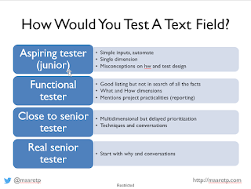

# How Would You Test A Text Field?

*Published 2021-07-30*  
*Source: <https://visible-quality.blogspot.com/2021/07/how-would-you-test-text-field.html>*

---

Long, long time ago we used a question "How would you test a text field?" in interview situations. We learned that there seemed to be a correlation of how well the person had their game together to test for such a simple question, and we noted there were four categories of response types we could see, repeatedly.

  

Every aspiring tester and a lot of developers aspiring to turn into testers approached the problem as simple inputs and automate it all approach. They imagined data you can put into the field, and automating data when there is a simple way of imagining recognizing success is a natural starting point. They may imagine easily repeatable dimensions even like different environments or speed, and while they think in terms of automating, they generally automate regression not reliability. Typical misconceptions include thinking hardware you run on always matters (well, it may matter with embedded software and some functionalities we use text fields for) or someone else telling them what to test. It used to be that they talked about someone else's test cases, but with agile, the replacement word is now acceptance criteria. Effectively, they think testing is checking against a listing someone else already created, when it is at most half the work.

Functional testers are only a notch stronger than aspiring testers. They come packed with more ideas, but their ideas are dull - like writing SQL into a text field in a system that has no database. It only matters if there is a connection to SQL database somewhere further down the line. So while the listing of things we could try has more width, it lacks in depth of understanding what would make sense to do. Typical added dimensions for functional testers are environments, separating function and data, seeing function from the interface (like enter vs. mouse click), and applying various kinds of lists and tools that focus on some aspect like html validators or accessibility checkers or security checkers. Usually people in this category also talk about what to do with the information that testing provides and writing good bug reports. On this level, when they mention acceptance criteria, they expect to contribute to it.

The highest levels are separated only by what the tester in question starts with. If they start with the \*why would anyone use this?\* and continue questioning not only what they are told but what they think they know based on what they see, they are *Real senior testers*, putting every opportunity to test in context of a real application, a real team, and a real organization with real business needs and constraints. If they start with showing off techniques and approaches and dimensions of thinking, they still need work on the \*financial motivations of information\* dimension. The difference to *Close to Senior tester* level is in prioritizing in the moment, which is one of the key elements of good and solid exploratory testing. Just because something could be tested it does not mean it has to be, and we make choices on what we end up testing every time we decide on our next steps.

If we don't have multidimensional ideas of what we could do, we don't do well. If we don't put our ideas in an order where we are already doing the best possible work in the time available when we stop without exhausting our ideas, we don't do well.

With years of experience with the abstract question, I started moving to making the question more concrete and sharing something that was a text field on the screen and asking two questions:

- What do you want to test next?
- What did you learn from this test?

I learned that the latter question in general helps people do better testing than they would without the coaching that sort of takes place there, but I don't want to hire a tester who is so stuck on their past experiences that they can't take in new information and adapt. I've use four text fields as typical starting points:

1. [Test This Box](https://maaretp.com/TestThisBox.html). This is an application that is only a text field and a button, and provides very little context around it. Seniors do well in extracting theory of purpose, comparing it to given purpose, deal with the idea that it is first step to incrementally building the application, learn that while the field is not used (yet), it already displays and that the application has many dimensions in which it fails that are not intended.
2. [Gilded Rose](https://github.com/emilybache/GildedRose-Refactoring-Kata/blob/main/GildedRoseRequirements.txt). This is a programming kata, a function that takes three inputs, and inputs could just as well be text fields. Text field is just an interface. The function has a clear and strong perspective to code coverage but also risk coverage - like who said you weren't supposed to use hexadecimal numbers? Using this text field I see ability to learn and this is my favorite one when selecting juniors I will teach testing but who will need to be picking up guidance from me. Also, if you can't see that code and IDE is just a UI when someone is helping you through it, I feel unsure in supporting you in growing to be a balanced contemporary exploratory tester who documents with automation and works closely with developers.
3. Dfeditor animations pane. This is a real size application where UI has text fields, like they all do. The text field is in context of a real feature, and a lot of the functionality is there by convention. This one reveals me if people discover functionality, and they need to be able to do that to do well in testing.
4. Azure Sentiment API. This is an API with a web page front end, but ML implementation recognizing sentiments of text automatically. This one is hardest to test and makes aspiring testers overfocus on data. For seniors it really reveals if people can make a difference between feedback that can be useful and feedback that isn't so useful through connections of business and architecture.

Watching people in interviews and trainings, my conclusion is that more practice is still needed. We continue to treat testing as something that is easy and learned on job without much focus.

If I had the answer key to where bugs are, wouldn't I trust that the devs can read it too and take those out? But alas, I don't have the answer key. My job is to create that answer key.
