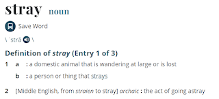

# Stray Testers Unite!

*Published 2021-08-31*  
*Source: <https://visible-quality.blogspot.com/2021/08/stray-testers-unite.html>*

---

I have been observing a phenomenon: there are stray testers out there.

It is unfortunately uncommon that testers find themselves wondering at large or being lost in what it looks like to do a good job at testing.

For one tester, being stray manifests as them waiting for a project to truly start. There's architecture, there's requirements, there's conversations, there's strategies, there's agreements, there's team building and all that, but whenever there's testing, the early prototypes often feel better left for developers to test. And there is only so much one can support, lead and strategize.

For another tester, being stray manifests as them following so many teams that they no longer have time for hands on work. They didn't intend to be lost in coordination and management, but with others then relying on them knowing and summarizing, it comes naturally. They make the moves but find no joy.

For a third tester, being stray manifests as not knowing where to even start and where to head to. With many things unknown to a new professional and little support available, trying to fulfill vague and conflicting expectations about use of time and results leaves them wondering around.

In many ways, I find we testers are mostly strays these days. We consider how \*we\* speak to developers but don't see developers putting the same emphasis on the mutual relationship. We navigate the increasingly complex team and system differences, figuring out the task of "find (some of the) bug that we otherwise missed". We have expectations of little time used, many bugs found, everything documented in automation while creating nice lists of bug reports in a timely manner. The ratio of our kind is down, driven to zero by making some of us assume new 'developer' identities. Finding out tribe is increasingly difficult, and requires looking outside the organization to feel less alone and different.

Communities are important. Connections are important. Caring across company boundaries is important. But in addition to that, I call for the companies to do their share and create spaces where testers grow and thrive. We need better support in the skills and career growth in this space. We need time of our peers for them helping us and us learning together. We need the space to learn, and the expectation and support from our teams in doing that.

Make sure you talk to your colleagues in the company. Make sure you talk to your colleagues in other companies. It will help us all. Stray testers need to unite.
