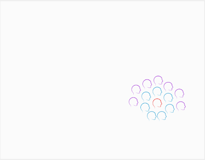
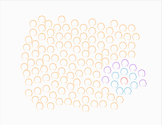

# Scaling Testing Bubbles

*Published 2022-01-17*  
*Source: <https://visible-quality.blogspot.com/2022/01/scaling-testing-bubbles.html>*

---

Back in the days of face to face conferences and golden era of paid testing conferences, we had up to 150 people come together for two days to discuss testing in Finland. Going to large international conferences, seeing audiences up to a thousand was typical. Living in the testing conferences bubble, you would meet other testers from other companies and other countries, with an occasional brave developer by trade tipping their toes into the mix.

As years passed, I started noticing that half of the speakers are usually from the same circuit, learning more and sharing more each time. People came and got started at speaking, some stayed around in the circuits, others faded away focusing on changing things from within the organizations that employ them.

Inside companies as years passed, the position of testers also changed. When in the past you could expect to find a condensed group of testers, agile sent everyone to teams and a typical team would have one specializing tester. At the same time communities of testers became even more active. Communities within companies, and communities that are connected by local or global thread emerged.

The world started to look more like this. A single tester, no other testers in sight.

*Picture 1. Single Tester*

But there were other great colleagues. When you no longer had that little group of testers who could feel like they were up against the world, we were no longer up against anyone. Instead, we had brilliant developer colleagues and great collaboration attempts. In a team for every tester, we had 7 developers.

*Picture 2. Tester embedded in development team*

Similarly, development teams did not exist in organizations in a vacuum of no one else around us, but we had great specializing colleagues: product owners, engineering managers, support, sales, marketing, legal, localization, documentation, user experience, you name it. In a typical organization, that would add 7 other stakeholders to the 7 developers we'd get to figure software out with.

*Picture 3. Development team with stakeholders*

The development team with stakeholders don't build the software just for their personal enjoyment, but have a group of users in mind. Users for worthwhile problems to automate with code would come in hundreds, thousands, millions.

*Picture 4. Development organization with users*

With the strengthened relationships with the developers and a new fact of repetition we can no longer deny and avoid with continuous integration and embracing change, testing became something that isn't the testers job, it is job of everyone in the development organization. Finding someone to hold space for testing became something that needs to be intentional and assigning responsibilities on looking after the work moved from test managers to the testers in the teams.

In the organizations, we had many teams and we could find a few colleagues with similar centers of focus - and build an internal community, topic popular in the recent years. We'd invite everyone to join, on the theme of testing, not testers.

In the communities at large, we would find others trying to figure out their tester and testing corners of the world, and have strength in numbers.

**How Many Testers Are There?**

  

Drawing these pictures of that one tester hiding in the sea of heads made me wonder how many testing specialists are there? Clearly programmers sharing the testing work are a significantly larger group already within scale of one team, but as we scale up the number of teams to an organization, to a country or to the world, what does this really look like. To have ideas on this, I went to statistics.

In Finland 6,8 % of workers are in ICT sector. Going for the number of people employed in 2020: 2 835 000 people, and calculated the number of people in ICT: 192 780. Just a little short of 200 000. I double checked other statistics discovering the numbers to be more like 120 000, but decided the first number was good enough. If we had 200 000 people in ICT and one out of 15 was a tester, we would have 13 000 testers and 91 000 programmers.

They also report that we need 7000 new programmers each year, thus needing 1000 more testers every year.

In my search of statistics, I also learned the EU average for percentage of workforce in IT is 3,7 % but Finland being a tiny country with 5.5M people, there's a few tester folks still available for networking and conferencing.

**Why Should We Care?**

  

I find it fascinating to look at how things have changed, and will be changing. We feel that the number (or at least proportion) of testers has been going down from 1:1 recommendations of the tester golden eras - although a lot less shiny now that we know what works better, developers owning quality and testing over externalizing it. At the same time, number of teams doing software development has gone up, and it may just be that we are generating less specializing testers. Similarly, we no longer recruit just programmers. We recruit embedded device programmers, full-stack programmers, and devops folks, and reliability engineers, and data analysis specialists are all specialist forms of programmers.

We need to keep our flexibility and grow with the industry. And the industry is still growing.

We'll serve our hundreds, thousands, millions of users with quality software and timely delivery. Let's find the mix that invites in the diverse workforce and enables every one of us to feel the work we figure out is work worth doing.
