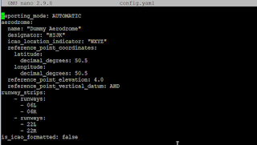
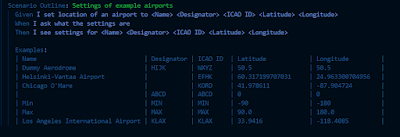

# Core tasks for test positions

*Published 2022-02-26*  
*Source: <https://visible-quality.blogspot.com/2022/02/core-tasks-for-test-positions.html>*

---

In the last weeks, I have been asking candidates in interviews and colleagues in conversations a question: 

> How Would You Test This?

I would show the the user interface. I would show them a single approval test against settings API returning the settings. And I would show them the server side configuration file. The thing to test is the settings.

I have come to learn that I am not particularly happy with the way people would test this. In most cases, describing the chosen test approach is best described as:

> Doing what developers did already locally in end to end environment.

For a significant portion, you would see application of two additional rules.

> Try unexpected / disallowed values.

> Find value boundary and try too small / too large / just right.

I've been talking about resultful testing (contemporary exploratory testing) and from that perspective, I have been disappointed. None of these three approaches center results, but routine.

For a significant portion of people centering automation, they would apply an additional rule.

> Random gives discovery a chance.

I had few shining lights amongst the many conversations. In the best ones people ground what they see in the world they know ("Location, I'll try my home address") and seek understanding of concepts ("latitude and longitude, what do they look like). The better automation testers would have some ideas of how to know if it worked as it was supposed to for their random values, and in implementing it may run a chance of creating a way to reveal how it breaks even if they could not explain it.

Looking at this from the point of view of me having reported bugs on it, and my team having fixed many bugs, I know that for most of the testers I have shown this to, they would have waited for the realistic customer trying to configure this for their unfortunate location to find out the locations in the world that don't work.

I've come to see that many professional testers overemphasize negative testing (input validation) and pay all too little attention to the positive testing that is much more than a single test with values given as the defaults.

As we have discovered essentially different, we also documented that. Whether we need to is another topic for another day.

This experience of disappointment leads me into thinking about **core tasks for positions**. Like when I hire for a (contemporary exploratory) tester position, the core task I expect them to be able to do is *resultful testing*. Their main assignment is to *find some of what others may have missed* and when they miss out on all information when there is information to find, I would not want to call them a tester. Their secondary assignment is to *document in automation* to support discovery in scale over iterations.

At the same time, I realize not all *testers* are contemporary exploratory testers. Some are manual testers. Their main assignment is to *do what devs may have done in local in test environment and document it in test case*. Later rounds of what they then do are *use test cases again as documented to ensure no regression with changes*. There is an inherent value also in being the persistently last one to check things before delivering them forward, especially in teams with little to none on test automation.

Some testers are also traditional exploratory testers. Their main assignment, to *find some of what others may have missed* combined with lack of time and skills on programming leave out the secondary assignment I require in a contemporary exploratory tester.

We would be disappointed in a contemporary exploratory tester if they did not find useful insights in a proportion that helps us not leak all problems to production, and contribute to automation baseline. We would be disappointed in a manual tester if they did not leave behind evidence of systematically covering basic scenarios and reporting blockers on those. We would be disappointed in a traditional exploratory tester if they did not find a trustworthy set of results, providing some types of models to support the continued work in the area.

What then are the core tasks for automation testers? If we are lucky, same as contemporary exploratory testers. Usually we are not lucky though, and their main assignment is to *document in automation basic scenarios in test environment*. Their secondary assignment is *maintain automation and ensure right reactions to feedback automation gives* and the resultful aspect is delayed to first feedback of results we are missing.

I find myself in a place where I am hoping to get all in one, yet find potential in manual testers or automation testers growing into contemporary exploratory testers.

I guess we need to still mention pay. I don't think the manual tester or the automation testers should be paid what developers are paid, unless the automation testers are developers choosing to specialize in the testing domain. A lot of automation testers are not very strong developers not strong testers. I have also heard a proposal on framing this differently: let's pay our people for the position we want them to be in, hire on potential and guide on expectations to do a different role than what their current experience is.

> Hiring on potential is hard. When people with decades of experience in testing have the wrong experience, you will decide on their potential to learn the new way. It's not like they could have all experienced it already.
>
> — Maaret Pyhäjärvi (@maaretp) [February 24, 2022](https://twitter.com/maaretp/status/1496784223251750912?ref_src=twsrc%5Etfw)
