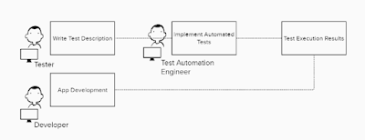
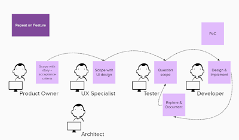
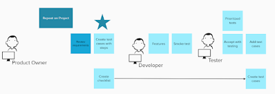
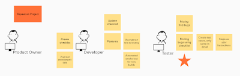

# More to lifecycle for testing

*Published 2022-02-26*  
*Source: <https://visible-quality.blogspot.com/2022/02/more-to-lifecycle-for-testing.html>*

---

With work on recruiting, I have seen a lot of CVs recently. A lot of CVs mention "experience on SDLC" - software development lifecycle, and everyone has a varying set of experiences what it really means in practice to work in agile or waterfall. So this week I've done my share of conversations with people, modeling differences to how we set up "lifecycle" to test, and how others are doing it. Here's a sampling of what I have learned.

**Sample 1. Oh So Many Roles.**

This team has embraced the idea of test automation, and defined their lifecycle around that. Per feature, they have a tester writing test cases, a test automation engineer implementing these written test cases in code, and an agreement in place where results on day to day app development belong to the developers to look at.

My conclusion: not contemporary exploratory testing or even exploratory testing, but very much test-case driven. Leverages specialized skills and while you need more people, specializing people allow you to scale your efforts. Not my choice of style but I can see how some teams would come to this.

**Sample 2. So many amigas**

This team has embraced the idea of scoping and specifying before implementing, and has so many amigas participating in the four amigas sessions. Yes, some might call this three amigos, but a story refinement workshop can have more than three people and they are definitely all men. So we should go for a gender-neutral feminine expression, right?

For every story refinement, there is the before and after thinking for every perspective, even if the session itself is all together and nicely collaborative. People aren't at their best when thinking on their feet.

My conclusion: Too much before implementation, and too many helpers. Cut down the roles, lighten up the process. Make the pieces smaller. This fits my idea of contemporary exploratory testing and leaves documentation around as automation.

**Sample 3. Prep with test cases, then test**

This team gets a project with many features in one go, and prepares by writing test cases. If the features come quicker than test cases can be written, the team writes a checklist to fill in them as proper step-by-step test cases later. Star marks the focus of effort - in preparing and analyzing.

My conclusion: not exploratory testing, not contemporary exploratory testing, not agile testing. A lot of wait and prep, and a little learning time. Would not be my choice of mode, but I have worked on a mode like this.

**Sample 4. Turn prep to learn time**

This team never writes detailed test cases, instead they create lighter checklist (and are usually busy with other projects while the prep time is ongoing). Overall time and effort is lower, but otherwise very similar to sample 3. Star marks focus of effort - during test execution, to explore around checklists.

  
My conclusion: exploratory testing, not contemporary exploratory testing, not agile testing. You can leave prep undone, but you can't make the tail in the end longer and thus are always squeezed with time.

**Conclusion overall**  
We have significantly different frames we do testing in, and when we talk about only the most modern ones in conferences, we have a whole variety of testers who aren't on board with the frame. And frankly, can be powerless in changing the frame they work from. We could do better.   
  

b
