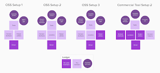

# Salesforce Testing - Components and APIs to Solutions of CRM

*Published 2022-05-06*  
*Source: <https://visible-quality.blogspot.com/2022/05/salesforce-testing-components-and-apis.html>*

---

In a project I was working on, we used Salesforce as source of our login data. So I got the hang of the basics and access to both test (we called it QUAT - Quality User Acceptance Testing environment) and production. I learned QUAT got data from yet another system that had a test environment too (we called that one UAT - User Acceptance Testing) with a batch job run every hour, and that the two environments had different data replenish policies.

In addition to coming to realise that I became one of the very few people who understood how to get test data in place across the three systems so that you could experience what users really experience, I learned to proactively design test data that wouldn't vanish every six months, and talk to people across two parts of organization that could not be any more different.

Salesforce, and business support systems like that, are not systems product development (R&D) teams maintain. They are IT systems. And even within the same company, those are essentially different frames for how testing ends up being organised.

Stereotypically, the product development teams want to just *use the services* and thus treat them as black box - yet our users have no idea which of the systems in the chain cause trouble. The difference and the reluctance to own experiences across two such different things is a risk in terms of clearing up problems that will eventually happen.

On the *salesforce component acceptance testing* that my team ended up being responsible for, we had very few tests in both test and production environments and a rule that if those fail, we just know to discuss it with the other team.

On the salesforce feature acceptance testing that the other team ended up being responsible for, they tested, with checklist, the basic flows they had promised to support with every release, and dreamed of automation.

On a couple of occasions, I picked up the business acceptance testing person and paired with her on some automation. Within few hours, she learned to create basic UI test cases, but since she did not run and maintain those continuously, the newly acquired skills grew into awareness, rather than change in what to fit in her days. The core business acceptance testing person is probably the most overworked person I have gotten to know, and anything most people would ask of her would go through strict prioritisation with her manager. I got a direct route with our mutually beneficial working relationship.

Later, I worked together with the manager and the business acceptance testing person to create a job for someone specialising in test automation there. And when the test automation person was hired, I helped her and her managers make choices on the tooling, while remembering that it was their work and their choices, and their possible mistakes to live with.

This paints a picture of a loosely coupled "team" with sparse resources in the company, and change work being done by external contractors. Business acceptance testing isn't testing in the same teams as devs work, but it is work supported by domain specialists with deep business understanding, and now, a single test automation person.

They chose a test automation tool that I don't agree with, but then again, I am not using that tool. So today, I was again thinking back to the choice of this tool, and how testing in that area could be organized. As response to a probing tweet, I was linked to an article on [Salesforce Developers Blog on UI Test Automation on Salesforce](https://developer.salesforce.com/blogs/2020/01/ui-test-automation-on-salesforce). What that article basically says is that they intentionally hide identifiers and use shadow DOM, and you'll need a people and tools that deal with that. Their recommendation is not on the tools, but on options of who to pay: tool vendor / integrator / internal.

I started drafting the way I understand the world of options here.

  

For any functionality that is integrating with APIs, the OSS Setup 1 (Open Source Setup 1) is possible. It's REST APIs and a team doing the integration (the integrator) is probably finding value to their own work also if we ask them to spend time on this. It is really tempting for the test automation person in the business acceptance testing side to do this too, but it risks delayed feedback and is anyway an approximation that does not help the business acceptance testing person make sense of the business flows in their busy schedule and work that focuses on whole business processes.

The article mentions two GUI open source tools, and I personally used (and taught the business acceptance testing person to use) a third one, namely Playwright. I colour-coded a conceptual difference of getting one more box from the tool over giving to build it yourself, but probably the skills profile you need to work so that you create the helper utilities or that you use someone else's helper utilities isn't that different, provided the open source tool community has plenty of online open material and examples. Locators are where the pain resides, as the platform itself isn't really making it easy - maintenance can be expected and choosing ones that work can be hard, sometimes also preventively hard. Also, this is full-on test automation programming work and an added challenge is that Salesforce automation work inside your company may be lonely work, and it may not be considered technically interesting for capable people. You can expect the test automation people to spend limited time on the area before longing for next challenge, and building for sustainability needs attention.

The Commercial tool setup comes to play by having the locator problem outsourced to a specialist team that serves many customers at the same time - adding to the interest and making it a team's job over an individual's job. If only the commercial tool vendors did a little less misleading marketing, some of them might have me on their side. The "no code anyone can do it" isn't really the core here. It's someone attending to the changes and providing a service. On the other side, what comes out with this is then a fully bespoke APIs for driving the UI, and a closed community helping to figure that API out. The weeks and weeks of courses on how to use a vendors "AI approach" create a specialty capability profile that I generally don't vouch for. For the tester, it may be great to specialise in "Salesforce Test Tool No 1" for a while, but it also creates a lock in. The longer you stay in that, the harder it may be to get to do other things too.

Summing up, how would I be making my choices in this space:

1. Open Source Community high adoption rate drivers to drive the UI as capability we grow. Ensure people we hire learn skills that benefit their career growth, not just what needs testing now.
2. Teach your integrator. Don't hire your own test automation person if one is enough. Or if you hire one of your own, make them work in teams with the integrator to move feedback down the chain.
3. Pay attention to bugs you find, and let past bugs drive your automation focus.
