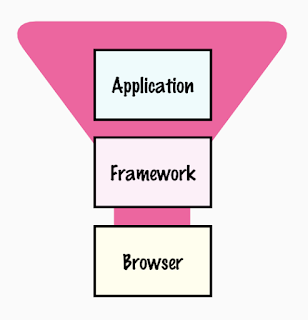

# WebUI Testing

*Published 2022-10-14*  
*Source: <https://visible-quality.blogspot.com/2022/10/webui-testing.html>*

---

I don't know about you, but my recent years have seen a lot of systems where users are presented with a webUI. The embedded devices I've tested ship with a built-in web server serving pages. The complex data processing pipelines end up presenting chewed up observations and insights on WebUI. Some are hosted in cloud, others in own server rooms. Even the windows user interfaces turned into webUIs wrapped in some sort of frame that appears less of a browser, but is really just a specializing browser.

With this in mind, it is no surprise that test automation tooling in this space is both evolving, and source of active buzz. The buzz is often on the new things, introducing something new and shiny. Be it a lovely API, the popularized 'self-healing' or the rebranded 'low-code/no-code' that has been around at least as long as I have been in this industry, there is buzz.

And where there's buzz, there's sides. I have chosen one side intentionally, which is against Robot Framework and for libraries in the developer team's dominant language. For libraries I am very hard trying to be, as they say, Switzerland - neutral ground. But how could I be neutral ground, as a self-identified Playwright girl, and a member of Selenium Project Leadership Group? I don't really care for any of the tools, but I care for the problems. I want to make sense of the problems and how they are solved.

In the organization I spend my work days in, we have a variety. We have Robot Framework (with Selenium library). We have Robot Framework (with Playwright library). We have python-pytest with Selenium, and python-pytest with Playwright. We have javascript with Selenium, Playwright and Testcafe, and Cypress. The love and enthusiasm of doing well seems to matter more for success than the libraries, but jury is still out.

I have spent a significant amount of time trying to make sense on Playwright and Selenium. Cypress, with all the love it is getting in world and my org, seems to come with functional limitations, yet people always test what they can with the tools, and figure out ways of telling that is the most important thing we needed to do, anyway. Playwright and Selenium, that pair is a lot trickier. The discussion seems to center around both testing \*real browsers\*. Playwright appears to mean a **superset-engine browser** that real users don't use and would not recognise as real browser. Selenium appears to mean the real browser, the **users-use-this browser**, with all the hairy versions and stuff that add to the real-world complexity in this space. The one users download, install on their machines and use.

Understanding this difference on what Playwright and Selenium drive for you isn't making it easy for me.

 I have strong affinity for the idea of risk-based testing, and build the need of it on top of experiences of maintaining cross-browser tests being more work than value. In many of the organizations I have tested in, we choose one browser we automate on, and cover other browsers by agreeing a rotation based on days of the week in testing, time of doing one-off runs of automation half-failing with significant analysis time or agreeing on different people using different browsers while we use our webUI. We have thought we have so few problems cross-browser hearing the customer feedback and analyzing behaviors from telemetry that the investment to cross-browser has just not been worth it.

With single browser strategy in mind, it matters less if we use that superset-engine browser and automation never sees users-use-this browser. There is the eyes-on-application on our own computers that adds users-use-this browsers, even if not as continuous feedback for each change automation can provide. Risk has appeared both low in likelihood and low in impact when it rarely has hit a customer. We use the infamous words "try Chrome as workaround" while we deliver fix in the next release.

Reality is that since we don't test across browsers, we believe this is true. It could be true. It could be untrue. The eyes-on sampling has not shown it to be untrue but it is also limited in coverage. Users rarely complain, they just leave if they can. And recognising problems from telemetry is still quite much of a form of art. We don't know if there are bugs we miss on our applications if we rely on superset-engine browsers over users-use-this browsers.

Browsers of today are not browsers of the future. At least I am picking up a sense of *differentiation* emerging, where one seems to focus on privacy related features, another being more strict on security, and so on. Even if superset-engine browsers are sufficient for testing of today, are they sufficient for testing in five years with browsers in the stack becoming more and more different from one another.

Yet that is not all. The answers you end up giving to these questions are going to be different depending on where your team's changes sit on the stack. Your team's contribution to the world of webUIs may be your very own application, and that is where we have large numbers. Each of these application teams need to test their very own application. Your team's contribution may also be on the framework applications are built on. Be it Wordpress or Drupal, or React or Vue, these exists to increase productivity in creating applications and come to an application team as a 3rd party dependency. Your team's contribution could also be in the browser space, providing a platform webUIs run on.

*Picture. Ecosystem Stack*

This adds to the trickiness of the question of how do we test for the results we seek. Me on top of that stack with my team of seven will not want to inherit testing of the framework and browser we rely on, when most likely there's bigger teams already testing those and we have enough on our own. But our customers using that webUI we give them, they have no idea if the problem is created by our code, the components we depend on, or the browser we depend on to run this all. They just know they saw a problem with us. That puts us in a more responsible spot, and when the foundation under us leaks and gives us a bad name, we try making new choices of the platform when possible. And we try clear timely reports hoping our tiny voices are heard with that clarify in the game with mammoths.

For applications teams we have the scale that matters the most for creators of web driver libraries. And with this risk profile and team size, we often need ease, even shortcuts.

The story is quite different on the platforms the scale of applications rely on. For both browsers and frameworks, it would be great if they lived with users-use-this browsers with versions, variants and all that, and did not shortcut to superset-engine type of an approach where then figuring out something is essentially different becomes a problem for their customers, the webUI development community. The browser and framework vendors won't have access (or means to cover even if they had access) to all our applications, so they sample applications based on some sampling strategy to think their contributions are tested and work.

We need to test the integrated system not only our own code for our customers. Sitting on top of that stack puts our name on all the problems. But if it costs us extra time to maintain tests cross-browser for users-use-this browser, we may just choose we can't afford to - the cost and the value our customers would get are not in balance. I'm tired of testing for browser and framework problems in the ever-changing world because those organizations wouldn't test their own, but our customers will never understand the complexities of responsibilities across this ecosystem stack.

We would love if our teams could test what we have coded, and a whole category of cross-browser bugs would be someone else's problem.
