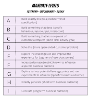

# How to Maximize the Need for Testers

*Published 2022-10-24*  
*Source: <https://visible-quality.blogspot.com/2022/10/how-to-maximize-need-for-testers.html>*

---

Back when I was growing up as a tester, one conversation was particularly common: the ratio of developers in our teams. A particularly influential writing was from [Cem Kaner et al, on Fall 2000 Software Test Managers Roundtable on 'Managing the Proportion of Testers to (Other) Developers"](https://www.researchgate.net/publication/2928929_Managing_The_Proportion_Of_Testers_To_other).

The industry followed the changes in the proportion from having less testers than developers, to peaking at the famous 1:1 tester developer ratio that Microsoft popularized, to again having less testers than developers to an extend where it was considered good to have no developers with testing emphasis (testers), but have everyone share the tester role.

If anything, the whole trend of looking for particular kinds of developers as test system responsibles added to the confusion of what do we count as testers, especially when people are keen to give up on the title when salary levels associated for the same job end up essentially different - and not in favor of the tester title.

The ratios - or task analysis of what tasks and skills we have in the team that we should next hire for a human-shaped unique individual - are still kind of core to managing team composition. Some go with the ratio to have at least ONE tester in each team. Others go with looking of tasks and results, and bring in a tester to coach on recognising what we can target in the testing space. Others have it built into the past experiences of the developers they've hired. It is not uncommon to have developers who started off with testing, and later changed focus from specializing into creating feedback systems to creating customer-oriented general purpose systems - test systems included.

As I was watching some good testing unfold in a team where testing happens by everyone not only by the resident tester, I felt the need of a wry smile on how invisible testing I as the tester would do. Having ensured that no developer is expected to work alone and making space for it, I could tick off yet another problem I was suspecting I might have to test for to find the problem, but now instead I could most likely be enjoying that it works - others pointed out the problem.

To appreciate how little structural changes can make my work more invisible and harder to point at, I collected the \*sarcastic\* list of how to maximise the need of testers by ensuring there will be visible for for you. Here's my to-avoid list that makes the testing I end up doing more straightforward, need of reporting bugs very infrequent, and allows me to focus more of my tester energies in telling the positive stories of how well things work out in the team.

1. **Feature for Every Developer**Make sure to support the optimising managers and directors who are seeking for a single name for each feature. Surely we get more done when everyone works on a different feature. With 8 people in the team, we can take forward 8 things, right? That must be efficient. Except we should not optimize for direct translation of requirements to code, but for learning when allocating developers features. Pairing them up, or even better \*single piece flow\* of one feature for the whole team would make them cross-test while building. Remember, we want to maximise need of testers, and having them do some of that isn't optimising for it. The developers fix problems before we get our hands on them, and we are again down a bug on reporting! So make sure two developers work together as little as possible, review while busy running with their own and the only true second pair of eyes available is a tester.
2. **Detail, and externalised responsibility**  
   Lets write detailed specifications: Build exactly this [to a predetermined specification]. All other mandates of thinking belong with those who don't code, because developers are expensive. That leaves figuring out all higher mandate levels to testers and we can point out how we built the wrong thing (but as specified). When developer assumptions end up in implementation, let's make sure they have as many assumptions strongly hold with an appearance of great answers in detail. *\*this model is from John Cutler (@johncutlefish)*  
   There's so much fun work to find out how they went off the expected rails when you work on higher mandate level. Wider mandate for testers but let's not defend the developers access to user research, learning and seeing the bigger picture. That could take a bug away from us testers! Ensure developers hold their assumptions that could end up in production, and then a tester to the rescue. Starting a fire just to put it out, why not.
3. **Overwhelm with walls of text**It is known that some people don't do so well with reading essential parts of text, so let's have a lot of text. Maybe we could even try an appearance of structure, with links and links, endless links to more information - where some of the links contain essential key pieces of that information. Distribute information so that only the patient survives. And if testers by profession are something, we are patient. And we survive to find all the details you missed. And with our overlining pens of finding every possible claim that may not be true, we are doing well when exceptional patience of reading and analyzing is required. That's what "test cases" are for - writing the bad documentation into claims with a step by step plan. And those must be needed because concise shared documentation could make us less needed.
4. **Smaller tasks for devs, and count the tasks all the time**Visibility and continuously testing, so let's make sure the developers have to give very detailed plans of what they do and how long that will take. Also, make sure they feel bad when they use even an hour longer than they thought - that will train them to cut quality to fit the task into the time they allocated. Never leave time between tasks to look at more effective ways of doing same things, learning new tech or better use of current tech. Make sure the tasks focus on what needs \*programming\* because it's not like they need to know about how accessibility requirements come from most recent legislation, or how supply chain security attacks have been in their tech, or expectations of common UX heuristics, more to the testers to point out that they missed! Given any freedom, developers would be *gold-plating* anyway so better not give room for interpretation there.
5. **Tell them developers they are too valuable test and we need to avoid overlapping work**  
   Don't lose out on the opportunities to tell developers how they were hired to develop and you were hired to test. Remember to mention that if they test it, you will test it anyway, and ensure the tone makes sure they don't really even try. You could also use your managers to create a no talking zone between a development team and testing team, and a very clear outline of everything the testing team will do that makes it clear that the development team does not need to do. Make sure every change comes through you, and that you can regularly say it was not good enough. You will be needed the more the less your developers opt in to test. Don't care that the time consuming part is not avoiding testing work overlap, but avoiding delayed fixing - testing could be quite fast if and when everything works. But that wouldn't maximise need of testers, so make sure the narrative makes them expect you pick up the trash.
6. **Belittle feedback and triage it all**Make sure it takes a proper fight to get any fixes on the developers task lists. A great way of doing this is making management very very concerned over change management and triaging bugs before, developers get only well-chewed clear instructions. No mentions of bugs in passing so that they might be fixed without anyone noticing! And absolutely no ensemble programming where you would mention a bug as it is about to be created, use that for collecting private notes to show later how you know where the bugs are. You may get to as far as getting managers telling developers they are not allowed to fix bugs without manager consent. That is a great ticket to all the work of those triage meetings. Nothing is important anyway, make the case for it.
7. **Branching policy to test in branch and for release**  
   Make sure to require every feature to be fully tested in isolation on a branch, manually since automation is limited. Keep things in branches until they are tested. But also be sure to insist on a process where the same things get tested integrated with other recent changes, at latest release time. Testing twice is more testing than testing once, and types of testing requiring patience are cut out for testers. Maximize the effect by making sure this branch testing cannot be done by anyone other than a tester or the gate leaks bad quality. Gatekeep. And count how many changes you hold at the gates to scale up the testers.
8. **Don't talk to people**  
   Never share your ideas what might fail when you have them. They are less likely to find a problem when you use them if someone else got there first. It might also be good to not use PRs but also not talk about changes. Rely on interface documentation over any conversation, and when documentation is off, write a jira ticket. Remember to make the ticket clear and perfect with full info, that is what testers do after all. A winning strategy is making sure people end up working neighbour changes that don't *really* like each other, the developers not talking bodes ill for software not talking either. Incentivising people to not work together is really easy to do through management.

Sadly, each of these are behaviors I still keep seeing in teams.

In a world set up for failing in the usual ways, we need to put special attention to doing the right thing.

It's not about maximising the need of testers. The world will take care bigger and harder systems. The time will take care of us growing to work with the changing landscapes in project's expectation on what the best value from us is, today.

There is still a gap in results of testing. It requires focused work. Make space for the hard work.
