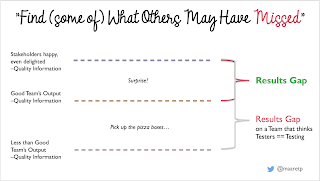

# 1-2-3 model to test coverage

*Published 2022-11-18*  
*Source: <https://visible-quality.blogspot.com/2022/11/1-2-3-model-to-test-coverage.html>*

---

This afternoon I jumped on a call with a colleague from the community at large. This one had sent me a LinkedIn message asking to talk about test coverage, and our previous correspondence was limited. And like I sometimes do, I said yes to a discussion. After the call, I am grateful. For realizing there is a 1-2-3 model of how I explain test coverage, but also for the conversation channel that helps me steer to understanding, starting from where ever whoever is.

The 1-2-3 model suggests there is one true measure of test coverage. Since that is unattainable, we have two we commonly use as starting point. And since the two are so bad, we need to remember three more to be able to explain further to people who may not understand the dimensions of testing.

**The One**

There is really one true measure of coverage, and it is that of risk/results coverage. Imagine a list of all relevant and currently true information about the product that we should have a conversation on listed on a paper - that is what you are seeking to cover. The trouble is, the paper when given to you is empty. There is no good way of creating a listing of all the relevant risks and results. But we should be having conversation on this coverage, here is how.

If you are lucky and work in a team where developers truly test and care for quality, the level of coverage in this perspective is around the middle line in the illustration below. That is a level of quality information produced by a Good Team (tm). The measure determining if we indeed are with a Good Team (tm) is sending someone Really Good at testing after them. That Really Good could be a tester, but I find that most testers find themselves out of jobs with good teams - the challenge level is that much higher. Or that Really Good could be all your users combined over time, with an unfortunate delay in feedback and higher risk of the feedback being lost in translation.

I call the difference between the output for a Good Team (tm) and the quality where our stakeholders are really happy, even delighted *the primary Results Gap.* There are plenty of organizations who are not seeking to do anything with this results gap themselves but leave it to their users. That is possible, since the nature of the problems people find within the primary results gap is a surprise.

I recognise if I am working with a team in this space by being surprised with problems. Sometimes I even exclaim: "this bug is so interesting that no one could have created this on purpose!". Consider yourself lucky if you get to work with a team like this that remains this way over time. After all, location on this map is dynamic with regards to consistently doing a good work across different kinds of changes.

There is a *secondary Results Gap* too. Sometimes the level to which teams of developers get to is Less than Good Team's Output. We usually see this level with organizations where managers hire testers to do testing, even when they place the tester in the same team. Testing is too important to be left just for testers, and should be shared variably between different team members. Sometimes working as tester in these teams feels like your job is to point out that there are pizza boxes in the middle of the living room floor and remind that we should pick them up. Personally when I recognise the secondary results gap, I find the best solution is to take away the tester, reorganize quality responsibilities on the remaining developers. The job of a tester in a team like this is move the team to the primary results gap, not deal with the pizza boxes except for temporarily as protection of the reputation of the organization.

A long explanation on the one true measure of coverage - risks/results. Everything else is an approximation subject to this. It helps to understand if we are operating with a team on the secondary results gap or with a team on the primary results gap, and the lower we start, the less likely we are ever to get to address all of the gap.

**The Two**

The two measures of coverage we commonly use and thus everyone needs to understand are code coverage and requirements/spec coverage. These are both test coverage, but very different by their nature.

*Code coverage* can only give us information of what is in the code and whether the tests we have touch it. If we have functionality we promised to implement, that users expect to be included but we are missing out on, that perspective will not emerge with code coverage. Code coverage focuses on the chances of seeing what is there.

Cem Kaner has an older article of 101 different criteria in the space of code coverage, so let's remember it is not one thing. There are many ways we can look at the code and discuss having seen it in action. Touching each line is one, taking every direction at every crossroad is one, and paying attention to the complex criteria of the crossroads is one. Tools are only capable of the simpler ways of assessing code coverage.

Seeing a high percentage does not mean "well tested". It means "well touched". Whether we looked at the right things, and verified the right details is another question. Driving up code coverage does not usually mean good testing. Whereas being code coverage aware, not wanting code coverage to go down from where it has been even when adding new functionality, and taking time for thoughtful testing based on code coverage seem to support good teams in being good.

*Requirement/spec coverage* is about covering claims in authoritative documents. Sometimes requirements need to be rewritten as claims, sometimes we go about spending time with each claim we find, and sometimes we diligently link each requirement to one or more tests, but some form of this tends to exist.

With requirements/spec coverage, we need to be aware that there are things the spec won't say and we still need to test for. We can never believe any material alone is authoritative, testing is about also discovering omissions. Omissions can be code that spec promises, or details spec fails at promising but users and customers would consider particularly problematic.

Having one test for a claim is rarely sufficient. There is no set number of tests we need for each claim. So I prefer thinking in none / one / enough. Enough is about risk/results. And it changes from project to project, and requires us to be aware of what we are testing to do a good job testing.

**The Three**

By this time, you may be a little exasperated with the One and the Two, and there is still the Three. These three are dimensions of coverage I find I need to explain again and again to help address the risks.

*Environment coverage* starts with the idea that users environments are different and testing in one may not represent them all. We could talk for hours on what makes environments essentially different, but for purposes of coverage, take my word for it: sometimes they are and sometimes they are not essentially different. So for the 10 functionalities to cover with tests with one test for each functionality, if we have three environments, we could have 30 tests to run.

Easy example is browsers. Firefox on Linux is separate from Firefox on Mac and Firefox on Windows. Safari on Mac or Edge on Windows is only available there. Chrome is available on Mac, Windows and Linux. That small listing alone gives us 8 environments. The amount of testing - should we want to do it regularly - could easily explode. We may address this with various strategies from having different people on different environments, changing environments on a round-robin fashion to cross-browser automation. Whether we care to depends on risks, and risks depends on the nature of the thing we are building.

*Data coverage* starts with the idea that each functionality processing data is covered with one data, but that may be far from sufficient. Like with embedded devices over the last three years, I find it surprising how often covering such simple thing as positive and negative temperature is necessary with the registry manipulation technologies. For this coverage, we would heavily rely on sampling, and it is part of every requirement test making it flexible to consider what percentage we are getting. Well, at least enough to note that percentages are generally useless measures in space of coverage.

*Parafunctional coverage* would be reminding on other dimensions that positive outputs. Security would be to have functionality that does something that can be used in wrong hands for bad. Performance would be considerations of fast and resource effective, particularly now in era of green code considerations. Reliability would be to run same things over longer period of time. And so on.

**Plus One**

Today's call concluded with us then discussing automation coverage. Usually what we end up putting in our automation is a subset of all the things we do, a subset we want to keep on repeating. Great automation isn't created from listing test cases and implementing them, for good automation we tend to decompose the feedback needed differently where sum of the whole is similar.

Automation coverage is ratio of what we have automated to something we care for. Some people care for documented test cases but I don't. If and when I care about this, I talk about automation coverage in terms of plans of growing it, and I avoid the conversation a lot.

In one project we did test automation coverage by assigning zero, one, enough values for requirements by tagging all automation with requirements identifiers. A lot of work, some good communications included on planning for what more we need (first), but the percentage was very much the same as I could estimate off cuff.

You may not have the half an hour it took for us to discuss 1-2-3 on the call, but knowing how to ground conversations of coverage is invaluable skill. If you spend time with testing, you are likely to get as many chances of practicing this conversation that I have by now.
