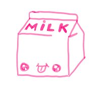

# Contemporary Regression Testing

*Published 2023-01-06*  
*Source: <https://visible-quality.blogspot.com/2023/01/contemporary-regression-testing.html>*

---

One of the first things I remember learning about testing is the repeating nature of it. Test results are like milk and stay fresh only a limited time, so we keep replenishing our tests. We write code and it stays and does the same (even if wrong) thing until changes, but testing repeats. It's not just the code changing that breaks systems, it's also the dependencies and platform changing, people and expectations changing.

*An illustration of kawaii box of milk from my time of practicing sketchnoting*

There's corrective, adaptive, perfective and preventive maintenance. There's the project and then there's "maintenance". And maintenance is 80% of products lifecycle costs since maintenance starts with first time you put the system in production.

- **Corrective maintenance** is when we had problems and need to fix them.
- **Adaptive maintenance** is when we will have problems if we allow for world around us to change and we really can't stop it, but we emphasize that everything was FINE before the law changes, the new operating system emerged or that 3rd party vendor figured out they had a security bug that we have to react to because of a dependency we have.
- **Perfective maintenance** is when we add new features while maintaining, because customers learn what they really need when they use systems.
- **Preventive maintenance** is when we foresee adaptive maintenance and change our structures so that we wouldn't always be needing to adapt individually.

It's all change, and in a lot of cases it matters that only the first one is defects and implying work you complete without invoicing for the work.

The thing about change is that it is small development work, and large testing work. This can be true considering the traditional expectations of projects:

1. Code, components and architecture are spaghetti
2. Systems are designed, delivered and updated as integrated end-to-end tested monoliths
3. Infrastructure and dependencies are not version controlled

With all this, the \*repeating nature\* becomes central, and we have devised terminology for it. There is **re-testing**(verifying a fix indeed fixed the problem) and **regression testing***(*verifying that things that used to work still work), and made it a central concept in how we discuss testing.

For some people, it feels regression testing is all the testing they think of. When this is true, it almost makes sense to talk about doing this *manual* or *automated*. After all, we are only talking of the part of testing that we are replenishing results for.

Looking at the traditional expectations, we come to expectations of two ways to think about regression testing. One takes a literal interpretation of "used to work", as in we clicked through exactly this and it worked, and I would call this **test-case based regression testing**. The other takes a liberal interpretation of "used to work" remembering that with risk-based testing we never looked at it all working but some of it worked even when we did not test it, and thus continuing with risk-based perspective, the new changes drive entirely new tests. I would call this **exploratory regression testing**. This discrepancy of thinking is a source of a lot of conversation in *automated* space because the latter would need to actively choose to pick tests as output to leave behind that we consider worthwhile repeating - and it is absolutely not all the tests we currently are leaving behind.

So far, we have talked in *traditional*  expectations. What is *contemporary* expectation then?

The things we believe are true of projects are sometimes changing:

1. Code is clean, components are microservices and architecture creates clear domain-driven architecture where tech and business concepts meet
2. Systems are designed, delivered and updated incrementally, but also per service basis
3. Infrastructure and dependencies are code

This leads to thinking many things are different. Things mostly break only when we break them with a change. We can see changes. We can review the change as code. We can test the change from a working baseline, instead of a ball of change spaghetti described in vague promises of tickets.

Contemporary regression testing can more easily rely on exploratory regression testing with improved change control. Risk-based thinking helps us uncover really surprising side effects of our changes without using major efforts. But also, contemporary exploratory testing relies on teams doing programmatic test-case based regression testing whenever it is hard for developers to hold their past intent in their heads. Which is a lot, with people changing and us needing safety nets.

Where with traditional regression testing we could choose one or the other, with contemporary regression testing we can't.
