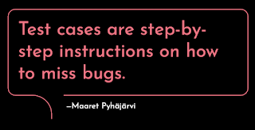

# On Test Cases

*Published 2023-04-15*  
*Source: <https://visible-quality.blogspot.com/2023/04/on-test-cases.html>*

---

25 years ago, I was a new tester working with localisation testing for Microsoft Office products. For reasons beyond my comprehension, my 1st ever employer in IT industry had won localisation project for four languages and Greek was one of them. The combination of my Greek language hobby and my Computer Science studies turned me into a tester.

The customer provided us test cases, essentially describing tours of functionalities that we needed to discover. I would have never known how certain functionalities of Access and Excel work without those test cases, and was extremely grateful for the step by step instructions on how to test.

Well, I was happy with them until I got burned. Microsoft had a testing QA routine where a more senior tester would take exactly the same test cases that I had, not follow the instructions but be inspired by the instructions and tell me how miserably I had failed at testing. The early feedback for new hires did the trick, and I haven't trusted test cases as actual step-by-step instructions since. Frankly, I think we would have been better off if we described those as feature manuals over test cases, I might have gotten the idea that those were just a platform a little sooner.

In years to come, I have created tons of all kinds of documentation, and I have been grateful for some of it. I have learned that instead of creating separate test case documentation, I can contribute to user manuals and benefit the end users - and still use those as inspiration and reminder of what there is in the system. Documentation can also be a distraction and reading it an effort away from the work that would provide us result, and there is always a balance.

When I started learning more on exploratory testing, I learned that a core group figuring that stuff out had decided to try to make space between test cases (and the steps those entail) by moving to use word charter, which as a word communicates the idea that it exists for a while, can repeat over time but isn't designed to be repeated, as the quest for information may require us to frame the journey in new ways.

10 years ago, I joined a product development organization, where the manager believed no one would enjoy testing and that test cases existed to keep us doing the work we hate. He pushed very clearly me to write test cases, and I very adamantly refused. He hoped for me to write those and tick at least ten each day to show I was working, and maybe if I couldn't do all the work alone, the developers could occasionally use the same test cases and do some of this work. I made a pact of writing down *session notes* for a week, tagging test ideas, notes, bugs, question and the sort. I used 80% of my work time on writing and I wrote a lot. With the window to how I thought and the results in the 20% time I had for testing, I got my message through. In the upcoming 2,5 years I would find 2261 bugs I would report that also got fixed, until I learned that pair fixing with developers was a way of not having to have those bugs created in the first place.

Today, I have a fairly solid approach to testing, grounded on exploratory testing approach. I collect claims, both implicit and explicit and probably have some sort of a listing of those claims. You would think of this as a feature list, and optimally it's not in test cases but in user facing documentation that helps us make sense of the story of the software we have been building. To keep things in check, I have programmatic tests, where I have written some, many have been written because I have shown ways systems fail, and they are now around to keep the things we have written down in check with changes.

I would sometimes take those tests, and make changes on data, running order, or timing to explore things that I can explore building on assets we have - only to throw most of those away after. Sometimes I would just use the APIs and GUIs and just think in various dimensions, to identify things inspired by application and change as my external imagination. I would explore alone without and with automation, but also with people. Customer support folks. Business representatives. Other testers and developers. Even customers. And since I would not have test cases I would be following, I would be finding surprising new information as I grow with with the product.

Test cases are step by step instructions on how to miss bugs. The sooner we embrace it, the sooner we can start thinking about what really helps our teams collaborate over time and changes of personnel. I can tell you: it is not test cases, especially in their non-automated format.
