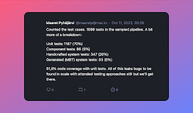

# How many test cases do we still have to execute?

*Published 2023-10-11*  
*Source: <https://visible-quality.blogspot.com/2023/10/how-many-test-cases-do-we-still-have-to.html>*

---

In a one on one conversation to understand where we are with our release and testing efforts, a manager asked me the infamous question that always makes me raise my eyebrows:

> How many test cases do we still have to execute?

This question was irrelevant 20 years ago when it send me fuming and explaining, and it is still irrelevant today. But today it made me think about how I want to change the frame of the conversation, and how I manage to now almost routinely do it.

I have two framings:

1. The 'transform for intent while hearing the question' framing
2. The 'teach better ways of asking so that you get the info when not talking to me' framing

It would be lovely if I was big enough person to always go with the first framing. I know from years of having answered this question that the real question is one about schedule and how testing supports it.  What they really ask me is twofold: a) How much work do we need to do to have testing done? b) Can we scale it to make it faster? This time the answer in the moment I gave was in the first framing. I explained that I would think since September 1st, we've made it to about 40% of what we need in time and effort. I illustrated actions we take as a team to ensure *fixing* which is the real problem supports testing, and how the critical knowledge of the domain specialist tester is made more available by team members pitching in to other work domain specialist could opt in. I reminded that my estimate of having to find and log 150 bugs based on a day of early sampling and years of profiling projects and that we are at 72 reported now, which indicates about half way through.

I recognised the question was really not about test cases. We sort of don't have them for the kind of testing the manager asked on. Or if I want to claim we have them for compliance purposes, they are high level ones and there are 21 of them, and only one of them is "passed".

The second framing is one that I choose occasionally, and today I chose it in hindsight. If I had my statistics in place and memory, I could have also said something akin to this:

We do two kinds of testing. Programmatic tests do probably 10% of our testing work and we have 1699 of them. They are executed 20...50 times per working day, and are green (passing) on merge.

  

These 1699 test cases miss out things the 21 high level test cases allow us to identify. And with those 21 high level test cases, we are about 40% into the work that is needed.

There are real risks to quality we have accrued in recent times, particularly on controlling our scope (even if they say scope does not creep but understanding grows, we have had a lot coming in as must fix that are improvements and grow scope for entire team), reliability and performance. Assessing and managing these risks is the work that remains.

> Other people may have other ways of answering this question, have you paid attention what are your framings?
