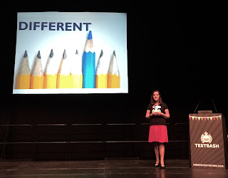
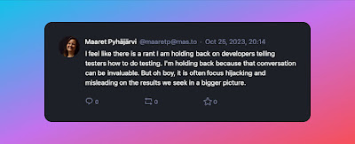

# Anyone can test but...

*Published 2023-10-25, updated 2023-10-26*  
*Source: <https://visible-quality.blogspot.com/2023/10/anyone-can-test-but.html>*

---

Some years ago, I was pairing with a developer. We often would do work on the code that needed creating, working on the developer home ground. So I invited us to try something different - work that was home ground to me.

There was a new feature the other developers had just called complete, that I had not had time to look at before. No better frame of cross-pollinating ideas, or so I thought.

Just minutes into our pairing session of exploring the feature, I asked out loud something about sizes of things we were looking at. And before I knew, the session went from learning what the feature might miss for the user to the developer showing me bunch of tools to measure pixels and centimeters, after all, I had sort of asked about sizes of things.

By end of pairing session, we did not do any of the work I would have done for the new feature. I was steamrolled and confused, even deflated. It took weeks or months and a conference talk to co-deliver on pairing before I got to express that we \*never\* paired on my work.

I am recounting this memory today because I had a conversation with a new tester in a team with one of testerkind, and many of developerkind. The same feelings of being the odd one out, being told (and in pairing directed) to do the work the developer way resonated. And the end result was an observation on how hard it it to figure out if you are doing good work as tester when everyone thinks they know testing, but you can clearly see the results gap showing their behaviors and results don't match their idea of knowing testing so well.

I spoke about being the odd one out in TestBash in 2015. I have grown up as tester with testing teams, learning from my peers, and only when I became the only one with 18 developers as my colleagues, I started to realize that I had team members and lovely colleagues, but not a single person who could direct my work. I could talk to my team members to find out what I did not need to do, but never what I need to do. My work turned to finding some of what others may have missed. I think I would have struggled without having had those past colleagues who had grown me into what I had become. And I had become someone who reported (and got fixed) 2261 bugs over 2,5 years before I stopped reporting bugs and started pairing on fixes to shift the lessons to where they matter the most.

  

For a better future, I hope two things:

1. Listen and make space more. Look for that true pairing where both contribute, and sit with the silent moments. Resist the temptation of showing off. You never know what you would learn.
2. Appreciate that testing is not one thing, and it is very likely that the testing you do as developer is not the same as what someone could add on what you did. Be a better colleague and discover the results gap, resisting the refining the newer person to a different center of focus.

I searched my peers and support in random people of the internet. I blogged and I paired like no other time when I was the odd one out. And random people of the internet showed up for me. They made me better, and they held me on growth path.

If I can be your random people of the internet to hold you on growth path, let me know. I'm ready to pay back what people's kindness has given me.

Anyone can test. Anyone can sing. But when you are paid to test as the core of your work week, coverage and results can be different to what they would be if you needed to squeeze it in.
