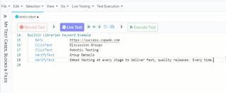

# Not an ad but a review: Copado Robotic Testing

*Published 2024-10-16*  
*Source: <https://visible-quality.blogspot.com/2024/10/not-ad-but-review-copado-robotic-testing.html>*

---

The world of low code  / no code tools is an exhausting one. I've looked at a few in last weeks, and will look at a few more. I don't try to cover them all, but I am trying to do a decent tour to appreciate the options. Currently my list of looking looks like this, in alphabetical order:

- Alchemy
- Curiosity
- Copado Robotic Testing
- KaneAI
- Leapwork
- Mabl
- SahiPro
- Tricentis Tosca
- UIPath
- QF-Test

I am well aware that while my list is 10, the real list counts in hundreds. The space is overwhelmed with options. Overwhelmed enough that asking the real users of these tools their experiences, the conversation slides to DMs (direct messages). It feels a bit like dipping one's toes in hot water to start conversations in this space.

Learning out in the open, today about Copado Robotic Testing, I accepted the kind offer to level-appropriate demo from a conversation started last week. Level-appropriate in the sense that people demoing were aware of what I know already and may avoid the shiny over the real. Thankful for Esko Hannula and Copado team for the very personalized experience.

Before drilling more into what I learned, I must preface this for why am I writing about this. First of all, I am a great fan of great things we do in Finland. Copado Robotic Testing has roots in Finland, even if they, like any successful companies, outgrow geographical limits. Second, I am NOT a great fan of low code, and anyone showing me products in this space tends to fight an uphill battle on how they frame their messaging.

I believe this:

> Programming is like writing. Getting started is easy and it takes a lifetime to get good at.

Visual programming languages tend to become constraints rather than leveling people up. Growing in space of a general purpose programming language tends to build people up. Growing in space of a visual programming language tends to constrain problems. Quoting a colleague from a conversation at Mastodon:

> All these things (orms, 4gl, dnd-coding, locode) seem to follow the paradigm of "make simple things simpler, hard things impossible and anything in between really tedious"

Kids graduate from Blockly in a few sessions by having aspirations too big for the box they are given. I am skeptical that adults wouldn't experience the same with low code. Drilling into the expectation that a user should be able to select between "Get text", "Get Web Text", "Get UI Text", "Get Electron Text" and "Find Text" based on whether the app is green screen, web application, desktop application, Electron desktop application or virtual desktop application is kind of stretching it. That is to say that the design of the **simplification** on the **user perspective** really matters and it is less than obvious looking into some of these tools.

Enough of prefacing, let's talk about the tool. Copado Robotic Testing sits on top of Robot Framework. Robot Framework sits on top of Selenium. Selenium sits on top of Python. Anything aiming for low code would hide and abstract away most of this stuff. I mention it because 1) respecting your roots matters 2) stack awareness helps address the risks of moving parts.

Robot Framework is test orchestration framework with libraries. Copado's approach starts with a few Robot Framework libraries of their own. A core one is called [qWeb](https://github.com/qentinelqi/qweb), and that core one is available as open source.

If I take nothing else out of my hour of learning with them, I can take this: Robot Framework ecosystem has at least three options for libraries driving the web: Selenium library, Browser (playwright) library, and qWeb library. The third one has a lovely simplicity to it. User language. Reminds me how many versions of custom keywords on top of Selenium library I've seen over the years being called "work on our internal test framework" in *every single project*.

Copado's product has a **recording**feature they call Live testing. On one screen, side by side you'd operate your web application, and watch script being built on top of the qWeb (and other qwords style) -libraries. Since this script is a Robot Framework script, I can see a way out with fear of dependencies of possible lifecycle changes on products as the script can be written too. It can be used independent of the product. And the part I appreciated particularly, saved up in version control and diffing nicely so that making sense of changes while I looked the other way can be made sense on for those of us with practices relying on it.

  
Writing the scripts in Visual Studio Code with Copado's add-on was mentioned while not demoed. Two IDE homes with essentially different user groups is an approach I appreciate. Nice bridge between the way things are and the way things could be.

We looked at running tests, reports over all the runs and the concept of running tests in development mode to not keep around results while developing tests. We discussed library support for iFrames and shadow DOM, and noted there's platform product specific libraries available in the product, namely qForce for SalesForce testing capturing some of that product's testing complexities.

From a fresh memory of a day to sort out version dependencies in languages and libraries this week, I could appreciate the encapsulation of the environment you need to run tests from into the product.

We also looked at current state of AI in the product, now called Agents. While I feel like assistant style features of generating tests from text or explaining code are a little less than word 'agents' would lead me to expect, it serves as a placeholder for growing within that box. Assisting AI well integrated into an IDE like this one is a feature we are learning to expect. and benefit from.

Finally, we looked at a feature called Explorer. The framing of it being even lower code than the text-based Live Testing is something I can link with, yet framing the path we click and things we note as exploratory testing is something I would be careful with. The idea of hiding text from certain groups of users seems solid though. Nice bridge, even if not a bridge from exploratory testing to automation as I would think, but a bridge from business user testing to automation.

While Copado team opened the session with five things to preface test automation conversations with, I close with the same. Test environments, vendor lock in, Subject matter expert inclusion, Results sharing and Test maintenance definitely sound like problems to design against in this space. Copado team's choices on those made sense to me and show they have a solid background in this problems and solutions space.

For me that was an hour well spent, and lead me into a further conversation on the Robot Framework libraries for driving web user interfaces. Lovely people, which I already knew. And a worthwhile tool to consider.
