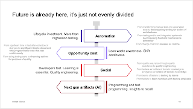
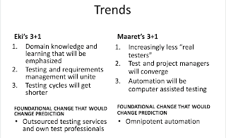

# Dividing future of testing more evenly

*Published 2024-10-25*  
*Source: <https://visible-quality.blogspot.com/2024/10/diving-future-of-testing-more-evenly.html>*

---

I have been a consultant specializing in testing now for five months at CGI. Those months have given me a reason of thinking about **scale** and **legacy** and **relevance**, driving forces that lead to the negotiation of tailoring me a role amongst great people. I have built myself up to a platform of actionable testing knowledge, and I need to figure out how to do things better. For more people while still having limited time. For building things forward even when I am not around. For seeing a positive change in quality and testing for companies in Finland.

When thinking about where to go, knowing where you are matters. And looking at where we are, in scale, is an eye opener. Everything I have left behind in learning about how to better do testing, it all still exists. But also, there is a steady stream of new good insights, practices, tools and framings that drive an aspirational better future of testing. Steady stream of awareness though because I have come to realize that, by words of William Gibson:

> Future is already here, it's just not evenly divided.

Sampling in scale is how I believe we find our future. Sampling, and experimenting. Evolving from where we are with ideas of where we could try being.

Being awarded so many great people's time and attention for conversations, both with my consultant colleagues and many of our customers, I started collecting the themes of change. First listing statements of movement in behaviors expected, then structuring that further an open space conference session, to finally figuring out the created dimensions into a visual of a sort.

  

The future that is here and needs distributing more evenly, summed up to four themes.

### **Automation**

Lifecycle investment. More than regression testing.

The changes in this theme are:

- From transforming manual tests into automated tests to **decomposing testing for scales of architectures**
- From testing end to end integrated systems to **decomposing feedback mechanisms differently**
- From change control to **releases as routine**.

Automation is not optional. It's not about what we automate, but what we automate first. Organizations need ownership of software over lifecycle of it, and people will leave for positive reasons of growth and opportunities. We can't afford the change in software without automation. But automation is not end to end testing as testers have learned it. It is reassignment of relevant feedback to design of test systems. Change is here to stay, and the future we need is one where testing looks essentially different.   

### **Opportunity cost**

Lean waste awareness. Shift continuous.

The change in this theme are:

- From significant time to test after collection of changes to **significant time to document with programmatic tests that test continuously**
- From doing testing tasks to **choosing actions for purpose of quality**

A lot of what we consider testing is wasteful. Not doing exploratory testing is wasteful. Overemphasis on specifications is wasteful. Waiting with feedback is wasteful. We need to make better choices of how we use our time. We need agency and collaboration. Writing test cases into a test management system is not the future. We shift left (requirements), right (monitoring) and down (unit testing). And we do smaller increments, making testing continuous so that left and right aren't really concepts anymore.   

### **Social**

Developers test. Learning is essential. Quality engineering.

The change in this theme are:

- From quality assurance through quality assistance to **quality engineering**
- From testers as holders of domain knowledge to **everyone as holders of domain knowledge**
- From teams of testers to **testing by teams**
- From testers to **team members with testing emphasis**

The work gets distributed so that titles don't tell us who does and knows testing. Interest and learning tells something about that. We collaborate for trust so that we understand what others test, and we own quality together. Test specialists may be called developers, and developers are growing into exceptional testers. Instead of making testing smaller, we pay attention to mechanisms of feedback where some might not qualify as testing to some folks.

### **Next generation artifacts (AI)**

Programming and test programming. Insights to recall.

We can't generate more artifacts that people don't read. We need to revisit opportunity cost, and have executable documentation, and mechanisms of recalling insights even when people change.

## Future 2011

I have been daring to speak on future before, especially when showing up with a friend, Erkki Pöyhönen. We did a talk in 2011 of two predictions for future. I translated our conclusions from that time for international access.

The approach we took for the talk was to talk about three things we believe are core to change we will experience. We also reflect what would have to be foundationally changing in what we stand on for things to be different.   

Eki most definitely did see the work on specification by example. Coming from long cycles and organizational splits that I live with now, his platform was on how people will look at ownership and thus distribution of knowledge and skills.

I was expecting things I still expect. Less testers, everyone tests. But I was not ready then to see how much of a role automation will play, still framing it as computer assisted testing. I said that AI will rock my foundation, and it will.
