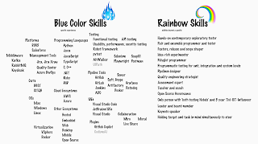
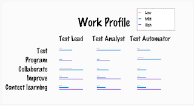
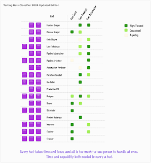
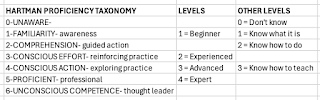
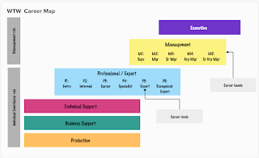
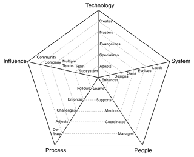

# Multi-Model Assessment Practice for Describing Skills

*Published 2024-10-29*  
*Source: <https://visible-quality.blogspot.com/2024/10/multi-model-assessment-practice-for.html>*

---

I keep making the same observation: we are not great at verbalizing our skills and knowledge. Not just about testers and testing, but particularly about testers and testing. Instead, we tend to behave as if **testing** carried more meaning of similar work and results than it does.

Just a couple of examples. **Testing** could mean that they:

- Reproduce customer reported issues from customer acceptance testing, improving insufficient reports and running change advisory boards to prioritize the customer issues.
- Spend time conducting a technical investigation of the system and its features and changes, reporting discrepancies they are curious about.
- Maneuver builds between environments so that customer acceptance testing can do what they feel like doing on the version targeted for production.
- Reboot test environment on Wednesdays since by that time the low-end test environment has seen enough of week to be less performant.

Well, you could continue the list. You could describe the things you routinely do. You could try avoiding saying you *plan testing*, *design test cases*, *execute test cases* and *report results*. You could try other words for size, and you could describe things you routinely do, have done in the past and could do again, and even things you are working your way into including them.  Elizabeth Zagroba does this exceptionally well with her [trustworthy resume](https://elizabethzagroba.com/assets/resumes/trustworthy-resume.pdf).

As consultant, my CV (as well as my consultant colleagues CVs) are often looked at for selecting us for delivery projects. Needing to create the concept of *Exceptional Consulting CV,* I am in the process of experimentation of what works for me. Since my latest version of CV is labeled *confidential*, I won't go about sharing it. Instead, I share some thinking that I have been doing for it. And well, for annual performance reviews. The two reasons to wrap your skills and competences in a nice sales-oriented package.

**Personal Skills**

My first infographic is inspired by the re-emergence of frustration on how consulting CVs are often looked at for skills that are equivalent for "has painted with blue color"without considering transference of experiences between technologies, or combinations making application of a particular color particularly insight-driven from experiences. I have written python code. I have also written Java code. I choose to not list language specific application frameworks even though I have used some of them, because I am not making a case for hiring me as a developer. I want to focus on developing for purposes of *test problems*.

At this point of my career and my interests, I am very confident in my belief that I can learn technologies and application domains so that my feedback after 6 months includes remarks of surprise on the things I know. I have learned to learn. That's a rainbow skill through - so meta, and particularly hard to explain.  

**Roles**

Past experiences mean little if the future I aspire isn't about repeating past experiences. The future I aspire is one of testing specialty. But alas, testing is not a single specialty. At minimum, it's three. And while I may be assigned the default role of *Test Lead*, I always prefer the role of *Test Analyst* and will intertwine that with whatever ideas people have about *Test Automator.* I call this mix *Contemporary Exploratory Testing* and my insistence on this mix leads me to another infographic, the idea of how you can your order of growing on main areas of skills depends on the role.

There are beginner test leads, beginner test analysts and beginner test automators. Acquiring them all is an action distributed over decades, and juggling tends to create a fair share of trashing for focus.

**Hats**

Since roles is taken for the concept above, I have been particularly playing with observing people with hats. These are my descriptions of the more detailed (yet not detailed at all) listing of what components testers (and developers testing) build their test role from. I create the first version of this four years ago, observing my team working with embedded software testing. In that particular area, test lab maintenance, the hat of 'test technician' is easily a full-time job. Attending to the artificial sky, coordinating who gets to stand inside the radar that fits 5 people, simulating rain by taking your test environment to shower - all experiences that I have now witnessed and scheduled.

Since the 1st version that I presented as a keynote at Appium Lite Conference 2021, I had my later team of mostly developers assess their focus (and make agreements on the gaps) and today I updated the model. [A version with resolution you can read the purple box fine print is also available](https://drive.google.com/file/d/1gZLmP5MNLW6vPoUeeVZFR8TFO8Mrc9Jq/view?usp=sharing).

The *focused / occasional / aspiring* intersection for 3x17 (roles x hats) is a way for indicating coverage. Very tester of me to want a coverage measure on a model.

**Levels and Proficiencies**

Generally I am not a great fan of assessing skills on a scale. As soon as you stop using a skill, skills atrophy. As soon as you are applying a skill and paying attention to thoughtful application, you are improving. Knowing where you are takes a lot of conversations and there is no better way of learning your place on journey and making steps ahead on the journey than ensemble testing. But say you want or are asked to describe levels and proficiencies anyway. Well, I am.    

I have recently discovered love of [Hartman proficiency taxonomy](https://marianhartman.com/proficiency-taxonomy). On level of hats, I get to a richer vocabulary to explain where I am, and where I am growing. On level of roles, granularity suffers. And on level of task analysis, I can really use it to drive home growth.

**Industry-wide benchmarking**

For industry-wide benchmarking, where I am at we are using [WTW](https://www.wtwco.com/en-ie/solutions/services/job-architecture-job-leveling-and-reward-and-career-frameworks). For obvious reasons I am mostly curious on how I am leveled and whether that is right since some folks use this to argue that Women's Euro is about same as Men's. I feel like I should try voting for placing me on the Professional / Expert scale where I reside.

  

It's a career progression model. Professional has QA track within. And I am somewhere half in Professional, Half in Management, not fitting anyone's model as such.

**Engineering Ladders**

Final piece of multi-model assessment practice walkthrough is [engineering ladders](http://www.engineeringladders.com). Doing justice to testers in this is always a bit of an exercise for the other models, but this grounds us all on one. And I appreciate that. I don't believe there is a magical tester mindset. Developers can test, the split we have is less of mindset and more of allowing for time for perspectives.

Test leads tend to be growing on the people, process and influence axes. Test analysts tend to grow on the system and process axes. Test automators tend to grow on technology and system axes. I have worked with people who can work, skills-wise, on full range of five dimensions, but they can't do it time wise. Full range is a team of people.

**Multi-model Assessment Practice?**

A fancy name, right? It basically says take as many models as you feel you benefit from. This was my selection for describing skills, today. I have another selection for test process improvement assessments, which I also do multi-model: with Quality Culture Transition Assessment (modern testing), TPI-model (testing), and Testomat Assessment model (test automation), spicing it usually with Context STAR model, and whatever complementary models I feel I could use based on my experience as assessor on observations I need to illustrate. I illustrate a lot of things. Like the things in this blog.

Create your own selection and use bits of what I have if that is useful. I care less for a universal model, and more for a model that helps me make sense of complexities I am dealing with.
