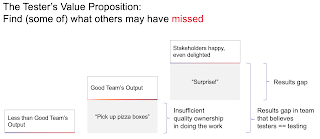

# Resultful Testing

*Published 2025-04-16*  
*Source: <https://visible-quality.blogspot.com/2025/04/resultful-testing.html>*

---

All of March, I did not manage to make time to blog. There was a lot going on:

- Modeling and understanding how to describe the differences in results of testing for different setups of testing
- Modeling and finding people with a *contemporary exploratory tester* profile, where people would need to know how to *test, program for test purposes, and collaborate with various stakeholders*.
- Experimenting with an exercise for people to test and program for test purposes to see if they fit the contemporary exploratory tester profile.
- Selenium & Appium Conference in Valencia, Spain
- Usual work

A lot of my thinking is around the idea that to recognize resultful testing (testing that produces results it would be fair to expect of testing), you need to test and know testing. There is a lot of experiences where people of various roles believe they can't test in a resultful scale. They can test, kind of like everyone can sing, but not test, kind of like not get on stage to sing for an audience of hundreds. Resultful is limited by attitudes, effort put on testing, and to a degree, abilities of people. Believing in growth mindset, however, ability and skill follows effort.

There are many teams without testers who do a good job on resultful testing. Some of these teams heavily rely on *acceptance testers* in customer organizations to complete the results, but others have more product development default of enjoying the results without acceptance testing.

There are also many teams with testers, who do a good job on resultful testing. And there are separate testing teams that glue on resultful testing, kind of like acceptance testers would do, but by representing the same or different organization but at least being a separate *independent* team that still collaborates.

This is nothing new, but a movement that the entire industry has been in for years. Testing tends to be more valuable integrated with development. It's feedback that, when trusted in the teams, is a productivity boost, not just a time saving on testing by automating it.

I find myself going back to the model I created a few years ago on results gap, and classifying it by splitting projects into two categories.

  

Sometimes the results gap I work with as a tester feels like my work is garbage collecting, and coaching a team on not to litter. Other times, I work for real quality and surprises.

My assignment, regardless is this: Find (some of) what others may have missed. Present it in consumable chunks, prioritized and enriched with context information for the decisions.
