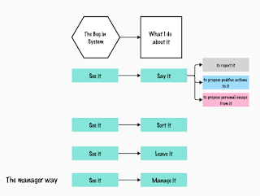

# Bug advocacy is to go beyond reporting

*Published 2025-08-01*  
*Source: <https://visible-quality.blogspot.com/2025/08/bug-advocacy-is-to-go-beyond-reporting.html>*

---

I've been fairly non-committal with my talks and topics, because I am interested and experienced in more than one thing. One talk that I am particularly happy with still this day is one I delivered as keynote at [DDD Europe on topic of 'Breaking Illusions with Testing'](https://www.youtube.com/watch?v=v0pNA8a7dbY).

The point I was making is that there are more illusions than just the usual "does it work if you did not see it work", where we can imagine a thing being operational while no one uses it, or says that they used it and it didn't work.

The talk grew from paraphrasing a community phrase to a personal response to a developer, and then many developers in crafter community. The original phrase was not only breaking illusions but also trashing delusions, a bit more attack-oriented than the insight in what could be expected of me, professionally.

Remembering the illusions are more than just bugs in the traditional sense and systems are sociotechnical including people and organizations, I still test applications but also organizations and unfortunately, people's patience in questioning the beliefs we (including me) hold dear.

A particular belief I find worth writing on today is the idea that testers \*report\* issues and it is someone else's job to do something about it. For years I have found this a core of what I consider bad advice. There is a lot more variety to your choices on what you could do when you see it.

If you could just sort it, like fix the bug, it would save up time. If you wanted to educate while fixing it, you could pair up to fix it. You could leave it to make space for more important bugs, and leaving things be and choosing your battles has been the core point of what I find I have needed to learn. I choose a thing to fix, I choose things to leave, and I choose things to say.

More recently, I have also observed patterns on framing things when saying it. I must have become a manager, because the saying it where solution is you yourself escaping the problem assuming grass is greener on the other side just feels like we give up when we should rally together, and collaborate.

For me, a major source of energy is what I call spite. I recognize myself annoyed for a good reason, collect that energy and do something that looks just like me as a positive action to change the world just a bit.

No women of merit in speaking? I do 50 keynotes and speak in 28 countries.

Poor contents on ISTQB Foundations? I volunteer for 6 months to rewrite, only to learn that some parts of that rewrite are lost in lack of intentional version control.

No training available? I teach what I can, encouraging community teaching, and learn ways to go around the corporate constraints.

We have agency, we have choices. And we need more fine-grained advice for testers than encouraging to stop at reporting the problem.

*I wrote this first into my LinkedIn posts queue on socialchamp that I am now experimenting with, to realize this was a moment where it was already a blog post size. Creating content for LinkedIn should really not be my thing so I write it here instead.*
