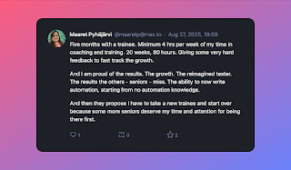

# The Reimagined Tester and How to Grow One

*Published 2025-08-27*  
*Source: <https://visible-quality.blogspot.com/2025/08/the-reimagined-tester-and-how-to-grow.html>*

---

Five years ago we hired a trainee who grew into the kind of tester we need. Polyglot with regards to programming, shifting actively between Python, PHP and TypeScript. Centers automation and ability to do great exploratory testing equally. Collaborative and making an impact far wider than her individual contributor work. She is a career changer, and I suspect I will always admire her drive of learning and combination that emerged from her past experiences and the new things the tech industry made available through work. We worked together about a year, and I have closely followed her growth since.

Yesterday, quoting Grey's Anatomy she told me: **'See one. Do one. Teach one.'** As corny as a life lesson on learning from Grey's Anatomy is, it's a great one-liner to describe the path we shared and the expectation I work with, that she works with.

It's not enough that you do. You need to see: pair and ensemble testing are essential. Seeing is essential. But so is teaching. Reinforcing what you learned by reflecting. Hearing your experience through others learning.

So today, I refer to her as my prototype for the Reimagined Tester. We have talked about the ideas of *contemporary exploratory testing* and how the set of skills of a tester isn't either great skill at targeted feedback (testing) and maintaining what we know (test automation) but a great intermix of these two.

There are more people like us, the Reimagined Testers, the Contemporary Exploratory Testers. But we are a minority in the field of testing. And the more I ask people to test applications and watch them test while pairing, the more I recognize we need a major revamp that goes beyond lip service of saying what we should do is what we are actually doing in the projects.

The last five years, I have invested a significant chunk of my summer and essentially my free time in growing the Reimagined Testers and figuring out how I could scale that. Because one a year is not enough.

**Choices of Growing 2025**

Looking back at how this years choices emerged, I see three stages:

1. Selection with a homework assignment
2. Model an application and write test automation
3. Find what others have missed

I'm writing a longer paper on the first one. The short story is I had people test the To Do App, and chose one that scored best on my schema emphasizing contemporary exploratory testing. That was a definite leading indicator to be able to do 3 when coached, but also a window into possibility of showing start of 2.

The candidate chosen did well on leading indicators to 3 but left any indicators on 2 out due to time constraints. So this year we learned 2 first.

For the second one, Modeling an application to write test automation, we made progress on the three months. Got comfortable with Robot Framework syntax and particularly complex selectors for the application under test. Learned about structures and readability. About transferability of test automation from test developer machine to somewhere else. I could can frame it in two ways:

- Look, we only got 2 test cases out of three months of effort
- Look, we got so much learning and also 2 test cases out of three months of effort

In hindsight, I would do some of my own facilitation choices differently.

- Make space for 'see one'. I handpicked courses that were good, but courses don't give you feedback when you miss the more subtle teachings. We ended up with more trial and error, and less results because delayed feedback is not the best platform for learning good foundational practices.
- If using courses to teach, structure schedule so that course gets completed. Sampling courses to start progress works great when you have solid foundation, but not when you need to build a foundation.
- Choose a better tool. Robot Framework was not a good choice. We would have gotten so much more if we used Playwright Typescript. The limited examples online. The hallucinations from GitHub Copilot. The technical limitations to some of the best parts of what is Playwright. They were my choices and they were wrong.
- A real team with full time people on same work would be better. But it is not always possible. We don't really have test automation teams, or test teams.

There were some choices I believe worked, at least I'm happy with:

- Introducing a trackable to do -list for feedback on improvements and corrections. It helped making progress and getting the sense of how the work grew as it was being done.
- Check ins on progress. Not ones on calendar, but making space for collaboratively look at what was there and where was it heading.
- Introducing other helpers, even if some of the help was self-discovered discouraged patterns. Making it so that my availability was not a blocker for its variability.
- Fixing the codebase and discussing the fixes. While that introduced merge conflicts, we need to learn merge conflicts early on. And we did.
- Enforcing 'teach one'. Internal demos. Teaching twice to the internal community. Writing a commit analysis with help of AI to reflect on the outcomes and sharing that with everyone. Essentially, becoming a speaker while a trainee.

The third stage was a deep end expectations with exploratory testing. With assignment to 'find what others missed and customers have been finding, before the customers' is a classic research formulation of testing. If *story-based testing* or *system test automation* were the key, there wouldn't be a gap to fill. Making a summer trainee the piece D in the chain of testing by A and B and C and D so that E would need to find less isn't the testing kiddie pool. Well, 2 months, 19 bugs with 2 critical and a skill of driving 3rd party test data through APIs are all things I have to be happy with. Great foundation for more growth in contemporary exploratory testing. And my main takeaway: "Two years as tester before were entirely different than this testing being asked for right now". They see the Reimagined Tester, in their own words.

In hindsight, I would do some of my own facilitation choices differently:

- Teach with exercises. I have them, plenty of them. And we would do better if I taught. Maybe. That is, I taught some bits on need basis while coaching for choices of focus, tasks and priorities. But teaching with exercises would most likely have been helpful. Because here it was even more evident: the course material I wrote and asked to study was never read beyond its start.
- Teach meta. Like the fact that I am at the same time manager, consultant and coach and have conflicting ideas with my roles. Clarifying and repeating agreements is an essential skill to teach and I learned this by failing with communication. It's always two people not getting each other.

There were some choices I believe worked, at least I'm happy with:

1. Radical candor. Some feedback I had to give was corrective of nature and it helped we established that I am telling things I see to help them grow. I did not enjoy giving some of the feedback but doing it made the growth.
2. Tester to tester coaching. I spent two weeks myself on testing the same system for making a consultant recommendation on the future actions of the team. I learned their test automation and created some of my own. I can come across as knowledgeable now in the business domain, and project status. And I have spend hours hands on with the system. My guidance was not high level, but steps I had taken and would take next if I had time.
3. The note taking emphasis. Being able to describe daily insights. Improving discussing results with coaching. While we agreed on leaving them public, they turned private as soon as I stepped out, but they existed. And they were fodder for genAI on generating test ideas.
4. The automation insistence. Automation almost got dropped out even though it was essential to be able to complete the mission: find what others miss. Without insistence, severely limited ability to test through GUIs would have won over and it would not be right.

In the end, I am reflecting my own choices because I might be at a crossroads. I am still figuring out if we can continue our common learning journey as I expect or if the state of the world means my next trainee is someone who is a career changer from traditional tester to a reimagined tester. I want to believe it might be both, but I need to figure out scale. One by one won't fly.

Everyone would need this attention. And it is sad people did not get it, and ended up not learning all this stuff they should know.

Schools really leave a gap. Going schools 20 years ago and then leaving all your training to your employer left a huge gap. Relying on old-school ISTQB did not bridge the gap but widened it.

I suspect we live at final times of changing direction for the tester profession. Time will tell, and today I was "lead developer" rather than a tester. But always, always, a tester at heart. <3
